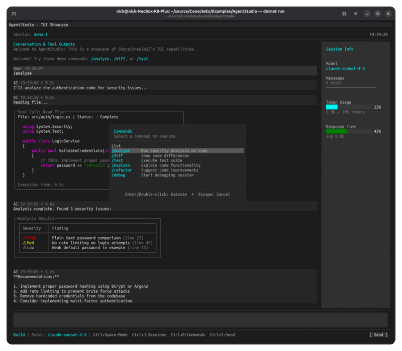

# ConsoleEx

<p align="center">
  
</p>

<p align="center">
  <a href="https://nickprotop.github.io/ConsoleEx/"></a>
  <a href="https://www.nuget.org/packages/SharpConsoleUI/"></a>
  <a href="https://www.nuget.org/packages/SharpConsoleUI/"></a>
  
  
  
</p>

**SharpConsoleUI** is a multi-window TUI framework for .NET 9 that combines Spectre.Console's rich markup with true overlapping window capabilities. Cross-platform (Windows, Linux, macOS).

- **Multi-window with per-window threads** — each window updates independently without blocking others
- **Spectre.Console markup everywhere** — just `[bold red]text[/]` and it works, no complex styling APIs
- **Any Spectre.Console widget works as a control** — Tables, BarCharts, Trees, Panels — wrap any `IRenderable`
- **Double-buffered, flicker-free rendering** with dirty region tracking
- **30+ built-in controls** — buttons, lists, trees, tables, text editors, dropdowns, menus, tabs, and more
- **Compositor effects** — PreBufferPaint/PostBufferPaint hooks for custom rendering, transitions, or even games
- **Fluent builders** for windows, controls, and layouts

**Visit the project website: [nickprotop.github.io/ConsoleEx](https://nickprotop.github.io/ConsoleEx/)**

**Browse examples with screenshots: [EXAMPLES.md](docs/EXAMPLES.md)**

## Showcase



*SharpConsoleUI in action - rich controls, multiple windows, smooth gradients, real-time updates, and full-screen capabilities*

## Quick Start

```csharp
using SharpConsoleUI;
using SharpConsoleUI.Builders;
using SharpConsoleUI.Drivers;

// Create window system with built-in logging and state services
var windowSystem = new ConsoleWindowSystem(new NetConsoleDriver(RenderMode.Buffer));

// Use fluent builder pattern
var window = new WindowBuilder(windowSystem)
    .WithTitle("Hello World")
    .WithSize(50, 15)
    .Centered()
    .WithColors(Color.White, Color.DarkBlue)
    .Build();

// Show a notification
windowSystem.NotificationStateService.ShowNotification(
    "Welcome", "Hello World!", NotificationSeverity.Info);

windowSystem.AddWindow(window);
windowSystem.Run();
```

## Installation

```bash
dotnet add package SharpConsoleUI
```

## Core Features

### Window Management
- **Multiple Windows**: Create and manage overlapping windows with proper Z-order
- **Window States**: Normal, maximized, minimized states
- **Window Modes**: Normal and modal dialogs
- **Independent Window Threads**: Each window can run with its own async thread for real-time updates
- **Focus Management**: Keyboard and mouse focus handling
- **Window Cycling**: Alt+1-9, Ctrl+T for window navigation

### Input Handling
- **Keyboard Input**: Full keyboard support with modifier keys
- **Mouse Support**: Click, drag, and mouse event handling
- **Input Queue**: Efficient input processing system

### Rendering System
- **Spectre.Console Foundation**: Leverages Spectre's perfect rendering engine for rich TUI widgets
- **Double Buffering**: Smooth rendering without flicker
- **Dirty Regions**: Efficient partial updates
- **Render Modes**: Direct and buffered rendering
- **Compositor Effects**: Post-processing buffer manipulation for transitions, blur, and filters
- **BufferSnapshot API**: Immutable buffer capture for screenshots and recording
- **Themes**: Multiple built-in themes (Classic, ModernGray) with runtime switching
- **Plugins**: Extensible architecture with DeveloperTools plugin
- **Status Bars**: Top and bottom status bar support

### Controls Library (30+)

| Category | Controls |
|----------|----------|
| **Text & Display** | MarkupControl, FigleControl, RuleControl, SeparatorControl, SparklineControl, BarGraphControl, LogViewerControl |
| **Input** | ButtonControl, CheckboxControl, PromptControl, DropdownControl, MultilineEditControl |
| **Data** | ListControl, TreeControl, TableControl, HorizontalGridControl |
| **Navigation** | MenuControl, ToolbarControl, TabControl |
| **Layout** | ColumnContainer, SplitterControl, ScrollablePanelControl, PanelControl |
| **Advanced** | SpectreRenderableControl (wraps any Spectre.Console `IRenderable`), ProgressBarControl, TerminalControl |

## API Usage

SharpConsoleUI provides a fluent API with built-in logging, state services, and modern C# features.

### 1. Built-in Services

The library includes built-in logging and state services - no DI setup required:

```csharp
var windowSystem = new ConsoleWindowSystem(new NetConsoleDriver(RenderMode.Buffer));

// Built-in logging (outputs to file, never console)
windowSystem.LogService.LogAdded += (s, entry) => { /* handle log */ };

// Built-in state services
windowSystem.NotificationStateService.ShowNotification("Title", "Message", NotificationSeverity.Info);
windowSystem.ModalStateService.HasModals;
windowSystem.FocusStateService.FocusedWindow;
```

Enable debug logging via environment variables:
```bash
export SHARPCONSOLEUI_DEBUG_LOG=/tmp/consoleui.log
export SHARPCONSOLEUI_DEBUG_LEVEL=Debug
```

### 2. Fluent Window Builders
```csharp
using SharpConsoleUI.Builders;

// Create windows using fluent API
var mainWindow = new WindowBuilder(windowSystem)
    .WithTitle("Modern Application")
    .WithSize(80, 25)
    .Centered()
    .WithColors(Color.White, Color.DarkBlue)
    .Resizable()
    .Movable()
    .WithMinimumSize(60, 20)
    .Build();

// Dialog template - applies title, size, centered, modal automatically
var dialog = new WindowBuilder(windowSystem)
    .WithTemplate(new DialogTemplate("Confirmation", 40, 10))
    .Build();

// Tool window template - applies title, position, size automatically
var toolWindow = new WindowBuilder(windowSystem)
    .WithTemplate(new ToolWindowTemplate("Tools", new Point(5, 5), new Size(30, 15)))
    .Build();
```

### 3. Independent Window Threads

**KEY FEATURE**: Each window can run with its own async thread, enabling true multi-threaded UIs where windows update independently.

```csharp
// Create a window with an independent async thread
var clockWindow = new WindowBuilder(windowSystem)
    .WithTitle("Digital Clock [1s refresh]")
    .WithSize(40, 12)
    .WithAsyncWindowThread(UpdateClockAsync)  // Async method runs independently
    .Build();

// The async method receives Window and CancellationToken
private async Task UpdateClockAsync(Window window, CancellationToken ct)
{
    while (!ct.IsCancellationRequested)  // Runs until window closes
    {
        try
        {
            var now = DateTime.Now;

            // Find and update control by name
            var timeControl = window.FindControl<MarkupControl>("timeDisplay");
            timeControl?.SetContent(new List<string>
            {
                $"[bold cyan]{now:HH:mm:ss}[/]",
                $"[yellow]{now:dddd}[/]",
                $"[white]{now:MMMM dd, yyyy}[/]"
            });

            await Task.Delay(1000, ct);  // Update every second
        }
        catch (OperationCanceledException) { break; }  // Clean shutdown
    }
}
```

**Benefits:**
- **True Parallelism**: Multiple windows update simultaneously without blocking
- **Real-time Data**: Perfect for dashboards, monitors, live feeds
- **Clean Cancellation**: CancellationToken handles automatic cleanup on window close
- **No Manual Threading**: Framework manages thread lifecycle

### 4. Resource Management
```csharp
using SharpConsoleUI.Core;

// Automatic resource disposal
using var disposableManager = new DisposableManager();

// Register resources for automatic cleanup
var window1 = disposableManager.Register(CreateWindow("Window 1"));
var window2 = disposableManager.Register(CreateWindow("Window 2"));

// Register custom cleanup actions
disposableManager.RegisterDisposalAction(() =>
{
    // Perform custom cleanup
});

// Create scoped disposals
using var scope = disposableManager.CreateScope();
scope.Register(temporaryWindow);
scope.RegisterDisposalAction(() => SaveTempData());
// Scope automatically disposes when using block exits
```

### 5. Event Handlers with Window Access

All event handlers in fluent builders include a `window` parameter, enabling access to other controls via `FindControl<T>()`:

```csharp
// Create controls with names
window.AddControl(
    Controls.Markup("[bold]Status:[/] Ready")
        .WithName("status")
        .Build()
);

window.AddControl(
    Controls.Prompt("Enter name:")
        .WithName("nameInput")
        .OnInputChanged((sender, text, window) =>
        {
            // Access other controls through window parameter
            var status = window.FindControl<MarkupControl>("status");
            status?.SetContent($"[bold]Status:[/] Typing... ({text.Length} chars)");
        })
        .Build()
);

window.AddControl(
    Controls.Button("Submit")
        .OnClick((sender, e, window) =>
        {
            var nameInput = window.FindControl<PromptControl>("nameInput");
            var status = window.FindControl<MarkupControl>("status");

            if (string.IsNullOrWhiteSpace(nameInput?.Text))
            {
                status?.SetContent("[red]Error:[/] Name is required");
            }
            else
            {
                status?.SetContent($"[green]Submitted:[/] {nameInput.Text}");
                nameInput.Text = "";
            }
        })
        .Build()
);
```

#### Available Event Handler Signatures

All fluent builders provide event handlers with window access:

| Builder | Event Method | Event Handler Signature |
|---------|--------------|-------------------------|
| ButtonBuilder | `OnClick` | `(sender, ButtonControl, Window)` |
| ListBuilder | `OnItemActivated` | `(sender, ListItem, Window)` |
| ListBuilder | `OnSelectionChanged` | `(sender, int, Window)` |
| ListBuilder | `OnSelectedItemChanged` | `(sender, ListItem?, Window)` |
| CheckboxBuilder | `OnCheckedChanged` | `(sender, bool, Window)` |
| DropdownBuilder | `OnSelectionChanged` | `(sender, int, Window)` |
| DropdownBuilder | `OnSelectedItemChanged` | `(sender, DropdownItem?, Window)` |
| PromptBuilder | `OnEntered` | `(sender, string, Window)` |
| PromptBuilder | `OnInputChanged` | `(sender, string, Window)` |

This enables **pure declarative UIs** where all control interactions happen through named lookups, eliminating the need to maintain field references.

## Architecture Overview

### Core Components

```
┌─────────────────────────────────────────────────────────────┐
│                    SharpConsoleUI Architecture              │
├─────────────────────────────────────────────────────────────┤
│  Application Layer (Your Code)                              │
│  └── Window Builders & Event Handlers                       │
├─────────────────────────────────────────────────────────────┤
│  Framework Layer                                            │
│  ├── Window Builders (Fluent API)                           │
│  ├── State Services (Focus, Modal, Notification, etc.)      │
│  ├── Logging Service (ILogService)                          │
│  └── Resource Management (DisposableManager)                │
├─────────────────────────────────────────────────────────────┤
│  Core UI Layer                                              │
│  ├── ConsoleWindowSystem (Window Management)                │
│  ├── Window (Container & Rendering)                         │
│  ├── Controls (UI Components)                               │
│  └── Themes (Appearance)                                    │
├─────────────────────────────────────────────────────────────┤
│  Driver Layer                                               │
│  ├── IConsoleDriver (Abstraction)                           │
│  ├── NetConsoleDriver (Implementation)                      │
│  └── Input/Output Handling                                  │
└─────────────────────────────────────────────────────────────┘
```

### Spectre.Console Integration

SharpConsoleUI uses **Spectre.Console as its rendering foundation**, combining Spectre's beautiful rendering with a complete windowing system:

1. **Capture Spectre Output**: `AnsiConsoleHelper` captures Spectre's ANSI rendering into our CharacterBuffer
2. **Wrap Any Spectre Widget**: `SpectreRenderableControl` makes any `IRenderable` (Tables, Trees, Panels, Charts) work as a window control
3. **Combine with Windows**: Multiple Spectre-rendered controls + interactive controls + independent window threads
4. **Result**: Best of both worlds - Spectre's rich rendering + full windowing system + multi-threading

This architecture allows using Spectre's perfect rendering engine while adding features Spectre.Console doesn't provide: overlapping windows, Z-order management, independent window threads, and a complete event-driven UI system.

### Modern C# Features Used
- **Records**: Immutable data structures (WindowBounds, InputEvent, etc.)
- **Nullable Reference Types**: Explicit null handling
- **Pattern Matching**: Enhanced switch expressions
- **Async/Await**: Throughout the framework
- **Top-level Programs**: Simplified entry points
- **Init-only Properties**: Immutable initialization
- **Primary Constructors**: Concise record definitions

## Examples

### Complete Modern Application
```csharp
using SharpConsoleUI;
using SharpConsoleUI.Builders;
using SharpConsoleUI.Controls;
using SharpConsoleUI.Core;
using SharpConsoleUI.Drivers;

namespace MyApp;

internal class Program
{
    static int Main(string[] args)
    {
        // Create window system (has built-in logging and state services)
        var windowSystem = new ConsoleWindowSystem(new NetConsoleDriver(RenderMode.Buffer))
        {
            TopStatus = "My Modern App",
            BottomStatus = "ESC: Close | F1: Help"
        };

        // Main window with fluent builder
        var mainWindow = new WindowBuilder(windowSystem)
            .WithTitle("Task Manager")
            .WithSize(80, 25)
            .Centered()
            .WithColors(Color.White, Color.DarkBlue)
            .Build();

        // Add controls
        mainWindow.AddControl(new MarkupControl(new List<string>
        {
            "[bold yellow]Welcome to Task Manager![/]",
            "",
            "[green]Features:[/]",
            "• Real-time task monitoring",
            "• Interactive controls",
            "• Built-in notifications",
            "",
            "[dim]Press F2 to add a new task[/]"
        }));

        // Setup key handlers
        mainWindow.KeyPressed += (sender, e) =>
        {
            switch (e.KeyInfo.Key)
            {
                case ConsoleKey.F2:
                    CreateAddTaskWindow(windowSystem);
                    e.Handled = true;
                    break;
                case ConsoleKey.Escape:
                    windowSystem.CloseWindow(mainWindow);
                    e.Handled = true;
                    break;
            }
        };

        windowSystem.AddWindow(mainWindow);
        return windowSystem.Run();
    }

    static void CreateAddTaskWindow(ConsoleWindowSystem windowSystem)
    {
        var taskWindow = new WindowBuilder(windowSystem)
            .WithTitle("➕ Add Task")
            .WithSize(50, 12)
            .Centered()
            .AsModal()
            .Build();

        taskWindow.AddControl(new MarkupControl(new List<string>
        {
            "[bold]Add New Task[/]",
            "",
            "Enter task description and press Enter:",
            ""
        }));

        // Add interactive input
        var input = new PromptControl
        {
            Prompt = "Task: ",
            OnEnter = (text) =>
            {
                // Handle task creation
                SaveTask(text);
                windowSystem.CloseWindow(taskWindow);
                return true;
            }
        };

        taskWindow.AddControl(input);
        windowSystem.AddWindow(taskWindow, activate: true);
    }

    static void SaveTask(string taskDescription)
    {
        // Save task to storage
        // File.AppendAllText("tasks.txt", taskDescription + Environment.NewLine);
    }
}
```

### Real-time Data Window
```csharp
public static async Task CreateRealtimeWindow(ConsoleWindowSystem windowSystem)
{
    var dataWindow = new WindowBuilder(windowSystem)
        .WithTitle("Real-time Data")
        .WithSize(60, 20)
        .AtPosition(10, 5)
        .Build();

    // Background task for real-time updates
    var updateTask = Task.Run(async () =>
    {
        var random = new Random();

        while (windowSystem.Windows.Values.Contains(dataWindow))
        {
            dataWindow.ClearControls();

            dataWindow.AddControl(new MarkupControl(new List<string>
            {
                "[bold blue]System Metrics[/]",
                $"[green]CPU Usage:[/] {random.Next(0, 100)}%",
                $"[yellow]Memory:[/] {random.Next(1000, 8000)}MB",
                $"[red]Network:[/] {random.Next(0, 1000)}KB/s",
                $"[cyan]Updated:[/] {DateTime.Now:HH:mm:ss}",
                "",
                "[dim]Updates every 2 seconds • ESC to close[/]"
            }));

            await Task.Delay(2000);
        }
    });

    dataWindow.KeyPressed += (sender, e) =>
    {
        if (e.KeyInfo.Key == ConsoleKey.Escape)
        {
            windowSystem.CloseWindow(dataWindow);
            e.Handled = true;
        }
    };

    windowSystem.AddWindow(dataWindow);
}
```

## Advanced Features

### Built-in Themes & Theme Registry

SharpConsoleUI includes multiple built-in themes that can be switched at runtime:

```csharp
// Switch to Modern Gray theme (dark theme with gray tones)
windowSystem.ThemeRegistry.SetTheme("ModernGray");

// Switch to Classic theme (navy blue windows, traditional look)
windowSystem.ThemeRegistry.SetTheme("Classic");

// Available built-in themes:
// - "Classic": Navy blue windows with traditional styling
// - "ModernGray": Modern dark theme with gray color scheme
```

Theme changes apply immediately to all windows and controls, enabling dynamic appearance customization.

### Plugin System

The DeveloperTools plugin provides built-in development tools and diagnostics:

```csharp
// Load the built-in DeveloperTools plugin
windowSystem.PluginStateService.LoadPlugin<DeveloperToolsPlugin>();

// Switch to DevDark theme (provided by plugin)
windowSystem.SwitchTheme("DevDark");

// Create Debug Console window from plugin
var debugWindow = windowSystem.PluginStateService.CreateWindow("DebugConsole");
windowSystem.AddWindow(debugWindow);

// Get diagnostics service from plugin (agnostic - no type knowledge required!)
var diagnostics = windowSystem.PluginStateService.GetService("Diagnostics");
if (diagnostics != null)
{
    var report = (string)diagnostics.Execute("GetDiagnosticsReport")!;
}
```

**DeveloperTools Plugin Provides:**
- **DevDark Theme**: Dark developer theme with green terminal-inspired accents
- **LogExporter Control**: Export and filter application logs
- **DebugConsole Window**: Interactive debug console for runtime inspection
- **Diagnostics Service**: System diagnostics and performance metrics (agnostic IPluginService)

Create custom plugins by implementing `IPlugin` for application-specific tools and extensions.

### Custom Themes
```csharp
using SharpConsoleUI.Themes;

public class MyDarkTheme : ITheme
{
    public Color WindowBackgroundColor => Color.Black;
    public Color WindowForegroundColor => Color.White;
    public Color ActiveBorderForegroundColor => Color.Cyan;
    public Color InactiveBorderForegroundColor => Color.DarkGray;
    public Color ActiveTitleForegroundColor => Color.Yellow;
    public Color InactiveTitleForegroundColor => Color.Gray;
    public Color DesktopBackgroundColor => Color.DarkBlue;
    public Color DesktopForegroundColor => Color.White;
    public char DesktopBackroundChar => '░';
}

// Apply theme
windowSystem.Theme = new MyDarkTheme();
```

### Compositor Effects

SharpConsoleUI v2.0+ exposes the rendering buffer for custom backgrounds and post-processing effects via `PreBufferPaint` and `PostBufferPaint` events:

```csharp
// Custom animated background (renders BEFORE controls)
public class FractalWindow : Window
{
    public FractalWindow(ConsoleWindowSystem windowSystem) : base(windowSystem)
    {
        // PreBufferPaint: fires after clear, before controls paint
        Renderer.PreBufferPaint += (buffer, dirtyRegion, clipRect) =>
        {
            // Render fractal/gradient/pattern - controls appear on top
            for (int y = 0; y < buffer.Height; y++)
                for (int x = 0; x < buffer.Width; x++)
                    buffer.SetCell(x, y, '█', ComputeFractalColor(x, y), Color.Black);
        };
    }
}

// Post-processing effect (renders AFTER controls)
public class FadeInWindow : Window
{
    private float _fadeProgress = 0f;

    public FadeInWindow(ConsoleWindowSystem windowSystem) : base(windowSystem)
    {
        // PostBufferPaint: fires after controls paint, before display
        Renderer.PostBufferPaint += (buffer, dirtyRegion, clipRect) =>
        {
            for (int y = 0; y < buffer.Height; y++)
            {
                for (int x = 0; x < buffer.Width; x++)
                {
                    var cell = buffer.GetCell(x, y);
                    var fadedFg = BlendColor(Color.Black, cell.Foreground, _fadeProgress);
                    var fadedBg = BlendColor(Color.Black, cell.Background, _fadeProgress);
                    buffer.SetCell(x, y, cell.Character, fadedFg, fadedBg);
                }
            }
        };
    }
}
```

**Use Cases:**
- **Custom Backgrounds**: Animated fractals, gradients, patterns (PreBufferPaint)
- **Transitions**: Fade-in/fade-out, slide, dissolve effects (PostBufferPaint)
- **Filters**: Blur, sharpen, color grading, sepia tone (PostBufferPaint)
- **Overlays**: Glow effects, borders, highlights on focused controls
- **Screenshots**: Capture immutable buffer snapshots with `buffer.CreateSnapshot()`
- **Recording**: Frame-by-frame capture for replay or analysis

**Example Application:**
```bash
dotnet run --project Examples/CompositorEffectsExample
```

See the [Compositor Effects Guide](https://nickprotop.github.io/ConsoleEx/docfx/_site/COMPOSITOR_EFFECTS.html) for complete documentation and examples.

## Troubleshooting

### Known Issues

#### Linux: Input Echo Leak (Resolved)

**Affected platforms**: Linux, macOS (not Windows)

**Status**: Fixed. On Unix, SharpConsoleUI bypasses .NET's Console infrastructure entirely using raw libc I/O for both input (`read` from stdin fd 0) and output (`write` to stdout fd 1). The terminal is put into raw mode via `tcgetattr`/`tcsetattr`, and `Console.Out` is redirected to `/dev/null` to prevent any .NET runtime code from touching terminal settings. This eliminates the echo leak at its root.

**Root cause**: .NET's `ConsolePal.Unix` calls `tcsetattr` when `Console.ReadKey`/`KeyAvailable` is used, briefly toggling the ECHO terminal flag. During these brief windows, raw ANSI input sequences (especially mouse reports) leak to the screen as visible garbage characters.

**Solution approach inspired by [Terminal.Gui v2](https://github.com/gui-cs/Terminal.Gui)**, which solved the same problem by avoiding all .NET Console APIs on Unix. The fix can be disabled via `ConsoleWindowSystemOptions(UseDirectAnsi: false)` to fall back to .NET Console APIs if needed.

**Related .NET issues**:
- [dotnet/runtime#29662](https://github.com/dotnet/runtime/issues/29662) - No way to turn off tty echo via corefx API
- [dotnet/runtime#24456](https://github.com/dotnet/runtime/issues/24456) - Console.ReadLine echoes first few hundred milliseconds of input

## Contributing

We welcome contributions! Here's how to get started:

### Development Setup
```bash
git clone https://github.com/nickprotop/ConsoleEx.git
cd ConsoleEx
dotnet restore
dotnet build
```

### Running Examples
```bash
# Comprehensive demo application
cd Examples/DemoApp
dotnet run

# Console monitoring tool (ConsoleTop-style dashboard)
cd Examples/ConsoleTopExample
dotnet run

# Full screen example
cd Examples/FullScreenExample
dotnet run

# Plugin showcase
cd Examples/PluginShowcaseExample
dotnet run
```

### Project Structure
```
ConsoleEx/
├── SharpConsoleUI/           # Main library
│   ├── Core/                 # State services & infrastructure
│   ├── Logging/              # Built-in logging system
│   ├── Controls/             # UI controls
│   ├── Builders/             # Fluent builders & templates
│   ├── Helpers/              # Utility classes
│   ├── Drivers/              # Console abstraction layer
│   └── Themes/               # Theming system
├── Examples/                 # 20 example applications
│   ├── DemoApp/              # Comprehensive demo
│   ├── ConsoleTopExample/    # System monitoring dashboard
│   ├── FullScreenExample/    # Full screen demo
│   ├── PluginShowcaseExample/# Plugin system demo
│   ├── SnakeGame/            # Snake game (compositor effects)
│   ├── TextEditorExample/    # Multi-line text editor
│   ├── TabControlDemo/       # Tab control showcase
│   ├── TableDemo/            # Table control showcase
│   ├── CompositorEffectsExample/ # Visual effects demo
│   └── ...                   # And more (see Examples/)
└── Tests/                    # Unit tests
```

### Coding Standards
- Follow C# coding conventions
- Use modern C# features (records, nullable refs, etc.)
- Include XML documentation
- Add unit tests for new features
- Maintain backward compatibility

### Important: No Console Output
**Do not use `Console.WriteLine()`, `Console.Write()`, or console logging providers** — they corrupt the UI rendering. Use the built-in `LogService` or file-based logging instead.

## License

This project is licensed under the MIT License - see the [LICENSE.txt](LICENSE.txt) file for details.

## Acknowledgments

- Built on [Spectre.Console](https://github.com/spectreconsole/spectre.console) for rich console rendering
- Unix raw I/O approach inspired by [Terminal.Gui v2](https://github.com/gui-cs/Terminal.Gui)

## Documentation

Detailed documentation is available in separate guides:

- **[Examples Gallery](docs/EXAMPLES.md)** - All examples with screenshots
- **[Fluent Builders](docs/BUILDERS.md)** - WindowBuilder and control builder APIs
- **[Controls Reference](docs/CONTROLS.md)** - Complete guide to all 30+ UI controls
- **[Built-in Dialogs](docs/DIALOGS.md)** - File pickers, folder browsers, and system dialogs
- **[Configuration Guide](docs/CONFIGURATION.md)** - Complete system configuration reference
- **[Theme System](docs/THEMES.md)** - Built-in themes, custom themes, and runtime switching
- **[State Services](docs/STATE-SERVICES.md)** - Window state, focus, modal, and notification services
- **[Plugin Development](docs/PLUGINS.md)** - Creating custom plugins and using the plugin architecture
- **[Compositor Effects](docs/COMPOSITOR_EFFECTS.md)** - Buffer manipulation, transitions, and visual effects
- **[Portal System](docs/PORTAL_SYSTEM.md)** - Floating portals and overlay system
- **[DOM Layout System](docs/DOM_LAYOUT_SYSTEM.md)** - Layout engine internals
- **[Rendering Pipeline](docs/RENDERING_PIPELINE.md)** - Rendering architecture details
- **[Status System](docs/STATUS_SYSTEM.md)** - Status bars, window task bar, and Start Menu

## Links

- **NuGet Package**: [SharpConsoleUI](https://www.nuget.org/packages/SharpConsoleUI)
- **GitHub Repository**: [ConsoleEx](https://github.com/nickprotop/ConsoleEx)
- **Documentation**: [docs/](docs/) folder and inline XML comments
- **Issues**: [GitHub Issues](https://github.com/nickprotop/ConsoleEx/issues)

## Projects Using SharpConsoleUI

Real-world applications built with SharpConsoleUI:

| Project | Description |
|---------|-------------|
| **[ServerHub](https://github.com/nickprotop/ServerHub)** | A terminal-based control panel for Linux servers and homelabs. Features 14 bundled widgets for monitoring CPU, memory, disk, network, Docker containers, systemd services, and more. Supports custom widgets in any language and context-aware actions. |
| **[LazyNuGet](https://github.com/nickprotop/lazynuget)** | A terminal-based NuGet package manager for .NET solutions. Search, install, update, and manage NuGet dependencies across projects with multi-source support, dependency tree visualization, and cross-platform binaries. |
| **[LazyDotIDE](https://github.com/nickprotop/lazydotide)** | A lightweight console-based .NET IDE with LSP IntelliSense, built-in terminal, and git integration. Works over SSH, in containers, anywhere you have a console. |

*Using SharpConsoleUI in your project? Open a PR to add it to this list!*

## Development Notes

SharpConsoleUI was initially developed manually with core windowing functionality and double-buffered rendering. The project evolved to include modern features (DOM-based layout system, fluent builders, plugin architecture, theme system) with AI assistance. Architectural decisions and feature design came from the project author, while AI generated code implementations based on those decisions.

---

**Made for the .NET console development community**