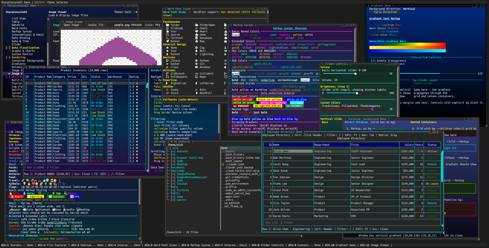

# ConsoleEx

<p align="center">
  
</p>

<p align="center">
  <a href="https://nickprotop.github.io/ConsoleEx/"></a>
  <a href="https://www.nuget.org/packages/SharpConsoleUI/"></a>
  <a href="https://www.nuget.org/packages/SharpConsoleUI/"></a>
  
  
  
</p>

**SharpConsoleUI** is a terminal GUI framework for .NET — not just a TUI library, but a full **retained-mode GUI framework** that targets the terminal as its display surface. Cross-platform (Windows, Linux, macOS).

The rendering engine follows the same architecture as desktop GUI frameworks like WPF and Avalonia: a **Measure → Arrange → Paint** layout pipeline, **double-buffered compositing** with occlusion culling, and a **unified cell pipeline** where ANSI never crosses layer boundaries. The terminal is just the rasterization target.

- **GUI-grade rendering engine** — DOM-based layout, three-level dirty tracking, occlusion culling, adaptive Cell/Line/Smart rendering modes
- **Multi-window with per-window threads** — each window updates independently without blocking others
- **Rich markup everywhere** — just `[bold red]text[/]` and it works, no complex styling APIs
- **Any Spectre.Console widget works as a control** — Tables, BarCharts, Trees, Panels — wrap any `IRenderable`
- **30+ built-in controls** — buttons, lists, trees, tables, text editors, dropdowns, menus, tabs, and more
- **Full Unicode & emoji support** — CJK, Arabic, Hebrew, Thai, Devanagari, combining marks, variation selectors, ZWJ sequences — accurate wcwidth-based cell measurement
- **Compositor effects** — PreBufferPaint/PostBufferPaint hooks for custom rendering, transitions, or even games
- **Alpha blending** — `Color.Transparent` control backgrounds composite against window gradients automatically; per-cell alpha in `CharacterBuffer` requires no extra work from control authors
- **MVVM-compatible** — all controls implement `INotifyPropertyChanged`; one-way and two-way data binding with `Bind()` / `BindTwoWay()`
- **Fluent builders** for windows, controls, and layouts

**Visit the project website: [nickprotop.github.io/ConsoleEx](https://nickprotop.github.io/ConsoleEx/)**

**New to SharpConsoleUI? Follow the [Getting Started Tutorials](docs/tutorials/README.md)**

**Browse examples with screenshots: [EXAMPLES.md](docs/EXAMPLES.md)**

## Showcase

[](https://www.youtube.com/watch?v=sl5C9jrJknM)

*Watch SharpConsoleUI in action on YouTube*


*Rich controls, multiple windows, smooth gradients, real-time updates, and full-screen capabilities*



*All demos running simultaneously: data grid, file explorer, image viewer, markup/colors, emoji, gradients, sliders, tables, containers, and more*

## Quick Start

```bash
dotnet add package SharpConsoleUI
```

```csharp
using SharpConsoleUI;
using SharpConsoleUI.Builders;
using SharpConsoleUI.Drivers;

var windowSystem = new ConsoleWindowSystem(new NetConsoleDriver(RenderMode.Buffer));

var window = new WindowBuilder(windowSystem)
    .WithTitle("Hello World")
    .WithSize(50, 15)
    .Centered()
    .WithColors(Color.White, Color.DarkBlue)
    .Build();

windowSystem.NotificationStateService.ShowNotification(
    "Welcome", "Hello World!", NotificationSeverity.Info);

windowSystem.AddWindow(window);
windowSystem.Run();
```

### Project Templates

```bash
dotnet new install SharpConsoleUI.Templates

dotnet new tui-app -n MyApp            # Starter app with list, button, notification
dotnet new tui-dashboard -n MyDash     # Fullscreen dashboard with tabs and live metrics
dotnet new tui-multiwindow -n MyApp    # Two windows with master-detail pattern

cd MyApp && dotnet run
```

### Desktop Distribution (schost)

Package your app so end users can double-click to launch — no terminal knowledge required.

Install schost from NuGet:

```bash
dotnet tool install -g SharpConsoleUI.Host
```

Then use it:

```bash
# Initialize terminal config for your project
schost init

# Launch in a configured terminal window (what the user will see)
schost run

# Package as portable zip + optional installer
schost pack --installer
```

schost opens your app in Windows Terminal (or Linux terminal emulator) with custom title, font, colors, and size. The app uses the real terminal — no compatibility layer. See the [schost guide](docs/SCHOST.md) for details.

## Controls Library (30+)

| Category | Controls |
|----------|----------|
| **Text & Display** | MarkupControl, FigleControl, RuleControl, SeparatorControl, SparklineControl, BarGraphControl, LogViewerControl |
| **Input** | ButtonControl, CheckboxControl, PromptControl, DropdownControl, MultilineEditControl |
| **Data** | ListControl, TreeControl, TableControl (interactive DataGrid with virtual data, sorting, editing), HorizontalGridControl |
| **Navigation** | MenuControl, ToolbarControl, TabControl, NavigationView |
| **Layout** | ColumnContainer, SplitterControl, ScrollablePanelControl, PanelControl |
| **Drawing** | CanvasControl, ImageControl (PNG/JPEG/BMP/GIF/WebP/TIFF via ImageSharp) |
| **Video** | VideoControl — terminal video playback via FFmpeg (half-block, ASCII, braille modes) |
| **Advanced** | SpectreRenderableControl (wraps any Spectre.Console `IRenderable`), ProgressBarControl, TerminalControl |

See the [Controls Reference](docs/CONTROLS.md) for detailed documentation on each control.

## Key Features

### Independent Window Threads

Each window can run with its own async thread, enabling true multi-threaded UIs:

```csharp
var clockWindow = new WindowBuilder(windowSystem)
    .WithTitle("Digital Clock")
    .WithSize(40, 12)
    .WithAsyncWindowThread(async (window, ct) =>
    {
        while (!ct.IsCancellationRequested)
        {
            var time = window.FindControl<MarkupControl>("time");
            time?.SetContent(new List<string> { $"[bold cyan]{DateTime.Now:HH:mm:ss}[/]" });
            await Task.Delay(1000, ct);
        }
    })
    .Build();
```

### Fluent Builders with Window Access

Event handlers include a `window` parameter for cross-control interaction via `FindControl<T>()`:

```csharp
window.AddControl(Controls.Button("Submit")
    .OnClick((sender, e, window) =>
    {
        var input = window.FindControl<PromptControl>("nameInput");
        var status = window.FindControl<MarkupControl>("status");
        status?.SetContent($"[green]Submitted:[/] {input?.Text}");
    })
    .Build());
```

### Built-in Services

```csharp
// Notifications
windowSystem.NotificationStateService.ShowNotification("Title", "Message", NotificationSeverity.Info);

// Panel status text
windowSystem.PanelStateService.TopStatus = "[bold]My App[/]";
windowSystem.PanelStateService.BottomStatus = "Ready";

// Debug logging (file-based, never console)
// export SHARPCONSOLEUI_DEBUG_LOG=/tmp/consoleui.log
windowSystem.LogService.LogAdded += (s, entry) => { /* handle */ };

// State services: Modal, Window, Theme, Cursor, etc.
// Focus is per-window: window.FocusManager.FocusedControl;
windowSystem.ModalStateService.HasModals;
```

### Themes & Plugins

```csharp
// Built-in themes with runtime switching
windowSystem.ThemeRegistry.SetTheme("ModernGray");

// Plugin system
windowSystem.PluginStateService.LoadPlugin<DeveloperToolsPlugin>();
```

### Compositor Effects

Direct buffer access for custom backgrounds, post-processing, and transitions:

```csharp
window.Renderer.PreBufferPaint += (buffer, dirty, clip) =>
{
    // Render custom background before controls
};

window.Renderer.PostBufferPaint += (buffer, dirty, clip) =>
{
    // Apply post-processing effects after controls
};
```

## Architecture

```
┌─────────────────────────────────────────────────────────────┐
│  Application Layer (Your Code)                              │
│  └── Window Builders, Event Handlers, Controls              │
├─────────────────────────────────────────────────────────────┤
│  Framework Layer                                            │
│  ├── Fluent Builders, State Services, Logging, Plugins      │
├─────────────────────────────────────────────────────────────┤
│  Layout Layer                                               │
│  ├── DOM Tree (LayoutNode) — Measure → Arrange → Paint      │
├─────────────────────────────────────────────────────────────┤
│  Rendering Layer                                            │
│  ├── Multi-pass compositor, occlusion culling, portals      │
├─────────────────────────────────────────────────────────────┤
│  Buffering Layer                                            │
│  ├── CharacterBuffer → ConsoleBuffer → adaptive diff output │
├─────────────────────────────────────────────────────────────┤
│  Driver Layer                                               │
│  ├── NetConsoleDriver (production) / Headless (testing)     │
│  └── Raw libc I/O (Unix) / Console API (Windows)            │
└─────────────────────────────────────────────────────────────┘
```

The native markup parser converts `[bold red]text[/]` directly into typed `Cell` structs — no ANSI intermediate format. Everything flows as cells through CharacterBuffer → ConsoleBuffer → terminal output.

## Projects Using SharpConsoleUI

<table>
  <tr>
    <td align="center" width="160"><a href="https://github.com/nickprotop/ServerHub"></a></td>
    <td><strong><a href="https://github.com/nickprotop/ServerHub">ServerHub</a></strong><br>TUI server monitoring and management dashboard for Linux. Real-time metrics, logs, and remote control from your terminal with 14 bundled widgets.</td>
  </tr>
  <tr>
    <td align="center" width="160"><a href="https://github.com/nickprotop/lazynuget"></a></td>
    <td><strong><a href="https://github.com/nickprotop/lazynuget">LazyNuGet</a></strong><br>TUI for managing NuGet packages across .NET solutions. Search, update, and manage dependencies with multi-source support and dependency trees.</td>
  </tr>
  <tr>
    <td align="center" width="160"><a href="https://github.com/nickprotop/lazydotide"></a></td>
    <td><strong><a href="https://github.com/nickprotop/lazydotide">LazyDotIDE</a></strong><br>Lightweight console-based .NET IDE with LSP IntelliSense, built-in terminal, and git integration. Works over SSH, in containers, anywhere you have a console.</td>
  </tr>
</table>

*Using SharpConsoleUI in your project? Open a PR to add it to this list!*

## Getting Started

```bash
git clone https://github.com/nickprotop/ConsoleEx.git
cd ConsoleEx
dotnet build
dotnet run --project Examples/DemoApp
```

## Documentation

| Guide | Description |
|-------|-------------|
| **[Tutorials](docs/tutorials/README.md)** | Step-by-step guides: Hello Window → Dashboard → Settings App |
| **[Examples Gallery](docs/EXAMPLES.md)** | All examples with screenshots |
| **[Fluent Builders](docs/BUILDERS.md)** | WindowBuilder and control builder APIs |
| **[Controls Reference](docs/CONTROLS.md)** | Complete guide to all 30+ UI controls |
| **[Markup Syntax](docs/MARKUP_SYNTAX.md)** | Markup tags, colors, decorations |
| **[Built-in Dialogs](docs/DIALOGS.md)** | File pickers, folder browsers |
| **[Configuration](docs/CONFIGURATION.md)** | System configuration reference |
| **[Themes](docs/THEMES.md)** | Built-in themes, custom themes, runtime switching |
| **[State Services](docs/STATE-SERVICES.md)** | Window state, focus, modal, notification services |
| **[Registry](docs/REGISTRY.md)** | Persistent hierarchical key-value storage |
| **[Plugins](docs/PLUGINS.md)** | Plugin architecture and development |
| **[Gradients & Alpha](docs/GRADIENTS.md)** | Gradient text, window backgrounds, transparent control compositing |
| **[Video Playback](docs/VIDEO_PLAYBACK.md)** | Terminal video player — FFmpeg decode, half-block/ASCII/braille modes |
| **[Compositor Effects](docs/COMPOSITOR_EFFECTS.md)** | Buffer manipulation and visual effects |
| **[DOM Layout System](docs/DOM_LAYOUT_SYSTEM.md)** | Layout engine internals |
| **[Rendering Pipeline](docs/RENDERING_PIPELINE.md)** | Rendering architecture details |
| **[Portal System](docs/PORTAL_SYSTEM.md)** | Floating portals and overlay system |
| **[Panel System](docs/PANELS.md)** | Configurable top/bottom panels with elements |
| **[Panels, Task Bar & Start Menu](docs/STATUS_SYSTEM.md)** | Task bar, Start Menu, performance metrics |
| **[Desktop Host (schost)](docs/SCHOST.md)** | Launch, package, and distribute TUI apps as desktop apps |

**API Reference**: [nickprotop.github.io/ConsoleEx](https://nickprotop.github.io/ConsoleEx/)

## License

MIT License — see [LICENSE.txt](LICENSE.txt).

## Acknowledgments

- [Spectre.Console](https://github.com/spectreconsole/spectre.console) integration via SpectreRenderableControl
- Unix raw I/O approach inspired by [Terminal.Gui v2](https://github.com/gui-cs/Terminal.Gui)

## Development Notes

SharpConsoleUI was initially developed manually with core windowing functionality and double-buffered rendering. The project evolved to include modern features (DOM-based layout system, fluent builders, plugin architecture, theme system) with AI assistance. Architectural decisions and feature design came from the project author, while AI generated code implementations based on those decisions.

---

**Made for the .NET console development community**
