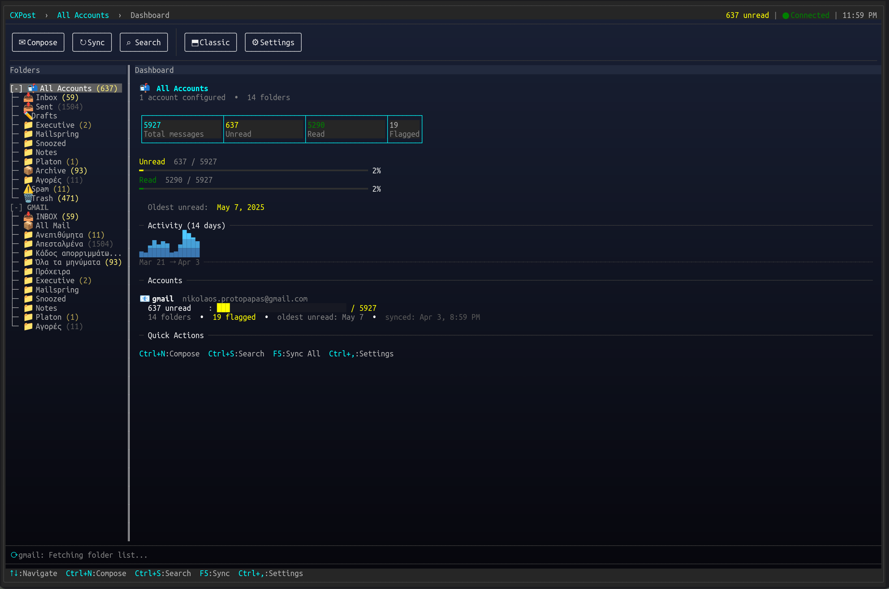
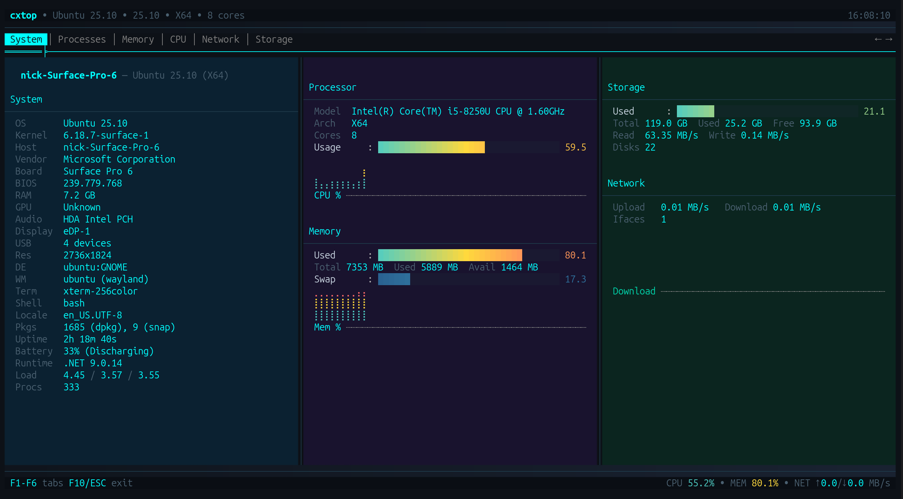
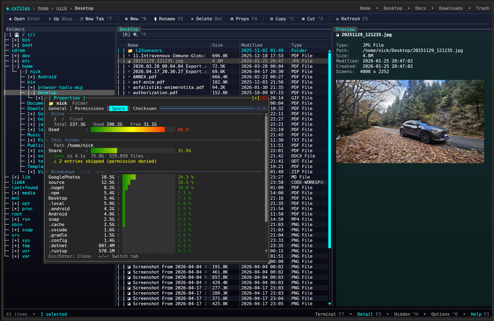

# SharpConsoleUI

<p align="center">
  
</p>

<p align="center">
  <a href="https://www.nuget.org/packages/SharpConsoleUI"></a>
  <a href="https://www.nuget.org/packages/SharpConsoleUI"></a>
  <a href="https://github.com/nickprotop/ConsoleEx/actions"></a>
  <a href="LICENSE.txt"></a>
  <a href="https://dotnet.microsoft.com"></a>
</p>

<p align="center">
  <a href="https://nickprotop.github.io/ConsoleEx/">Website</a> &nbsp;·&nbsp;
  <a href="https://nickprotop.github.io/ConsoleEx/docfx/_site/EXAMPLES.html">Examples</a> &nbsp;·&nbsp;
  <a href="https://nickprotop.github.io/ConsoleEx/docfx/_site/tutorials/README.html">Tutorials</a>
</p>

A terminal UI framework for .NET with a real compositor engine.

Per-cell alpha blending. Async windows. A portal system for dropdowns and overlays.
A plugin architecture. A video player.


[](https://www.youtube.com/watch?v=sl5C9jrJknM)

*Watch SharpConsoleUI in action on YouTube*

---

## What it is

SharpConsoleUI gives each window its own `CharacterBuffer`. A compositor merges
them — with occlusion culling, per-cell Porter-Duff alpha blending, and a
Measure→Arrange→Paint layout pipeline. Each window runs on its own async thread.
Gradient backgrounds propagate through every transparent control automatically.

Because rendering goes through a diff-based cell buffer rather than writing
directly to stdout, the output is equally clean over a local terminal or an
SSH connection — latency and flicker are determined by what actually changed,
not by a full-screen repaint.

This architecture makes things possible that other .NET terminal libraries
don't do: overlapping windows with drag/resize/minimize/maximize, animated
desktop backgrounds, a PTY-backed terminal emulator, video playback with Kitty
graphics + cell-based fallbacks, and compositor hooks for blur, fade, and custom
effects.

```
┌─────────────────────────────────────────────────────────────┐
│  Application Layer (Your Code)                              │
│  └── Window Builders, Event Handlers, Controls              │
├─────────────────────────────────────────────────────────────┤
│  Framework Layer                                            │
│  ├── Fluent Builders, State Services, Logging, Plugins      │
├─────────────────────────────────────────────────────────────┤
│  Layout Layer                                               │
│  ├── DOM Tree (LayoutNode) — Measure → Arrange → Paint      │
├─────────────────────────────────────────────────────────────┤
│  Rendering Layer                                            │
│  ├── Multi-pass compositor, occlusion culling, portals      │
├─────────────────────────────────────────────────────────────┤
│  Buffering Layer                                            │
│  ├── CharacterBuffer → ConsoleBuffer → adaptive diff output │
├─────────────────────────────────────────────────────────────┤
│  Driver Layer                                               │
│  ├── NetConsoleDriver (production) / Headless (testing)     │
│  └── Raw libc I/O (Unix) / Console API (Windows)            │
└─────────────────────────────────────────────────────────────┘
```

---

## Requirements

| Platform | Minimum version |
|----------|----------------|
| **.NET** | 8.0 or later |
| **Windows** | Windows 10 (1511+) / Server 2016+ |
| **Linux** | Any modern distribution with a terminal supporting 24-bit color |
| **macOS** | macOS 10.15+ |

---

## Quick start
```shell
dotnet add package SharpConsoleUI
```
```csharp
using SharpConsoleUI;
using SharpConsoleUI.Builders;
using SharpConsoleUI.Drivers;
using SharpConsoleUI.Panel;

var windowSystem = new ConsoleWindowSystem(
    new NetConsoleDriver(RenderMode.Buffer),
    options: new ConsoleWindowSystemOptions(
        BottomPanelConfig: panel => panel
            .Left(Elements.StartMenu())
            .Center(Elements.TaskBar())
            .Right(Elements.Clock())
    ));

var window = new WindowBuilder(windowSystem)
    .WithTitle("Hello")
    .WithSize(60, 20)
    .Centered()
    .WithBackgroundGradient(
        ColorGradient.FromColors(new Color(0, 20, 60), new Color(0, 5, 20)),
        GradientDirection.Vertical)
    .Build();

window.AddControl(Controls.Markup()
    .AddLine("[bold cyan]Real compositor. Full alpha blending.[/]")
    .AddLine("[#FF000080]This text has 50% alpha — composited over the gradient.[/]")
    .Build());

windowSystem.AddWindow(window);
windowSystem.Run();
```

Each window can run with its own async thread:

```csharp
var clockWindow = new WindowBuilder(windowSystem)
    .WithTitle("Digital Clock")
    .WithSize(40, 12)
    .WithAsyncWindowThread(async (window, ct) =>
    {
        while (!ct.IsCancellationRequested)
        {
            var time = window.FindControl<MarkupControl>("time");
            time?.SetContent(new List<string> { $"[bold cyan]{DateTime.Now:HH:mm:ss}[/]" });
            await Task.Delay(1000, ct);
        }
    })
    .Build();
```

### Project templates

```bash
dotnet new install SharpConsoleUI.Templates

dotnet new tui-app -n MyApp            # Starter app with list, button, notification
dotnet new tui-dashboard -n MyDash     # Fullscreen dashboard with tabs and live metrics
dotnet new tui-multiwindow -n MyApp    # Two windows with master-detail pattern

cd MyApp && dotnet run
```

### Desktop distribution (schost)

Package your app so end users can double-click to launch — no terminal knowledge required.

```bash
dotnet tool install -g SharpConsoleUI.Host
schost init        # Initialize terminal config
schost run         # Launch in a configured terminal window
schost pack --installer  # Package as portable zip + optional installer
```

See the [schost guide](https://nickprotop.github.io/ConsoleEx/docfx/_site/SCHOST.html) for details.

---

## Built with SharpConsoleUI

### CXPost — terminal email client



Multi-account IMAP/SMTP, conversation threading, HTML rendering, attachments, offline cache.
[github.com/nickprotop/cxpost](https://github.com/nickprotop/cxpost)

### cxtop — system monitor



ntop/btop-inspired. Hardware identity dashboard, sparkline graphs, process management. Cross-platform.
[github.com/nickprotop/cxtop](https://github.com/nickprotop/cxtop)

### LazyDotIDE — a .NET IDE in the terminal


LSP-powered IntelliSense, built-in PTY terminal, git integration.
Works over SSH and in containers.
[github.com/nickprotop/lazydotide](https://github.com/nickprotop/lazydotide)

### ServerHub — Linux server control panel


14 monitoring widgets. Real-time CPU, memory, disk, network, Docker, systemd.
[github.com/nickprotop/ServerHub](https://github.com/nickprotop/ServerHub)

### CXFiles — terminal file manager



Explorer-style three-pane layout with folder tree, file list, and detail panel. Tabs, image preview with Kitty graphics protocol, properties dialog, trash support.
[github.com/nickprotop/cxfiles](https://github.com/nickprotop/cxfiles)

### LazyNuGet — NuGet package manager TUI


lazygit-inspired. Browse, update, install, search NuGet.org. Cross-platform.
[github.com/nickprotop/lazynuget](https://github.com/nickprotop/lazynuget)

---

## What only SharpConsoleUI does

| Capability | Other .NET TUI libraries |
|---|---|
| Overlapping windows with drag, resize, minimize, maximize | Terminal.Gui v2 beta only |
| Per-cell Porter-Duff RGBA alpha blending | None |
| Gradient backgrounds propagating through controls | None |
| PreBufferPaint / PostBufferPaint compositor hooks | None |
| Per-window async threads | None |
| PTY-backed terminal emulator control | None |
| Video playback (Kitty graphics + half-block/ASCII/braille) | None |
| Animated desktop backgrounds | None |
| Portal system for dropdowns and overlays | None |
| Plugin architecture (themes, controls, windows, services) | None |

Full comparison with Terminal.Gui, Spectre.Console, and XenoAtom.Terminal.UI:
[nickprotop.github.io/ConsoleEx/docfx/_site/COMPARISON.html](https://nickprotop.github.io/ConsoleEx/docfx/_site/COMPARISON.html)

---

## Controls

30+ built-in controls including:

**Input:** Button, Checkbox, Prompt, MultilineEdit (with syntax highlighting),
Slider, RangeSlider, DatePicker, TimePicker, Dropdown, Menu, Toolbar

**Display:** MarkupControl (Spectre-compatible markup everywhere), FigletControl,
LogViewer, SpectreRenderableControl, LineGraph, SparklineControl, BarGraph

**Layout:** NavigationView (WinUI-inspired, responsive), TabControl,
HorizontalGrid, ScrollablePanel, SplitterControl, StatusBarControl

**Drawing:** CanvasControl (30+ primitives), ImageControl (Kitty graphics protocol + half-block fallback),
VideoControl (FFmpeg — Kitty graphics + half-block/ASCII/braille fallbacks), TerminalControl (PTY, Linux)

**Selection:** ListControl, TableControl (virtual data, 10k+ rows, sort, filter,
inline edit), TreeControl

Full reference: [nickprotop.github.io/ConsoleEx/docfx/_site/CONTROLS.html](https://nickprotop.github.io/ConsoleEx/docfx/_site/CONTROLS.html)

---

## Documentation

| | |
|---|---|
| [Get Started](https://nickprotop.github.io/ConsoleEx/docfx/_site/BUILDERS.html) | Fluent builder API reference |
| [Tutorials](https://nickprotop.github.io/ConsoleEx/docfx/_site/tutorials/README.html) | Three step-by-step tutorials |
| [Controls](https://nickprotop.github.io/ConsoleEx/docfx/_site/CONTROLS.html) | All 30+ controls |
| [Examples](https://nickprotop.github.io/ConsoleEx/docfx/_site/EXAMPLES.html) | 20+ runnable example projects |
| [Alpha Blending](https://nickprotop.github.io/ConsoleEx/docfx/_site/ALPHA_BLENDING.html) | Transparent windows & TransparencyBrush |
| [Compositor Effects](https://nickprotop.github.io/ConsoleEx/docfx/_site/COMPOSITOR_EFFECTS.html) | PreBufferPaint / PostBufferPaint |
| [Video Playback](https://nickprotop.github.io/ConsoleEx/docfx/_site/VIDEO_PLAYBACK.html) | VideoControl reference |
| [Panel System](https://nickprotop.github.io/ConsoleEx/docfx/_site/PANELS.html) | Taskbar, Start Menu, Clock |
| [Desktop Background](https://nickprotop.github.io/ConsoleEx/docfx/_site/DESKTOP_BACKGROUND.html) | Gradients, patterns, animations |
| [Plugins](https://nickprotop.github.io/ConsoleEx/docfx/_site/PLUGINS.html) | Extending the framework |
| [State Services](https://nickprotop.github.io/ConsoleEx/docfx/_site/STATE-SERVICES.html) | All 11 built-in services |
| [Themes](https://nickprotop.github.io/ConsoleEx/docfx/_site/THEMES.html) | Built-in and custom themes |
| [Comparison](https://nickprotop.github.io/ConsoleEx/docfx/_site/COMPARISON.html) | vs Terminal.Gui, Spectre.Console |
| [API Reference](https://nickprotop.github.io/ConsoleEx/docfx/_site/api/SharpConsoleUI.html) | Full API docs |

---

## License

MIT — [Nikolaos Protopapas](https://github.com/nickprotop)

## Acknowledgments

- [Spectre.Console](https://github.com/spectreconsole/spectre.console) integration via SpectreRenderableControl
- Unix raw I/O approach inspired by [Terminal.Gui v2](https://github.com/gui-cs/Terminal.Gui)

## Development Notes

SharpConsoleUI was initially developed manually with core windowing functionality and double-buffered rendering. The project evolved to include modern features (DOM-based layout system, fluent builders, plugin architecture, theme system) with AI assistance. Architectural decisions and feature design came from the project author, while AI generated code implementations based on those decisions.
