# SharpConsoleUI Examples

This document provides an overview of all example applications demonstrating SharpConsoleUI capabilities.

## Quick Start

Run any example with:
```bash
dotnet run --project Examples/<ExampleName>
```

---

## 🏆 Real-World Applications

### ServerHub
Production-ready Linux server control panel built with SharpConsoleUI.

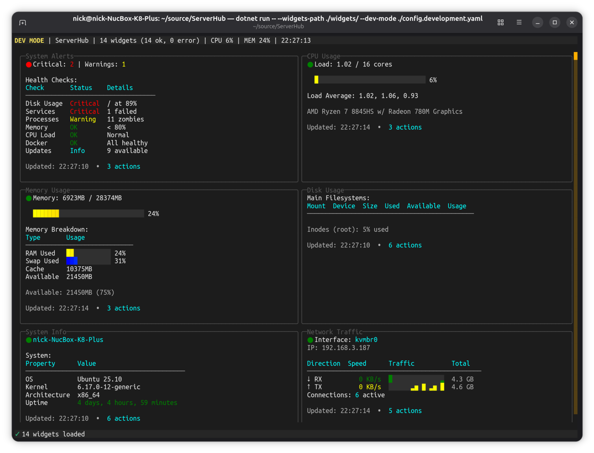

**Project:** [github.com/nickprotop/ServerHub](https://github.com/nickprotop/ServerHub)

**Description:** Terminal-based control panel for Linux servers and homelabs with 14 bundled widgets for monitoring CPU, memory, disk, network, Docker containers, systemd services, and more.

**Key Features:**
- Real-time system monitoring dashboard
- Widget-based architecture with 14 built-in widgets
- Network traffic visualization with historical trends
- Widget browser with search and filtering
- Custom widget support (any language)
- Context-aware actions system

**Screenshots:**

| Main Dashboard | Network Traffic | Widget Browser |
|----------------|-----------------|----------------|
|  | 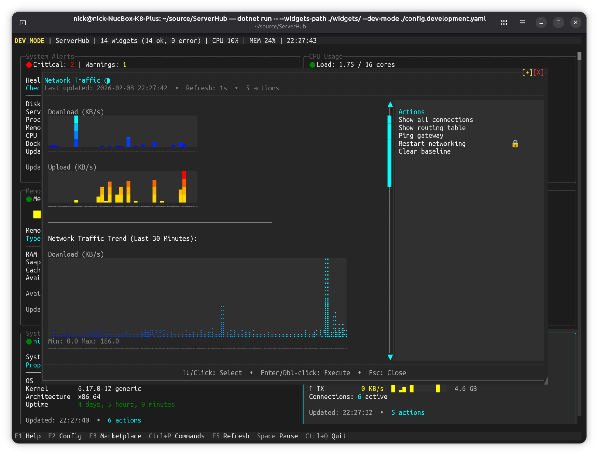 | 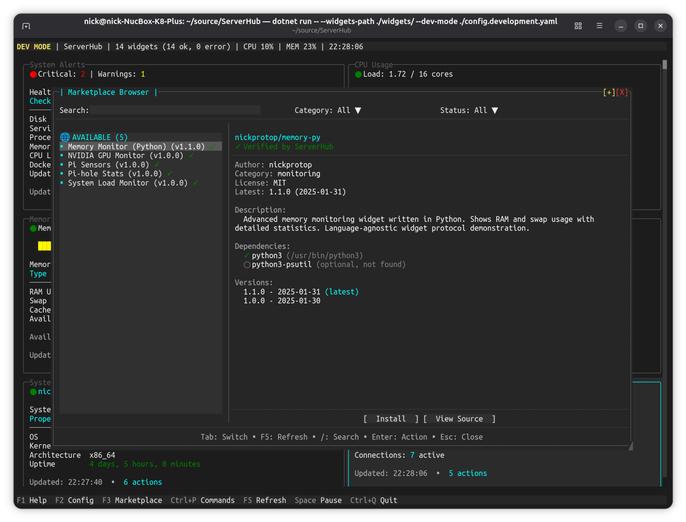 |

**What it demonstrates:**
- SharpConsoleUI powering a production application
- Complex multi-widget dashboard layouts
- Real-time data visualization with sparklines
- Professional UI/UX in a TUI environment

---

## Examples by Category

### 🎮 Interactive Applications

#### SnakeGame
Classic Snake game demonstrating direct frame buffer manipulation.

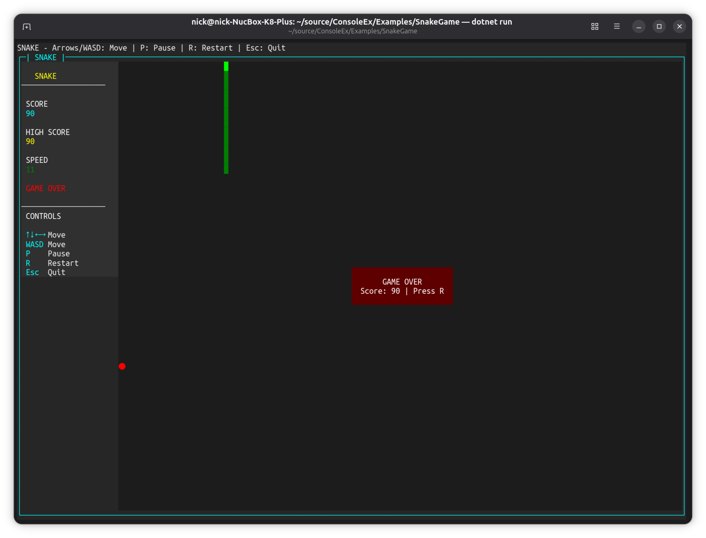

```bash
dotnet run --project Examples/SnakeGame
```

**Key Features:**
- Direct `CharacterBuffer` manipulation via `PostBufferPaint`
- Real-time game loop with `System.Timers.Timer`
- Sidebar layout using `HorizontalGridControl`
- Keyboard input handling (arrows/WASD)
- Game state management (playing, paused, game over)

**Controls:** Arrow keys or WASD to move, P to pause, R to restart, Esc to quit

---

#### AgentStudio
OpenCode-inspired TUI showcase demonstrating an AI coding agent interface aesthetic.

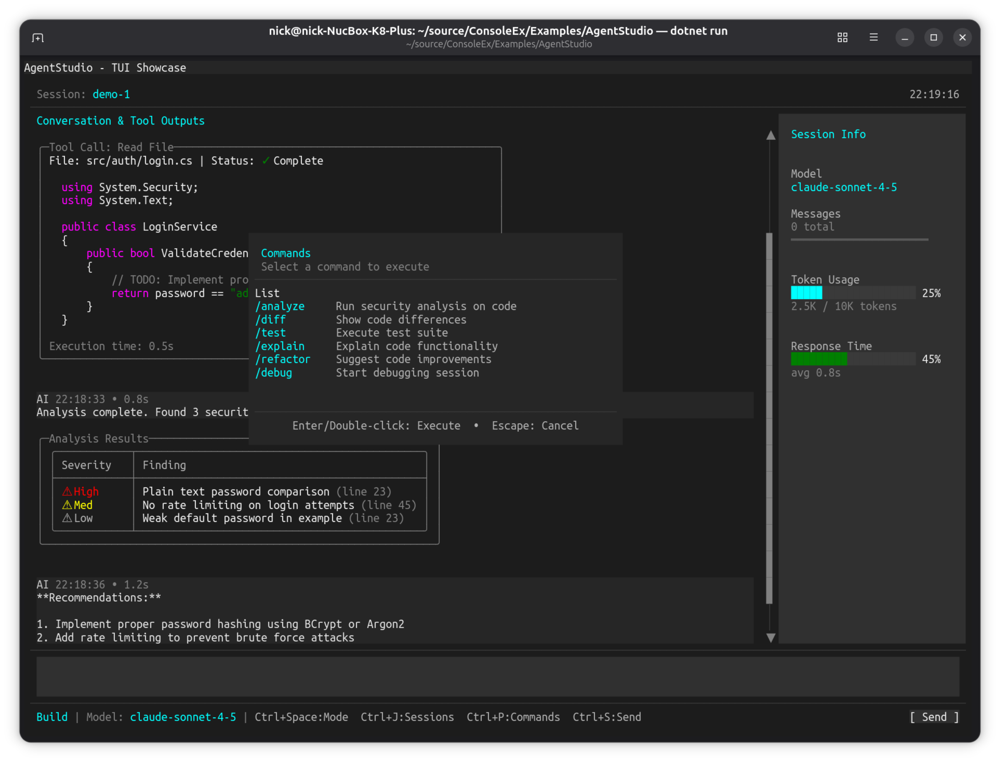

```bash
dotnet run --project Examples/AgentStudio
```

**Key Features:**
- Modern TUI design patterns
- Advanced `NetConsoleDriverOptions` configuration
- Hidden status bars for immersive experience
- Custom window class implementation

---

### 📊 Dashboards & Monitoring

#### ConsoleTopExample
ntop/btop-inspired live system monitoring dashboard.

| Processes | Memory | CPU |
|-----------|--------|-----|
| 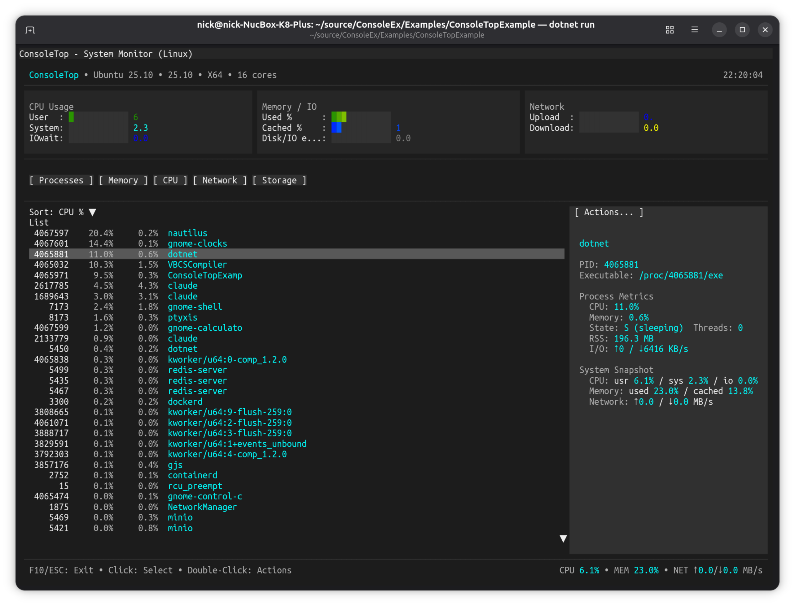 | 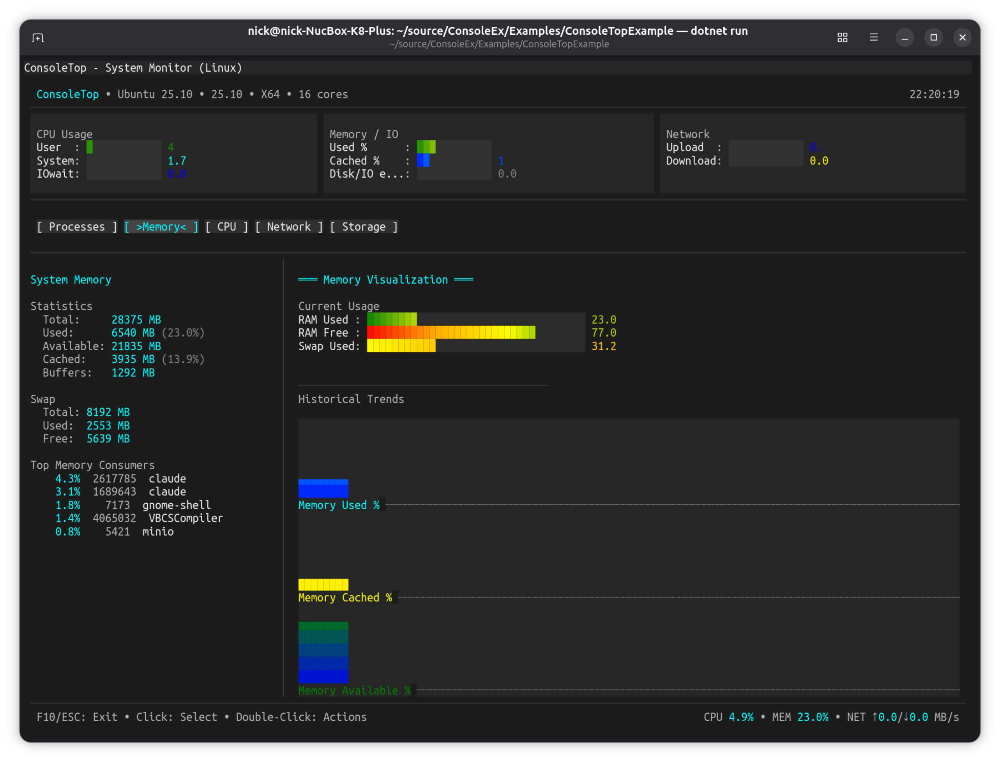 | 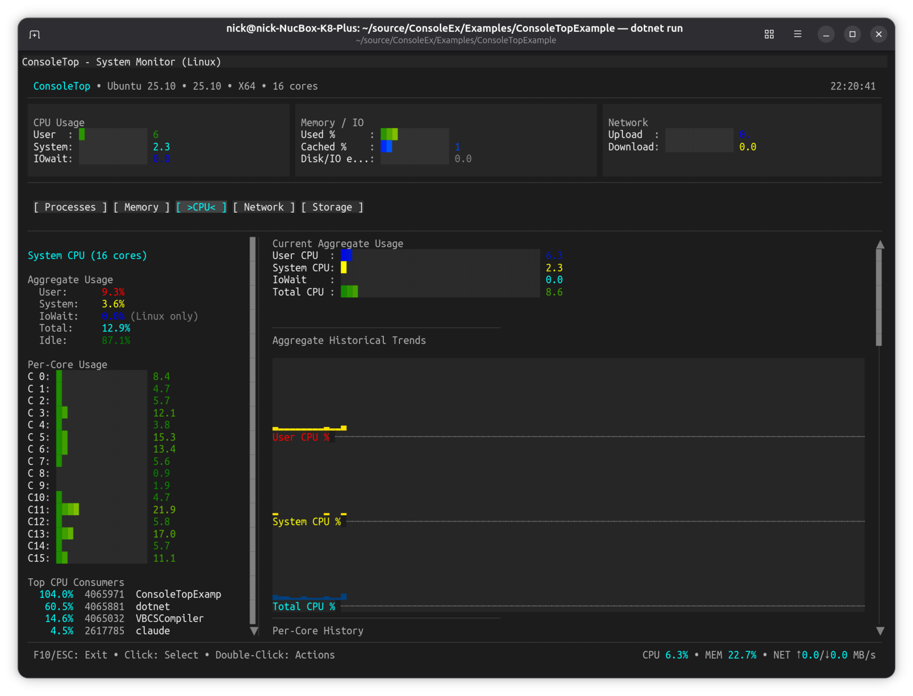 |

| Network | Storage |
|---------|---------|
| 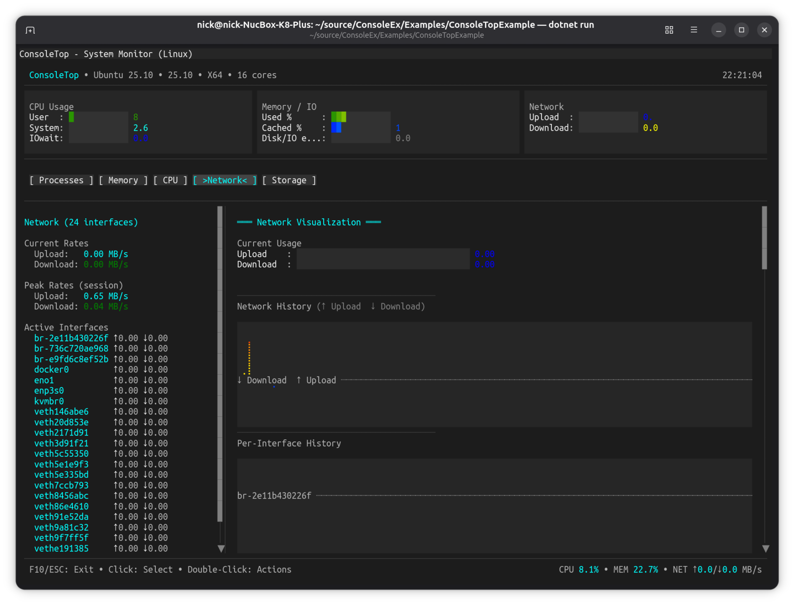 | 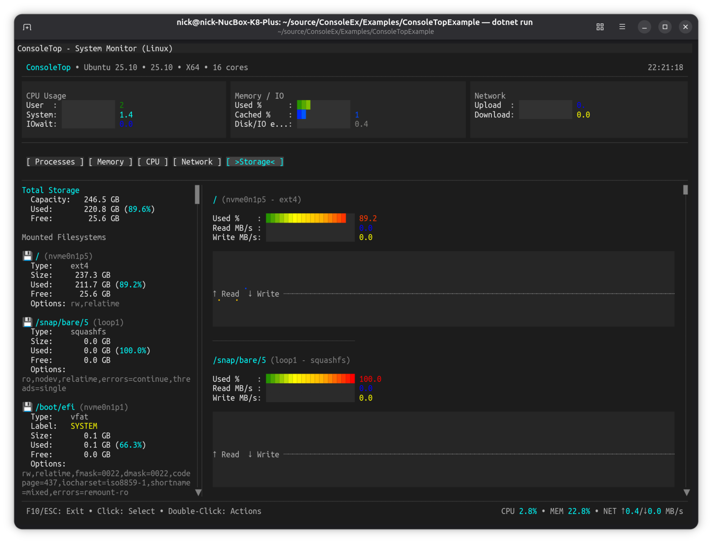 |

```bash
dotnet run --project Examples/ConsoleTopExample
```

**Key Features:**
- Full-screen maximized window
- Real-time system stats (CPU, memory, network, disk)
- Tab-based navigation (Processes, Memory, CPU, Network, Storage)
- Sparkline graphs with history
- Process list with sorting
- Cross-platform system stats provider

**Controls:** Tab keys to switch panels, arrow keys to navigate, Esc to quit

---

#### MultiDashboard
Showcases multiple windows with independent async update threads.

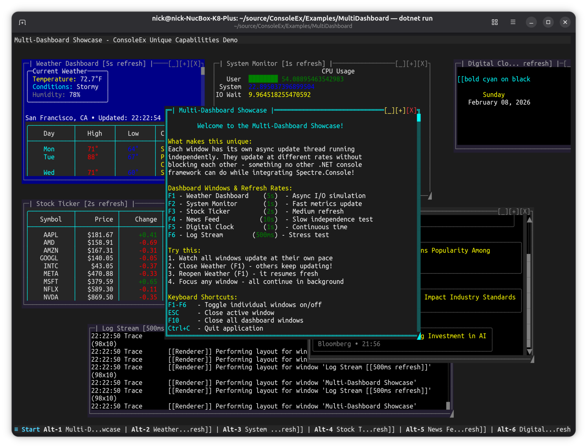

```bash
dotnet run --project Examples/MultiDashboard
```

**Key Features:**
- 6 independent dashboard windows updating at different rates
- Weather (5s), System Monitor (1s), Stock Ticker (2s), News (10s), Clock (1s), Log Stream (500ms)
- Demonstrates async window threads with `IDisposable` pattern
- Window toggle functionality (F1-F6)

**What makes it unique:** Each window has its own async update thread running independently - something no other .NET console framework can do while integrating Spectre.Console.

---

#### HighFreqDemo
Multi-frequency update showcase with various control update rates.

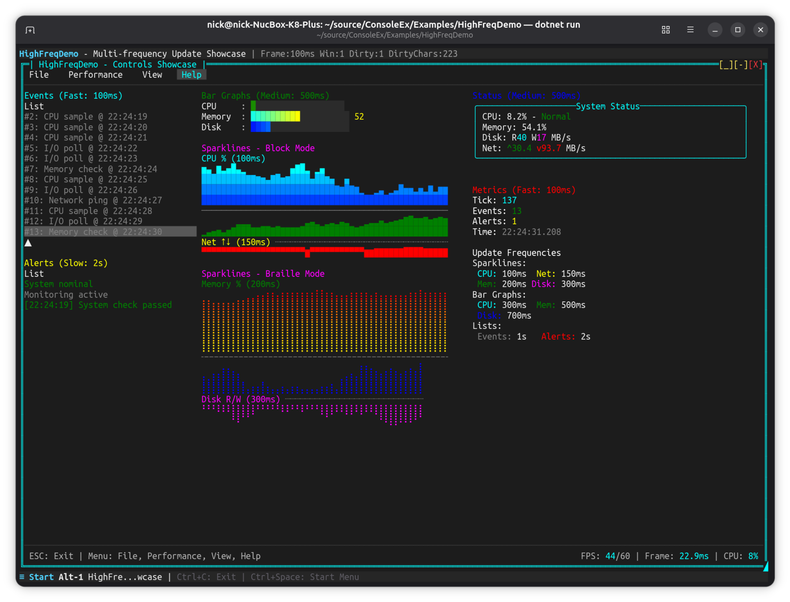

```bash
dotnet run --project Examples/HighFreqDemo
```

**Key Features:**
- Controls updating at different frequencies (100ms to 2s)
- Sparkline controls (Block, Braille, Bidirectional modes)
- Bar graph controls with smooth gradients
- ListControl for events and alerts
- Performance metrics overlay
- Menu system with frame rate controls

---

### 🎨 Visual Effects

#### CompositorEffectsExample
Demonstrates compositor-style buffer manipulation capabilities.

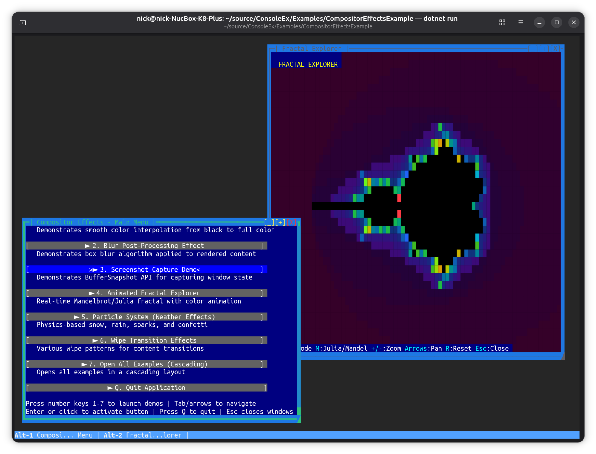

```bash
dotnet run --project Examples/CompositorEffectsExample
```

**Key Features:**
- **Fade-In Effect:** Smooth color interpolation using `PostBufferPaint`
- **Blur Effect:** Box blur post-processing algorithm
- **Screenshot Capture:** `BufferSnapshot` API for capturing window state
- **Fractal Explorer:** Animated Mandelbrot/Julia fractals using `PreBufferPaint`

**APIs Demonstrated:**
- `PreBufferPaint` - Custom backgrounds rendered before controls
- `PostBufferPaint` - Post-processing effects after controls
- `BufferSnapshot` - Immutable buffer captures

---

#### FrameRateDemo
Frame rate control and performance metrics demonstration.

```bash
dotnet run --project Examples/FrameRateDemo
```

**Key Features:**
- Adjustable target FPS (15, 30, 60, 120, 144)
- Frame rate limiting toggle
- Performance metrics display
- Rotating bar animation to visualize rendering speed
- Real-time FPS, frame time, and dirty chars display

**Controls:** 1-5 to set FPS, E/D to enable/disable limiting, M to toggle metrics

---

#### FigletShowcaseExample
ASCII art font showcase demonstrating Figlet font rendering.

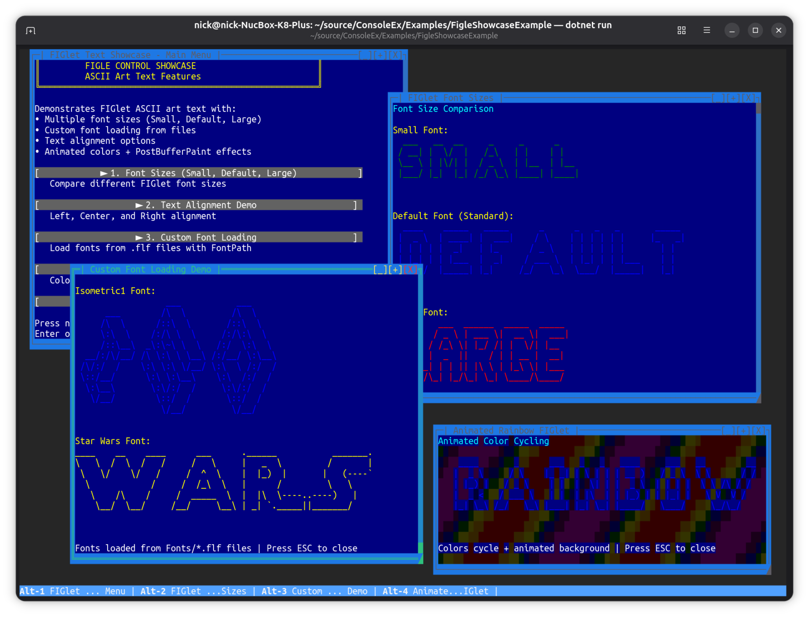

```bash
dotnet run --project Examples/FigleShowcaseExample
```

**Key Features:**
- Multiple Figlet ASCII art fonts (Star Wars, Graffiti, etc.)
- Font size comparison demo
- Color cycling with animated background
- Direct font loading from FLF (FigletFont) files
- Text alignment and positioning options

**Controls:** Number keys to switch examples, Esc to close

---

### 🖱️ Controls & Interactions

#### DemoApp
Comprehensive demo showcasing all major SharpConsoleUI features.

```bash
dotnet run --project Examples/DemoApp
```

**Key Features:**
- Fluent `WindowBuilder` pattern
- Multiple window types (Log, System Info, Clock, File Explorer, Command, etc.)
- `LogViewerControl` with real-time updates
- `TreeControl` for file system navigation
- `DropdownControl` with styled items
- `ListControl` with selection handling
- Async window threads with `CancellationToken`
- Theme switching

**Windows Available:** F1-F9 to open various demo windows

---

#### MenuDemo
Full-featured horizontal menu bar with keyboard and mouse support.


```bash
dotnet run --project Examples/MenuDemo
```

**Key Features:**
- Horizontal menu bar with unlimited nesting depth
- Full keyboard navigation (arrows, Enter, Escape, Home/End, letter keys)
- Complete mouse support (click, hover, delayed submenu opening)
- Separators and keyboard shortcut display
- Fluent `Controls.Menu()` builder API

---

#### StartMenuDemo
Windows-like Start menu system demonstration.

```bash
dotnet run --project Examples/StartMenuDemo
```

**Key Features:**
- Start button in status bar (☰ Start)
- Categorized menu items (File, Tools, Windows)
- Plugin integration (DeveloperTools)
- System actions (Theme, Settings, About)
- Window list in Start menu
- `PanelControl` with various border styles

**Controls:** Ctrl+Space or click Start button to open menu

---

#### TableDemo
TableControl with theme support demonstration.

```bash
dotnet run --project Examples/TableDemo
```

**Key Features:**
- Read-only tabular data display
- Fluent builder API with column justification
- Theme switching (F1=ModernGray, F2=Classic, F3=DevDark)
- Markup support in cells
- Rounded borders

---

#### PanelDemo
PanelControl mouse event handling demonstration.

```bash
dotnet run --project Examples/PanelDemo
```

**Key Features:**
- Panel mouse events (click, double-click, enter, leave, move)
- Event handling vs. bubbling behavior
- Multiple border styles (Rounded, DoubleLine)
- Real-time event status display

---

#### SpectreMouseExample
Mouse event support for SpectreRenderableControl.

```bash
dotnet run --project Examples/SpectreMouseExample
```

**Key Features:**
- Click, double-click, enter, leave, and move events
- Event counter statistics
- Fluent `SpectreRenderableControl.Create()` builder
- Interactive Spectre.Console Panel with mouse handling

---

#### TextEditorExample
Multiline text editor with syntax highlighting and file browser.

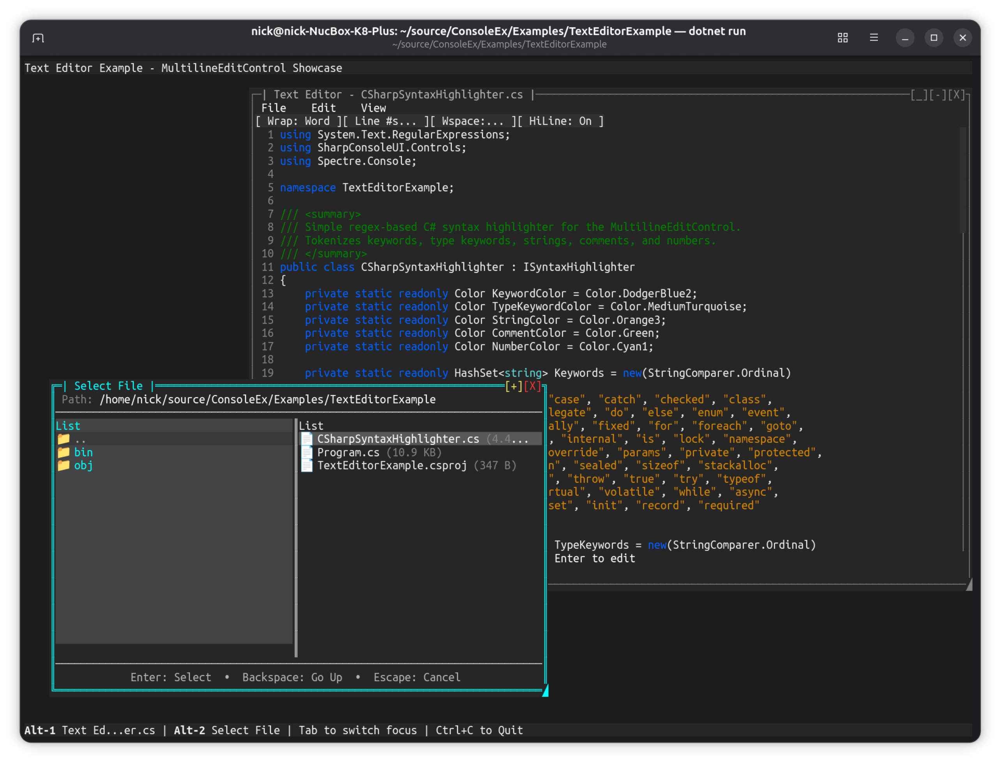

```bash
dotnet run --project Examples/TextEditorExample
```

**Key Features:**
- Multiline edit control with scrolling
- File browser dialog integration
- Syntax highlighting support
- Save/load functionality
- Line numbers and cursor position

**Controls:** Ctrl+O to open file, Ctrl+S to save, arrow keys to navigate

---

### 🪟 Window Features

#### FullScreenExample
Kiosk-style full-screen window mode demonstration.

```bash
dotnet run --project Examples/FullScreenExample
```

**Key Features:**
- Maximized window filling entire console
- Disabled resize, move, close, minimize, maximize
- Hidden taskbar for true full-screen
- Interactive buttons and status display

**Use Cases:** Kiosk applications, game interfaces, terminal dashboards, embedded UIs

---

#### BorderStyleDemo
Window border style demonstration.

```bash
dotnet run --project Examples/BorderStyleDemo
```

**Key Features:**
- `BorderStyle.DoubleLine` - Classic double-line border (default)
- `BorderStyle.None` - Borderless window
- Runtime border style toggling
- `WindowBuilder.Borderless()` convenience method

---

### 🔌 Plugin System

#### PluginShowcaseExample
DeveloperTools plugin demonstration using agnostic service pattern.

```bash
dotnet run --project Examples/PluginShowcaseExample
```

**Key Features:**
- Plugin loading with `LoadPlugin<T>()`
- DevDark theme from plugin
- Debug Console window creation
- LogExporter control usage
- Agnostic `IPluginService` pattern (no shared interfaces required)
- Service discovery and parameterized operations
- Log level dropdown control

---

## Feature Matrix

| Example | Async Windows | Buffer Paint | Mouse Events | Themes | Plugins | Games |
|---------|--------------|--------------|--------------|--------|---------|-------|
| DemoApp | ✅ | | | ✅ | | |
| StartMenuDemo | | | ✅ | | ✅ | |
| FullScreenExample | | | ✅ | | | |
| BorderStyleDemo | | | | | | |
| ConsoleTopExample | ✅ | | | | | |
| TableDemo | | | | ✅ | | |
| SpectreMouseExample | | | ✅ | | | |
| AgentStudio | | | | | | |
| MenuDemo | | | ✅ | | | |
| MultiDashboard | ✅ | | | | | |
| PluginShowcaseExample | | | | ✅ | ✅ | |
| HighFreqDemo | ✅ | | | | | |
| FrameRateDemo | | | | | | |
| PanelDemo | | | ✅ | | | |
| SnakeGame | | ✅ | | | | ✅ |
| CompositorEffectsExample | ✅ | ✅ | | ✅ | | |
| TextEditorExample | | | | | | |
| FigletShowcaseExample | | | | | | |

---

## Controls Demonstrated

| Control | Examples |
|---------|----------|
| `MarkupControl` | All examples |
| `ButtonControl` | DemoApp, FullScreenExample, CompositorEffectsExample |
| `ListControl` | DemoApp, HighFreqDemo |
| `TreeControl` | DemoApp (File Explorer) |
| `DropdownControl` | DemoApp, PluginShowcaseExample |
| `MenuControl` | MenuDemo, HighFreqDemo |
| `TableControl` | TableDemo |
| `PanelControl` | StartMenuDemo, PanelDemo, HighFreqDemo |
| `SparklineControl` | ConsoleTopExample, HighFreqDemo |
| `BarGraphControl` | HighFreqDemo |
| `ProgressBarControl` | DemoApp |
| `PromptControl` | DemoApp (Command Window) |
| `MultilineEditControl` | DemoApp, TextEditorExample |
| `LogViewerControl` | DemoApp |
| `HorizontalGridControl` | Most examples |
| `SpectreRenderableControl` | SpectreMouseExample |

---

## API Patterns Demonstrated

### Fluent Builders
```csharp
// WindowBuilder
new WindowBuilder(windowSystem)
    .WithTitle("My Window")
    .WithSize(80, 25)
    .Centered()
    .Closable(true)
    .Build();

// Controls fluent API
Controls.Menu().Horizontal().AddItem("File", ...).Build();
Controls.Markup().AddLine("[bold]Hello[/]").Build();
Controls.List().MaxVisibleItems(10).Build();
```

### Async Window Threads
```csharp
new WindowBuilder(windowSystem)
    .WithAsyncWindowThread(async (window, ct) => {
        while (!ct.IsCancellationRequested) {
            // Update window content
            await Task.Delay(1000, ct);
        }
    })
    .Build();
```

### Buffer Paint Hooks
```csharp
// PreBufferPaint - Custom backgrounds
window.Renderer.PreBufferPaint += (buffer, dirty, clip) => {
    // Render background before controls
};

// PostBufferPaint - Post-processing effects
window.Renderer.PostBufferPaint += (buffer, dirty, clip) => {
    // Apply effects after controls render
};
```

### Plugin Services
```csharp
// Load plugin
windowSystem.PluginStateService.LoadPlugin<DeveloperToolsPlugin>();

// Create window from plugin
var window = windowSystem.PluginStateService.CreateWindow("DebugConsole");

// Use service (agnostic pattern)
var service = windowSystem.PluginStateService.GetService("Diagnostics");
var result = service.Execute("GetDiagnosticsReport");
```

---

## Running All Examples

To build and verify all examples compile:
```bash
dotnet build ConsoleEx.sln
```

Each example is a standalone project that can be run independently.
