# SharpConsoleUI Examples

This document provides an overview of all example applications demonstrating SharpConsoleUI capabilities.

## Video Demo

[](https://www.youtube.com/watch?v=sl5C9jrJknM)

*Watch SharpConsoleUI examples in action on YouTube*

## Quick Start

Run any example with:
```bash
dotnet run --project Examples/<ExampleName>
```

---

## Real-World Applications

Production applications built with SharpConsoleUI.

### ServerHub
Production-ready Linux server control panel.

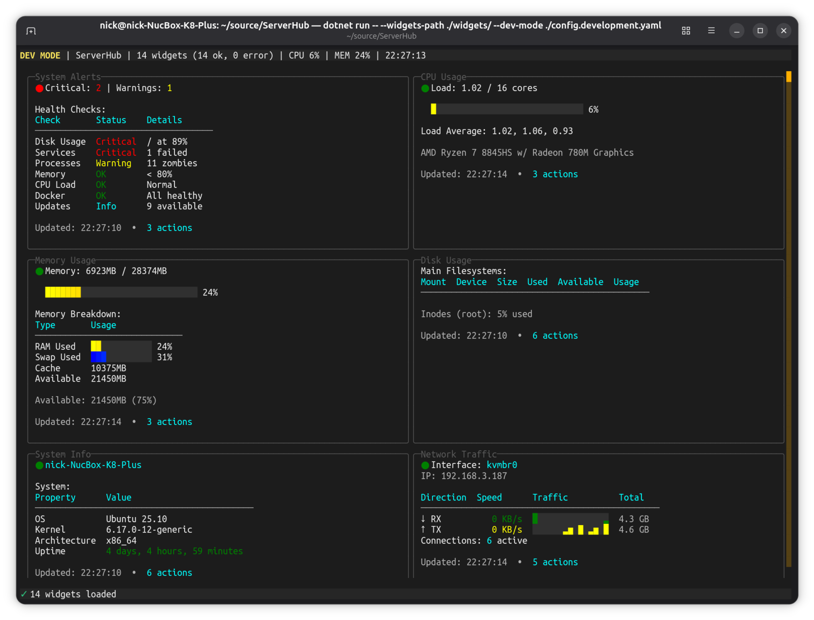

**Project:** [github.com/nickprotop/ServerHub](https://github.com/nickprotop/ServerHub)

Terminal-based control panel for Linux servers and homelabs with 14 bundled widgets for monitoring CPU, memory, disk, network, Docker containers, systemd services, and more.

**Key Features:**
- Real-time system monitoring dashboard
- Widget-based architecture with 14 built-in widgets
- Network traffic visualization with historical trends
- Widget browser with search and filtering
- Custom widget support (any language)
- Context-aware actions system

| Main Dashboard | Network Traffic | Widget Browser |
|----------------|-----------------|----------------|
|  | 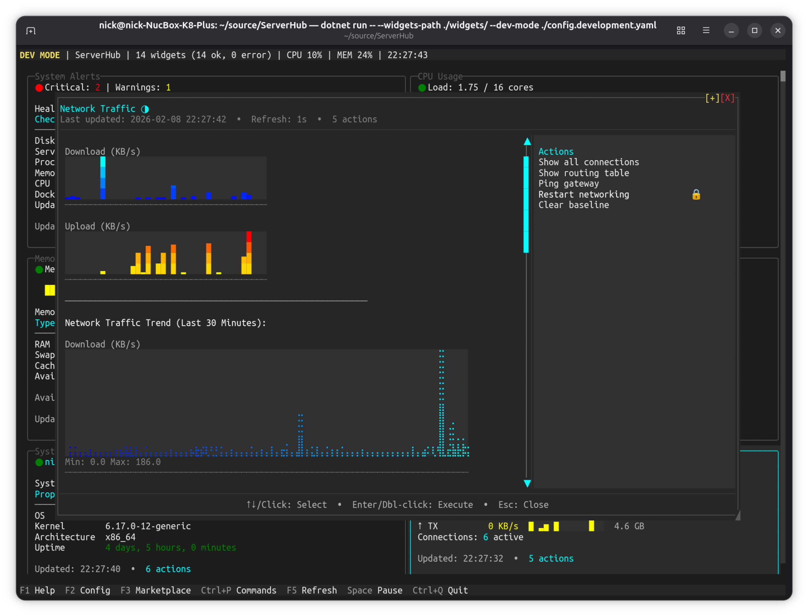 | 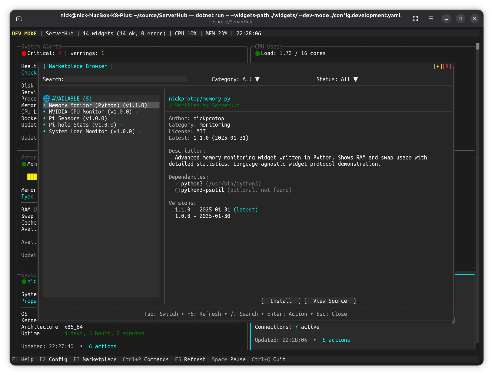 |

---

### LazyNuGet
A lazygit-inspired terminal UI for managing NuGet packages across .NET solutions.

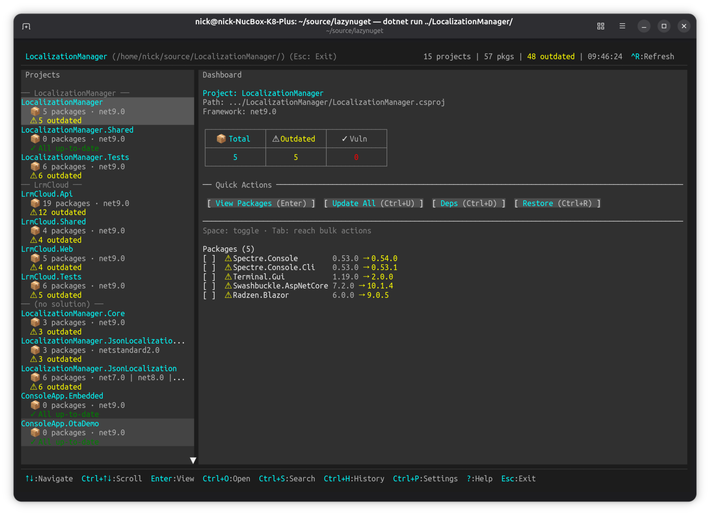

**Project:** [github.com/nickprotop/lazynuget](https://github.com/nickprotop/lazynuget)

Keyboard-driven TUI for browsing projects, checking for updates, installing/removing/updating packages, searching NuGet.org, and managing multiple package sources. Cross-platform (Windows, Linux, macOS).

**Key Features:**
- Interactive dashboard with project and package browsing
- NuGet.org search with package details and dependency trees
- Update strategies (latest stable, latest including prerelease, by constraint)
- Multi-source support with credential management
- CPM (Central Package Management) migration wizard
- Operation history with undo support

| Dashboard | Search NuGet.org | Dependency Tree |
|-----------|-----------------|-----------------|
|  | 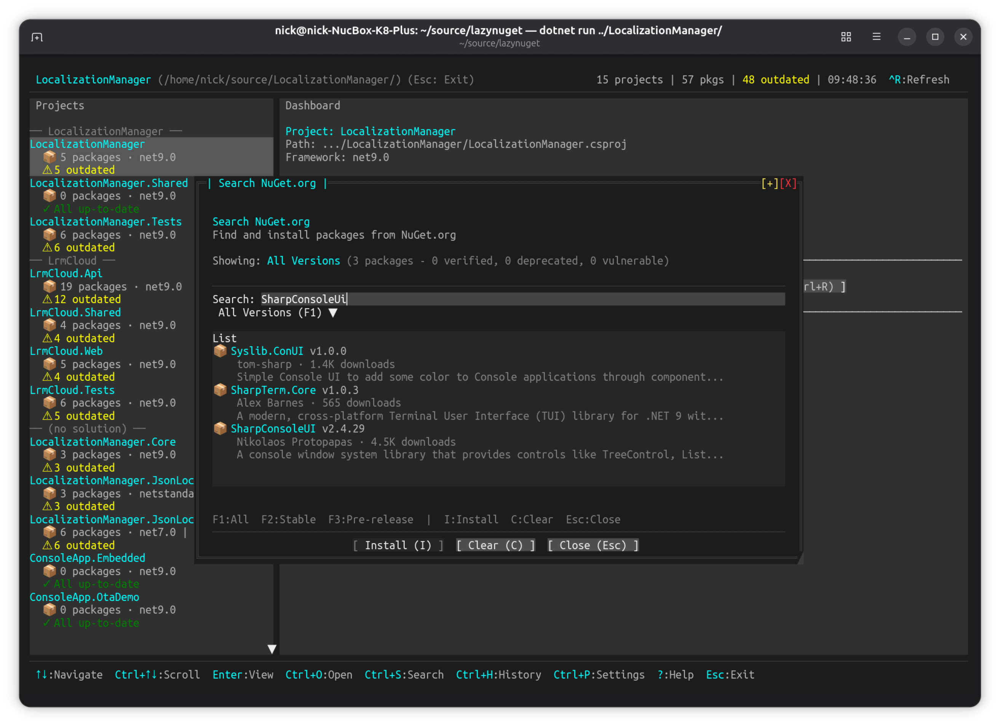 | 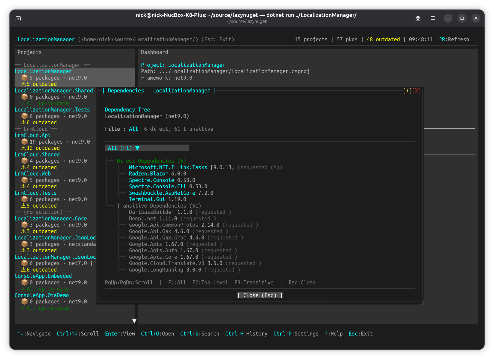 |

---

### LazyDotIDE
A lightweight console-based .NET IDE with LSP IntelliSense.

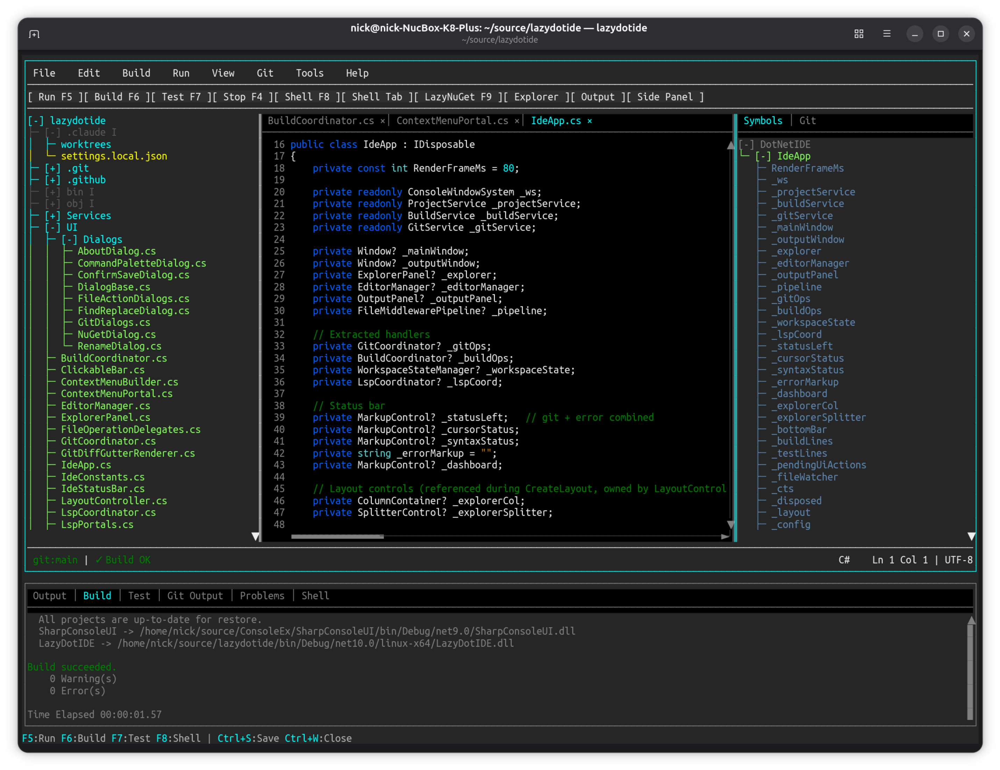

**Project:** [github.com/nickprotop/lazydotide](https://github.com/nickprotop/lazydotide)

Console-based .NET IDE with LSP-powered IntelliSense, built-in terminal, and git integration. Works over SSH, in containers, anywhere you have a console.

**Key Features:**
- LSP IntelliSense with code completion and diagnostics
- Built-in terminal emulator (PTY-based)
- Git integration with commit dialog and change tracking
- Multi-file editing with tab navigation
- Works over SSH and in containers

| Editor + IntelliSense | Git Integration |
|----------------------|-----------------|
| 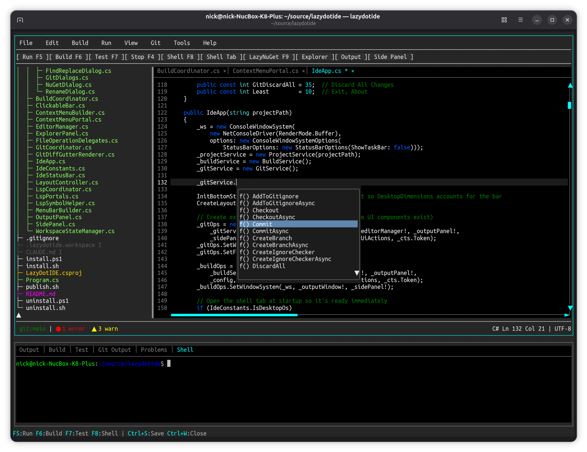 | 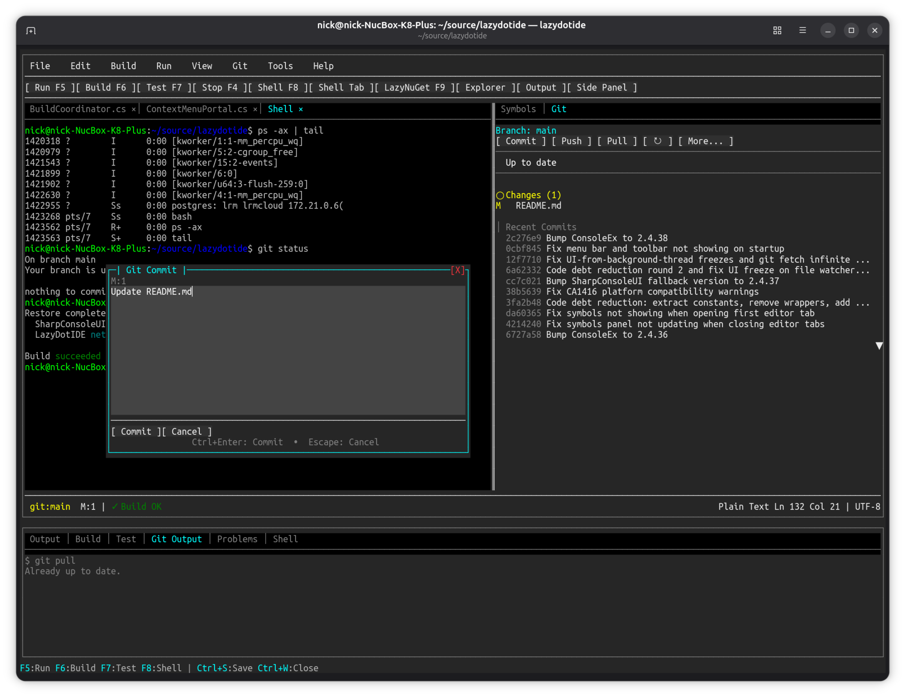 |

---

## Showcase Examples

The best visual demonstrations of SharpConsoleUI capabilities, ordered by impact.

### DemoApp
The flagship demo — six independent windows running simultaneously.

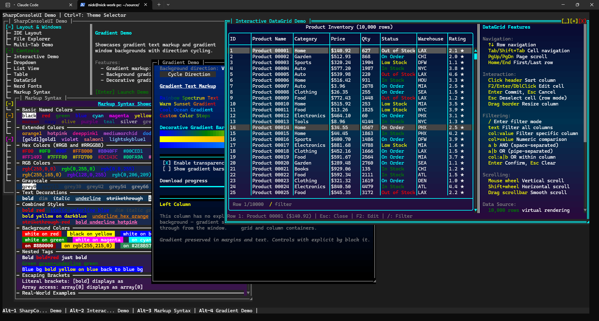

```bash
dotnet run --project Examples/DemoApp
```

**Key Features:**
- Six independent windows running simultaneously (Terminal, Canvas, DataGrid, System Info, Image Viewer, and the launcher)
- `TerminalControl` with PTY-backed shell
- `CanvasControl` with interactive starfield and plasma effects
- `TableControl` (DataGrid) with 10,000 virtual rows, sorting, filtering, and cell editing
- `ImageControl` rendering images directly in the terminal
- Full markup syntax showcase with colors, decorations, and gradients
- Async window threads with `CancellationToken`
- Theme switching and window taskbar navigation

**Controls:** Ctrl+O to open demo windows, Alt+1-6 to switch

| Markup, Gradients & International Text | File Explorer, DataGrid & Package Manager | NavigationView Launcher |
|----------------------------------------|--------------------------------------------|-------------------------|
| 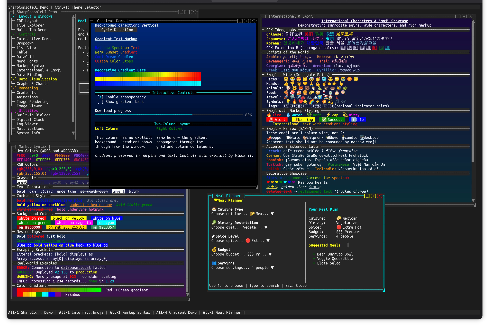 | 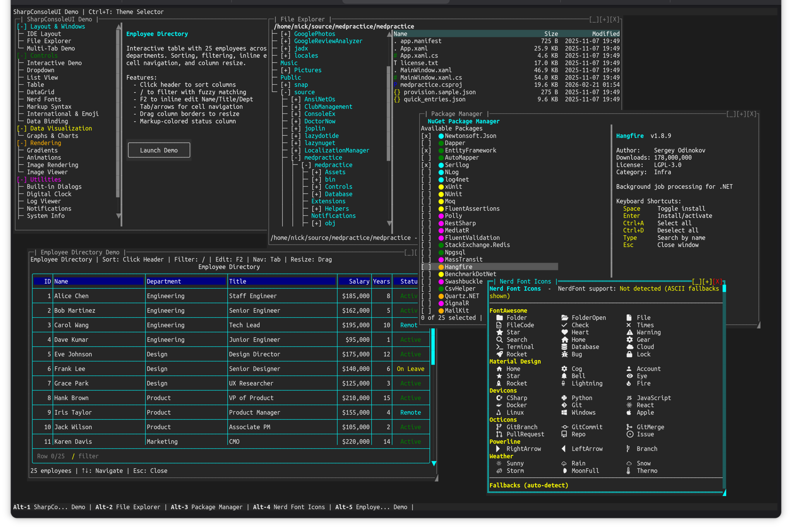 | 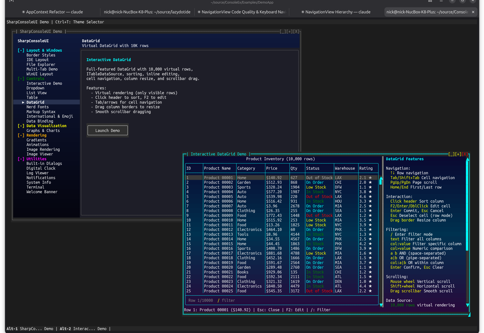 |

---

### NavigationViewDemo
Full-screen desktop-style application using the NavigationView pattern — the same sidebar + content layout found in native GUI frameworks like WinUI, GTK, and Qt.

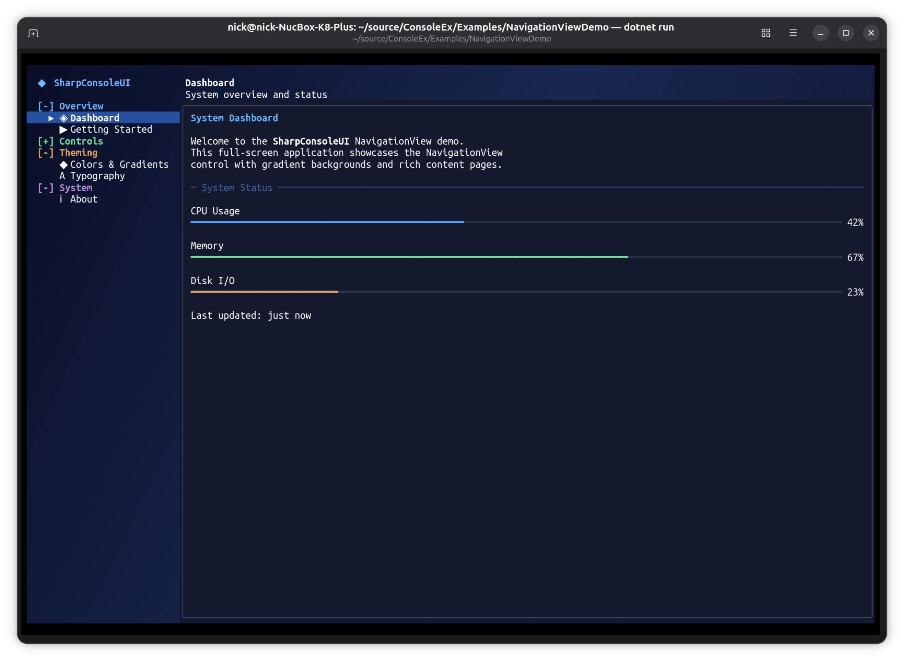

```bash
dotnet run --project Examples/NavigationViewDemo
```

This example demonstrates that SharpConsoleUI applications aren't limited to traditional terminal utilities. The NavigationView pattern produces applications that look and behave like native desktop software — with a navigation sidebar, content switching, gradient backgrounds, and rich interactive controls — the only difference is that every pixel is a character cell rendered in the terminal.

**Key Features:**
- Full-screen borderless window with diagonal gradient background
- **Responsive NavigationView** with WinUI-inspired display modes (Expanded, Compact, Minimal)
- NavigationView with collapsible header groups and content switching
- 9 content pages: Dashboard, Getting Started, Buttons & Inputs, Lists & Trees, Data Visualization, Layout, Colors & Gradients, Typography, About
- Interactive controls: progress bars, sparklines, bar graphs, checkboxes, buttons, lists, trees, text input
- Keyboard-driven navigation (Tab, arrows, Enter) and mouse support
- Works on Windows, Linux, and macOS — anywhere you have a terminal

#### Responsive Navigation

The NavigationView automatically adapts to the terminal width — full nav pane at wide sizes, icon-only with hamburger at medium, and hidden with overlay at narrow:


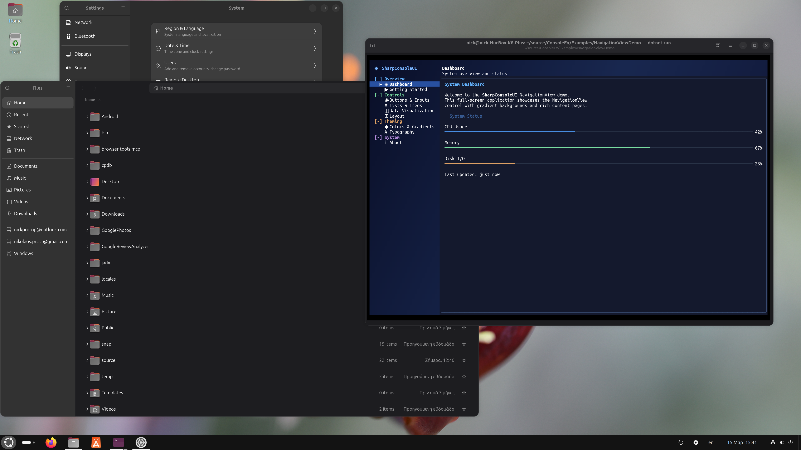
*The same NavigationView pattern used by GNOME Settings, rendered entirely in the terminal.*

| Dashboard | Typography |
|-----------|------------|
|  | 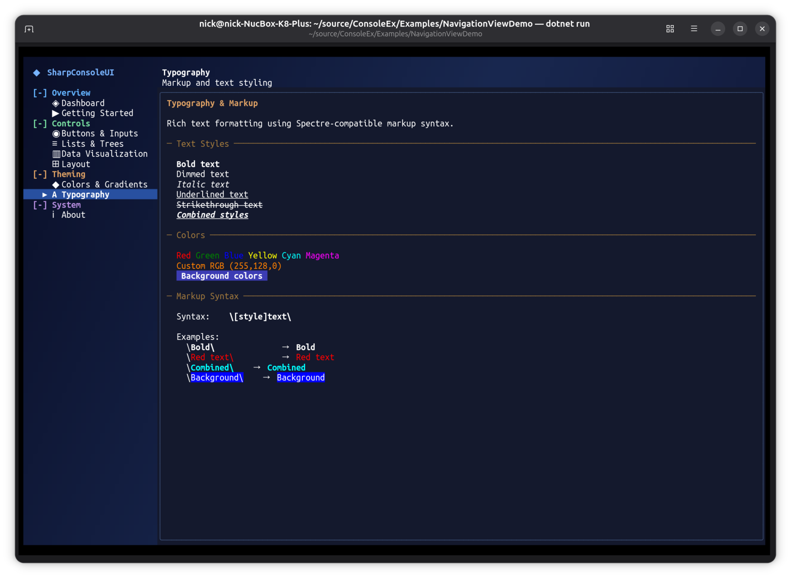 |

---

### CanvasDemo
Three animated windows showcasing the `CanvasControl` drawing surface with real-time graphics.

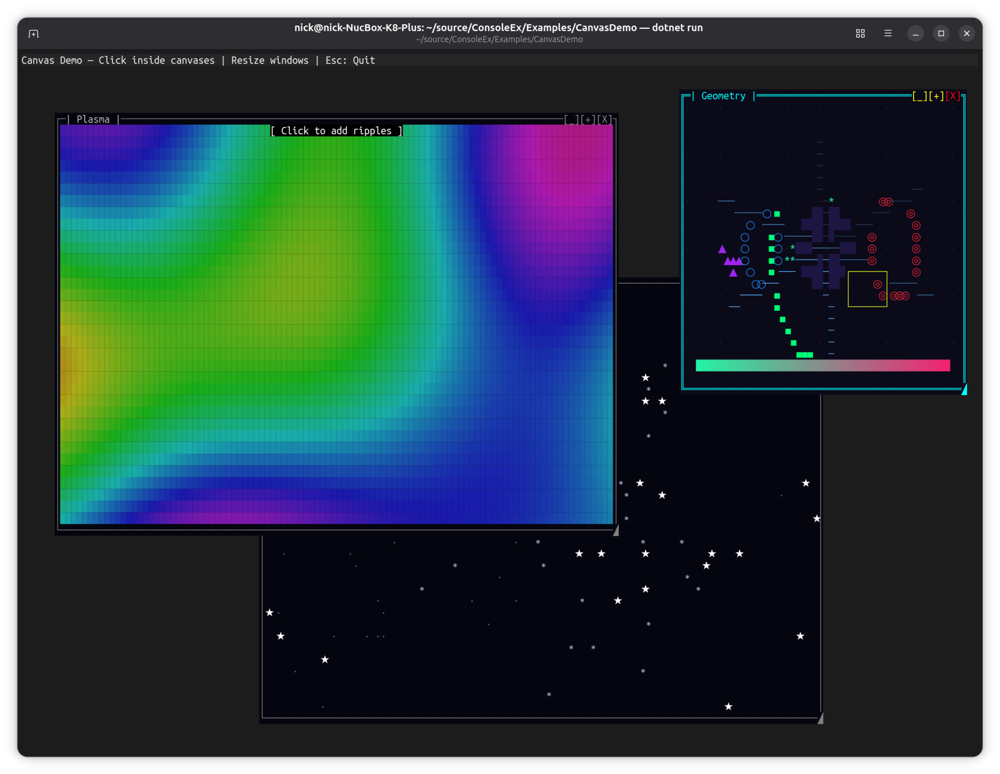

```bash
dotnet run --project Examples/CanvasDemo
```

**Key Features:**
- **Starfield:** 120 stars in 3 parallax layers with particle bursts on click
- **Plasma:** Per-cell HSV sine plasma with expanding ripple effects on click, combined retained + event-driven painting
- **Geometry:** Rotating polygon, orbiting triangle, pulsing circles, breathing ellipse, sweeping arc, radiating lines, bouncing box, gradient bar, expanding ring effects on click

**APIs Demonstrated:**
- `CanvasControl` with `BeginPaint()`/`EndPaint()` (retained mode)
- `Paint` event with `CanvasGraphics` (immediate mode)
- Combined retained + event overlay painting
- `AutoSize` with `Stretch`/`Fill` for responsive canvases
- Canvas-local mouse click events (`CanvasMouseClick`)
- Full `CanvasGraphics` API: circles, polygons, gradients, ellipses, arcs, lines, text

**Controls:** Click inside canvases for interactive effects, resize windows, Esc to quit

---

### Alpha Blending Demo
Real-time Porter-Duff alpha compositing showcase with a live cycling gradient background.


```bash
dotnet run --project Examples/DemoApp
# Navigate to Rendering → Alpha Blending
```

Five zones demonstrate every level of the alpha pipeline against a continuously cycling full-spectrum gradient (three hues 120° apart rotating through the colour wheel every ~12 s):

| Zone | What it shows |
|------|--------------|
| **Alpha Ladder** | Eight panels, same orange hue, alpha 0 → 255. Each panel background composites over the live gradient — fully transparent at α=0, fully opaque at α=255. |
| **Fade to Transparent** | 60 `█` block characters with foreground alpha stepping 255 → 0. Foreground blends against the resolved background, so the blocks dissolve into the gradient rather than fading to white. |
| **Glass Panels** | Four bordered panels at 25 / 50 / 75 / 100 % opacity. The gradient shows through each panel proportionally. |
| **Live Compositor** | Interactive `Color.Blend(src, dst)` visualiser — drag the slider to change source alpha and watch the blended swatch update in real time. |
| **Pulse Panel** | Background alpha animated 0 → 255 → 0 via a sine wave in an async window thread. |

**APIs Demonstrated:**
- `Color.Blend()` — Porter-Duff "over" compositing
- `ColorGradient.FromColors()` with time-varying hues for a smooth colour-wheel cycle
- `ScrollablePanel` with semi-transparent `BackgroundColor` (glass effect)
- `SliderControl` wired to a live `MarkupControl` preview
- Markup inline alpha: `[#RRGGBBAA]text[/]`
- `WithAsyncWindowThread` driving animation at 20 fps

---

### HighFreqDemo
Multi-frequency update showcase with various control update rates.

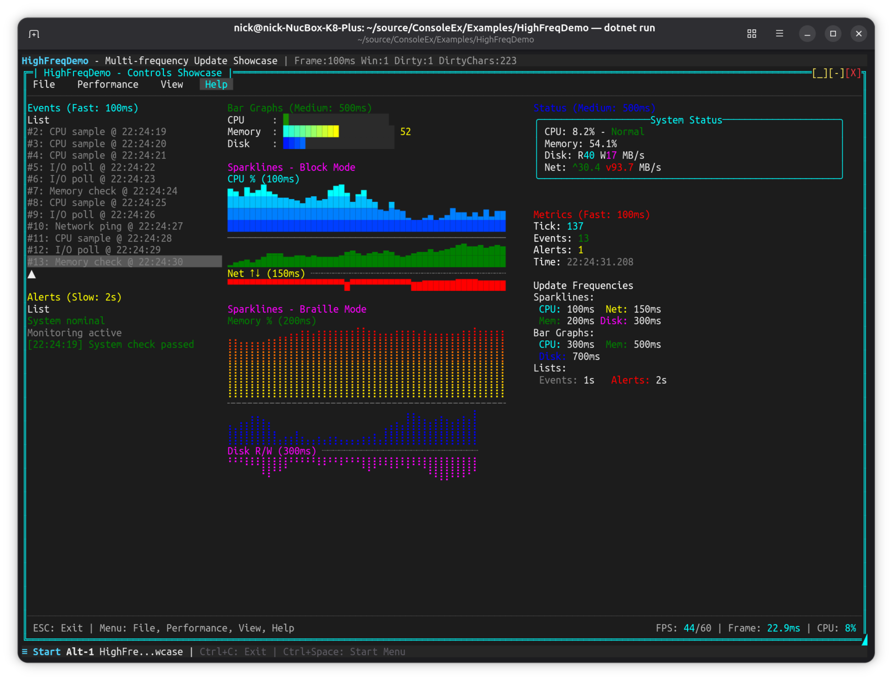

```bash
dotnet run --project Examples/HighFreqDemo
```

**Key Features:**
- Controls updating at different frequencies (100ms to 2s)
- Sparkline controls (Block, Braille, Bidirectional modes)
- Bar graph controls with smooth gradients
- ListControl for events and alerts
- Performance metrics overlay
- Menu system with frame rate controls

---

### CompositorEffectsExample
Compositor-style buffer manipulation — fractals, blur, particles, and wipe transitions.

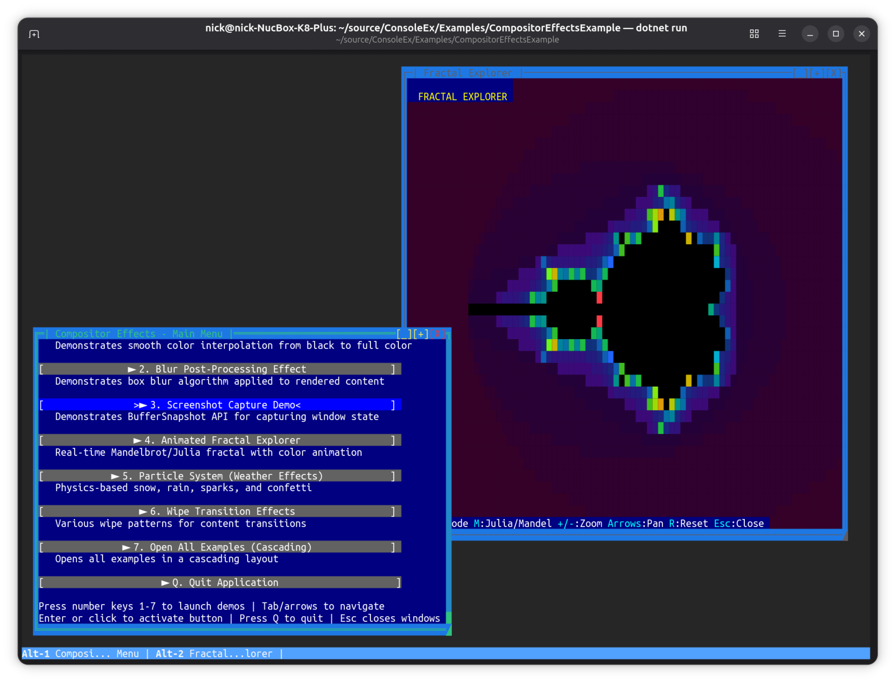

```bash
dotnet run --project Examples/CompositorEffectsExample
```

**Key Features:**
- **Fade-In Effect:** Smooth color interpolation using `PostBufferPaint`
- **Blur Effect:** Box blur post-processing algorithm
- **Screenshot Capture:** `BufferSnapshot` API for capturing window state
- **Fractal Explorer:** Animated Mandelbrot/Julia fractals using `PreBufferPaint`

**APIs Demonstrated:**
- `PreBufferPaint` - Custom backgrounds rendered before controls
- `PostBufferPaint` - Post-processing effects after controls
- `BufferSnapshot` - Immutable buffer captures

---

### AgentStudio
OpenCode-inspired TUI showcase demonstrating an AI coding agent interface aesthetic.

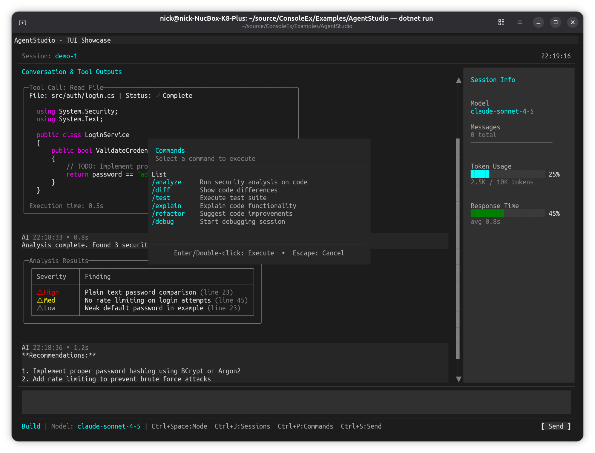

```bash
dotnet run --project Examples/AgentStudio
```

**Key Features:**
- Modern TUI design patterns
- Advanced `NetConsoleDriverOptions` configuration
- Hidden status bars for immersive experience
- Custom window class implementation

---

### SnakeGame
Classic Snake game demonstrating direct frame buffer manipulation.

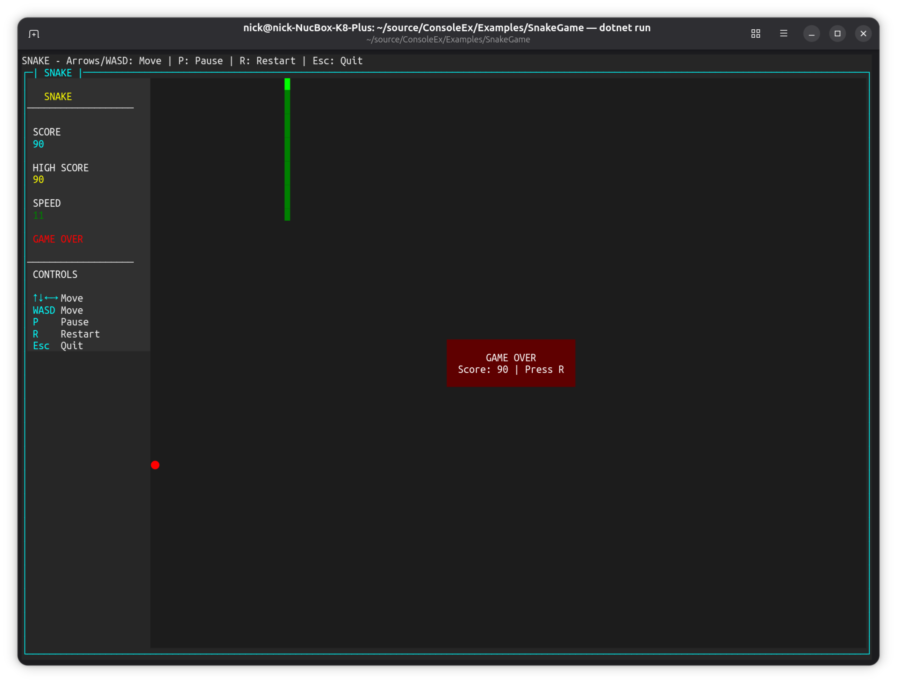

```bash
dotnet run --project Examples/SnakeGame
```

**Key Features:**
- Direct `CharacterBuffer` manipulation via `PostBufferPaint`
- Real-time game loop with `System.Timers.Timer`
- Sidebar layout using `HorizontalGridControl`
- Keyboard input handling (arrows/WASD)
- Game state management (playing, paused, game over)

**Controls:** Arrow keys or WASD to move, P to pause, R to restart, Esc to quit

---

### TextEditorExample
Multiline text editor with syntax highlighting and file browser.

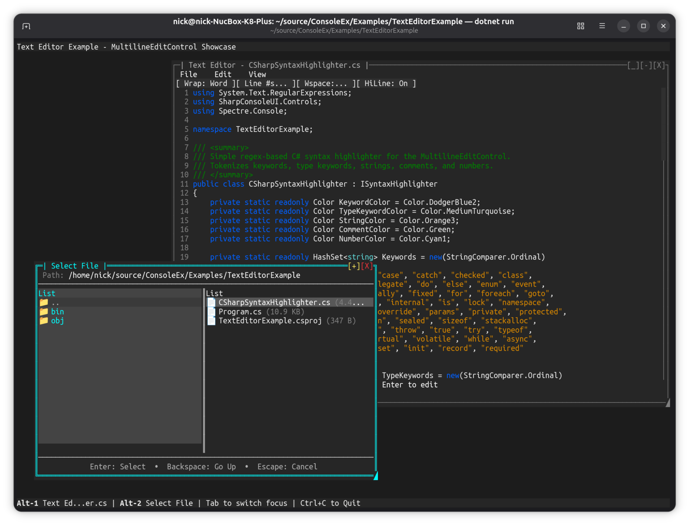

```bash
dotnet run --project Examples/TextEditorExample
```

**Key Features:**
- Multiline edit control with scrolling
- File browser dialog integration
- Syntax highlighting support
- Save/load functionality
- Line numbers and cursor position

**Controls:** Ctrl+O to open file, Ctrl+S to save, arrow keys to navigate

---

### Image Viewer (DemoApp)
Load and display real image files in the terminal using half-block Unicode rendering.

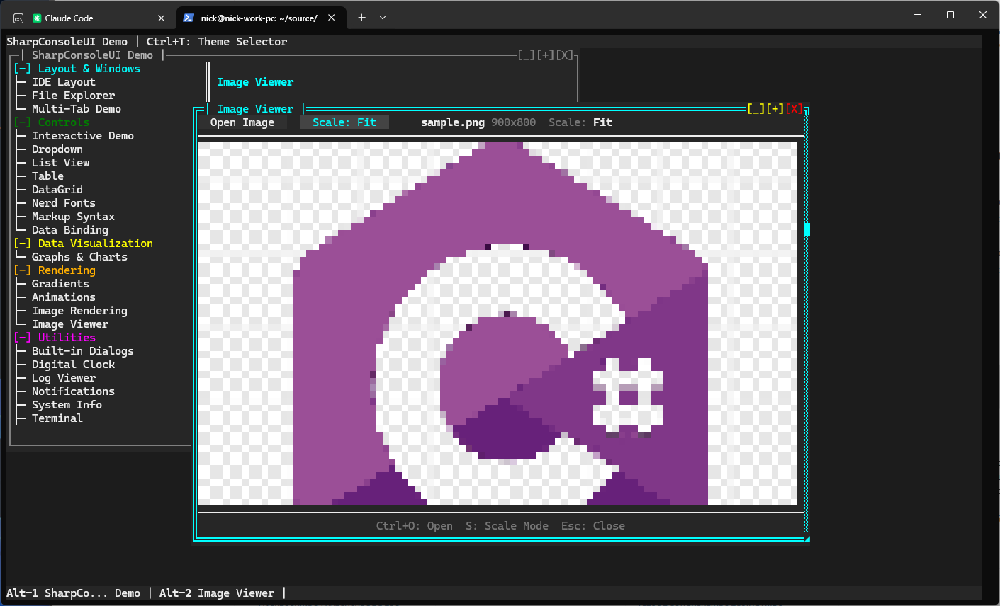

```bash
dotnet run --project Examples/DemoApp
# Navigate to Rendering → Image Viewer
```

**Key Features:**
- Load PNG, JPEG, BMP, GIF, WebP, TIFF files via file picker dialog
- Half-block rendering (2 vertical pixels per character cell)
- Four scale modes: Fit, Fill, Stretch, None
- Resizable window with live image rescaling
- Keyboard shortcuts: Ctrl+O to open, S to cycle scale, Esc to close

**APIs Demonstrated:**
- `PixelBuffer.FromFile()` — decode image files via SixLabors.ImageSharp
- `ImageControl` with `ScaleMode` switching
- `FileDialogs.ShowFilePickerAsync()` with format filter
- `HorizontalGridControl` for toolbar layout

---

### Video Player (DemoApp)
Play video files directly in the terminal with three render modes.


```bash
dotnet run --project Examples/DemoApp
# Navigate to Utilities → Video Player
```

**Key Features:**
- Half-block, ASCII, and braille render modes (press M to cycle live)
- FFmpeg subprocess decoding — no extra NuGet dependencies
- Dynamic resize — restarts at new resolution when window is dragged
- Overlay status bar — appears on keypress, auto-hides after 3 seconds
- Looping, pause/resume, frame skipping when behind
- Graceful FFmpeg-not-found message with install instructions

**APIs Demonstrated:**
- `Controls.Video()` fluent builder with `.WithOverlay()`, `.WithLooping()`
- `VideoControl.PlayFile()`, `CycleRenderMode()`, `TogglePlayPause()`
- `FileDialogs.ShowFilePickerAsync()` with video format filter
- `WithAsyncWindowThread` for non-blocking file picker

---

### Desktop Background (DemoApp)
Configurable desktop backgrounds with solid colors, gradients, patterns, and animated effects.

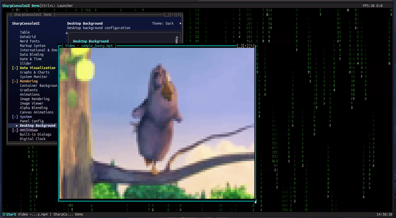

```bash
dotnet run --project Examples/DemoApp
# Navigate to System → Desktop Background
```

**Key Features:**
- Four background types: solid color, gradient, pattern, and animated effects
- Built-in pattern presets and animated effect presets (Matrix Rain, plasma, starfield, rain)
- Layer animated effects on top of any background type
- Cached buffer architecture — zero impact on window performance
- Configurable via Desktop Background dialog or API

**APIs Demonstrated:**
- `DesktopBackgroundService` with cached buffer rendering
- `DesktopBackground`, `DesktopPattern`, `DesktopEffectPresets`
- `DesktopBackgroundGradient` theme integration

---

### MultiDashboard
Multiple windows with independent async update threads.

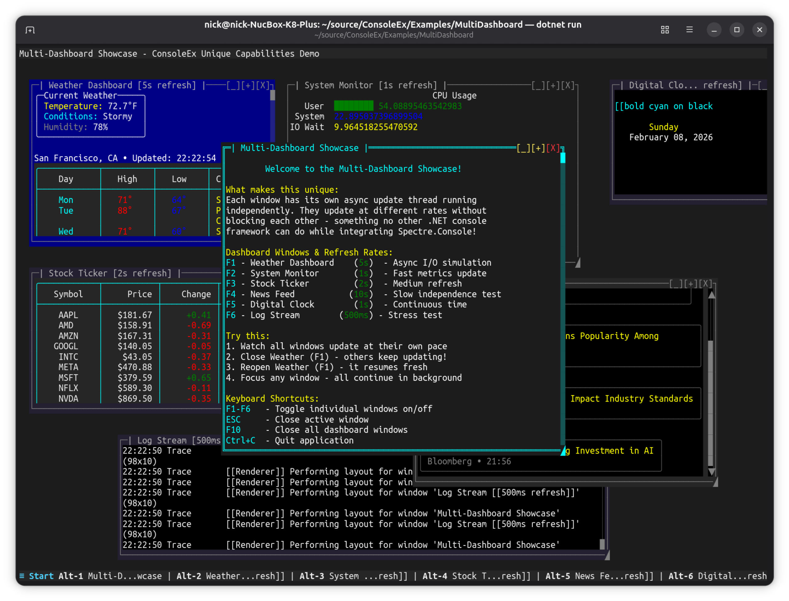

```bash
dotnet run --project Examples/MultiDashboard
```

**Key Features:**
- 6 independent dashboard windows updating at different rates
- Weather (5s), System Monitor (1s), Stock Ticker (2s), News (10s), Clock (1s), Log Stream (500ms)
- Demonstrates async window threads with `IDisposable` pattern
- Window toggle functionality (F1-F6)

**What makes it unique:** Each window has its own async update thread running independently.

---

### FigletShowcaseExample
ASCII art font showcase demonstrating Figlet font rendering.

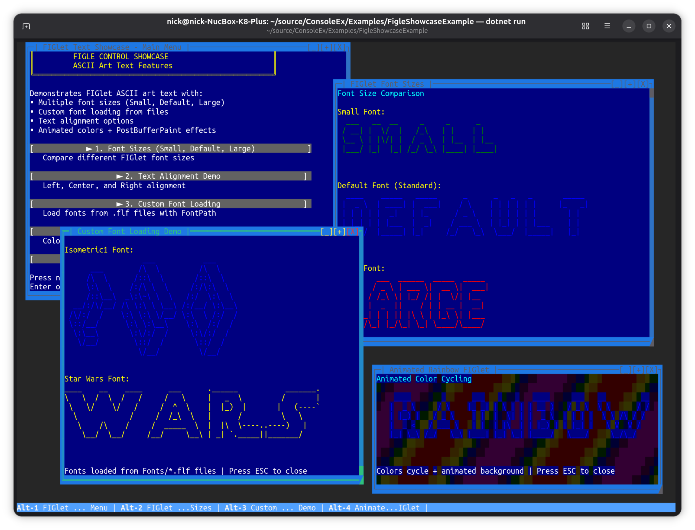

```bash
dotnet run --project Examples/FigleShowcaseExample
```

**Key Features:**
- Multiple Figlet ASCII art fonts (Star Wars, Graffiti, etc.)
- Font size comparison demo
- Color cycling with animated background
- Direct font loading from FLF (FigletFont) files
- Text alignment and positioning options

**Controls:** Number keys to switch examples, Esc to close

---

### MenuDemo
Full-featured horizontal menu bar with keyboard and mouse support.

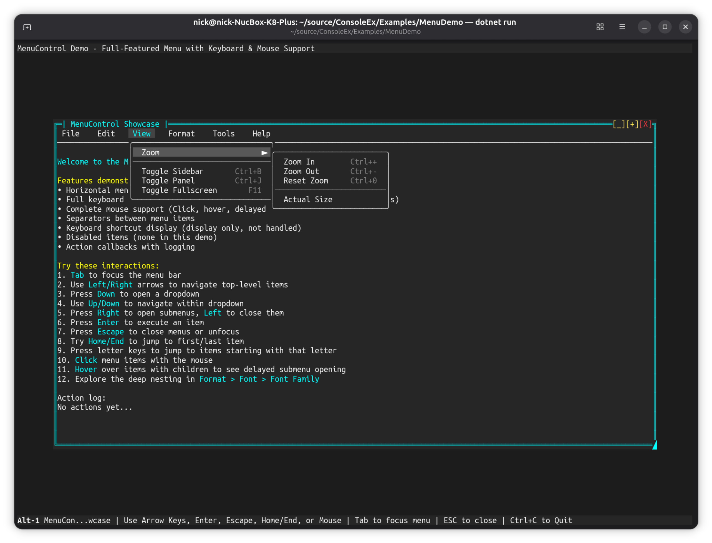

```bash
dotnet run --project Examples/MenuDemo
```

**Key Features:**
- Horizontal menu bar with unlimited nesting depth
- Full keyboard navigation (arrows, Enter, Escape, Home/End, letter keys)
- Complete mouse support (click, hover, delayed submenu opening)
- Separators and keyboard shortcut display
- Fluent `Controls.Menu()` builder API

---

## More Examples

These examples demonstrate specific features without full screenshots.

| Example | What it shows | Run command |
|---------|--------------|-------------|
| **FrameRateDemo** | Adjustable FPS (15-144), frame rate limiting, performance metrics | `dotnet run --project Examples/FrameRateDemo` |
| **FullScreenExample** | Kiosk-style maximized window, hidden taskbar, disabled chrome | `dotnet run --project Examples/FullScreenExample` |
| **StartMenuDemo** | Windows-like Start menu, plugin integration, categorized items | `dotnet run --project Examples/StartMenuDemo` |
| **TabControlDemo** | Multi-page tabs, Ctrl+Tab switching, ScrollablePanel integration | `dotnet run --project Examples/TabControlDemo` |
| **TableDemo** | TableControl with theme switching (F1-F3), markup in cells, rounded borders | `dotnet run --project Examples/TableDemo` |
| **PanelDemo** | Panel mouse events (click, double-click, enter, leave, move) | `dotnet run --project Examples/PanelDemo` |
| **BorderStyleDemo** | DoubleLine vs None border styles, runtime toggling | `dotnet run --project Examples/BorderStyleDemo` |
| **SpectreMouseExample** | Mouse events on SpectreRenderableControl, event counters | `dotnet run --project Examples/SpectreMouseExample` |
| **PluginShowcaseExample** | Plugin loading, DevDark theme, Debug Console, agnostic services | `dotnet run --project Examples/PluginShowcaseExample` |

---

## Feature Matrix

| Example | Async Windows | Buffer Paint | Mouse Events | Themes | Plugins | Games |
|---------|:---:|:---:|:---:|:---:|:---:|:---:|
| DemoApp | ✅ | | ✅ | ✅ | | |
| NavigationViewDemo | | | ✅ | | | |
| CanvasDemo | ✅ | ✅ | ✅ | | | |
| Alpha Blending Demo | ✅ | | ✅ | | | |
| HighFreqDemo | ✅ | | ✅ | | | |
| CompositorEffectsExample | ✅ | ✅ | | ✅ | | |
| AgentStudio | | | | | | |
| SnakeGame | | ✅ | | | | ✅ |
| TextEditorExample | | | | | | |
| MultiDashboard | ✅ | | | | | |
| FigletShowcaseExample | | | | | | |
| MenuDemo | | | ✅ | | | |
| FrameRateDemo | | | | | | |
| FullScreenExample | | | ✅ | | | |
| StartMenuDemo | | | ✅ | | ✅ | |
| TabControlDemo | | | ✅ | | | |
| TableDemo | | | | ✅ | | |
| PanelDemo | | | ✅ | | | |
| BorderStyleDemo | | | | | | |
| SpectreMouseExample | | | ✅ | | | |
| PluginShowcaseExample | | | | ✅ | ✅ | |

---

## Controls Demonstrated

| Control | Examples |
|---------|----------|
| `MarkupControl` | All examples |
| `ButtonControl` | DemoApp, FullScreenExample, CompositorEffectsExample |
| `ListControl` | DemoApp, HighFreqDemo |
| `TreeControl` | DemoApp (File Explorer), NavigationViewDemo |
| `DropdownControl` | DemoApp, PluginShowcaseExample |
| `MenuControl` | MenuDemo, HighFreqDemo |
| `TableControl` | DemoApp, TableDemo |
| `PanelControl` | StartMenuDemo, PanelDemo, HighFreqDemo |
| `SparklineControl` | HighFreqDemo, NavigationViewDemo |
| `LineGraphControl` | DemoApp |
| `BarGraphControl` | HighFreqDemo, NavigationViewDemo |
| `NavigationView` | DemoApp, NavigationViewDemo |
| `ProgressBarControl` | DemoApp, NavigationViewDemo |
| `PromptControl` | DemoApp (Command Window) |
| `MultilineEditControl` | DemoApp, TextEditorExample |
| `LogViewerControl` | DemoApp |
| `TabControl` | TabControlDemo |
| `ImageControl` | DemoApp (Image Rendering, Image Viewer) |
| `CanvasControl` | CanvasDemo, DemoApp |
| `HorizontalGridControl` | Most examples |
| `SliderControl` | DemoApp, Alpha Blending Demo |
| `RangeSliderControl` | DemoApp |
| `SpectreRenderableControl` | SpectreMouseExample |

---

## API Patterns Demonstrated

### Fluent Builders
```csharp
// WindowBuilder
new WindowBuilder(windowSystem)
    .WithTitle("My Window")
    .WithSize(80, 25)
    .Centered()
    .Closable(true)
    .Build();

// Controls fluent API
Controls.Menu().Horizontal().AddItem("File", ...).Build();
Controls.Markup().AddLine("[bold]Hello[/]").Build();
Controls.List().MaxVisibleItems(10).Build();
```

### Async Window Threads
```csharp
new WindowBuilder(windowSystem)
    .WithAsyncWindowThread(async (window, ct) => {
        while (!ct.IsCancellationRequested) {
            // Update window content
            await Task.Delay(1000, ct);
        }
    })
    .Build();
```

### Canvas Drawing
```csharp
// Retained mode — draw from any thread, content persists
var canvas = new CanvasControl { AutoSize = true };
var g = canvas.BeginPaint();
g.DrawCircle(30, 10, 8, '*', Color.Cyan, Color.Black);
g.GradientFillRect(0, 0, 60, 20, Color.DarkBlue, Color.Black, horizontal: false);
canvas.EndPaint();

// Immediate mode — redraw each frame
canvas.Paint += (sender, e) => {
    e.Graphics.WriteStringCentered(10, "Hello!", Color.White, Color.Black);
};

// Interactive — canvas-local mouse coordinates
canvas.CanvasMouseClick += (sender, e) => {
    var g2 = canvas.BeginPaint();
    g2.FillCircle(e.CanvasX, e.CanvasY, 2, '*', Color.Red, Color.Black);
    canvas.EndPaint();
};
```

### Buffer Paint Hooks
```csharp
// PreBufferPaint - Custom backgrounds
window.Renderer.PreBufferPaint += (buffer, dirty, clip) => {
    // Render background before controls
};

// PostBufferPaint - Post-processing effects
window.Renderer.PostBufferPaint += (buffer, dirty, clip) => {
    // Apply effects after controls render
};
```

### Plugin Services
```csharp
// Load plugin
windowSystem.PluginStateService.LoadPlugin<DeveloperToolsPlugin>();

// Create window from plugin
var window = windowSystem.PluginStateService.CreateWindow("DebugConsole");

// Use service (agnostic pattern)
var service = windowSystem.PluginStateService.GetService("Diagnostics");
var result = service.Execute("GetDiagnosticsReport");
```

---

## Running All Examples

To build and verify all examples compile:
```bash
dotnet build ConsoleEx.sln
```

Each example is a standalone project that can be run independently.
