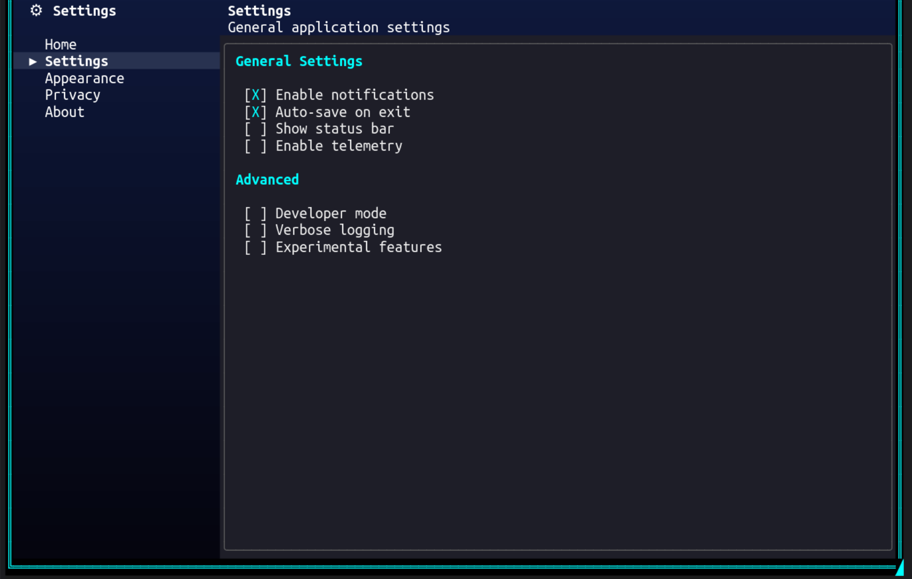

# NavigationView

A WinUI-inspired navigation control with a left navigation pane and a right content area, encapsulating item selection, content switching, and header management into a single reusable control.



## Overview

NavigationView provides the common "sidebar navigation + content area" pattern found in modern desktop applications. It eliminates the manual wiring typically needed for this layout — click handlers, selection state, header updates, and content switching are all handled internally.

The control composes a `HorizontalGridControl` internally with two columns: a fixed-width nav pane and a flexible content area. The content area includes an optional header (title + subtitle) and a `ScrollablePanelControl` for the active section's content.

**Key feature**: NavigationView is gradient-transparent — when placed in a window with a gradient background, the gradient shows through the nav pane and header areas while the content panel can have its own opaque background.

## Hierarchical Items

NavigationView supports **headers**, **sub-items**, and **separators** in addition to flat items. Headers group related items and support collapse/expand.

```
┌──────────────────────┐
│  ⚙  Settings         │
│                      │
│  [-] Layout & Windows │  ← Header (expanded)
│      ▸ IDE Layout    │  ← Sub-item (selected)
│        File Explorer │  ← Sub-item
│  [+] Controls        │  ← Header (collapsed)
│    About             │  ← Flat item
└──────────────────────┘
```

### NavigationItemType

| Type | Selectable | Description |
|------|-----------|-------------|
| `Item` | Yes | Regular selectable navigation item (default) |
| `Header` | No | Non-selectable group header with collapse/expand |
| `Separator` | No | Visual divider line |

## Properties

### Navigation Pane

| Property | Type | Default | Description |
|----------|------|---------|-------------|
| `NavPaneWidth` | `int` | `26` | Width of the left navigation column (minimum 10) |
| `PaneHeader` | `string?` | `null` | Markup text shown as the nav pane header |
| `SelectedItemBackground` | `Color` | `rgb(40,50,80)` | Background color for the selected nav item |
| `SelectedItemForeground` | `Color` | `White` | Foreground color for the selected nav item |
| `ItemForeground` | `Color` | `Grey` | Default foreground color for unselected items |
| `SelectionIndicator` | `char` | `'▸'` | Character used as the selection indicator prefix |

### Content Area

| Property | Type | Default | Description |
|----------|------|---------|-------------|
| `ContentBorderStyle` | `BorderStyle` | `Rounded` | Border style for the content panel |
| `ContentBorderColor` | `Color?` | `null` | Border color for the content panel |
| `ContentBackgroundColor` | `Color?` | `null` | Background color for the content panel |
| `ContentPadding` | `Padding` | `(1,0,1,0)` | Padding inside the content panel |
| `ShowContentHeader` | `bool` | `true` | Whether to show the title + subtitle header |

### Selection

| Property | Type | Default | Description |
|----------|------|---------|-------------|
| `SelectedIndex` | `int` | `-1` | Index of the currently selected item |
| `SelectedItem` | `NavigationItem?` | `null` | The currently selected item (read-only) |
| `Items` | `IReadOnlyList<NavigationItem>` | empty | Read-only collection of all items |

### Standard

| Property | Type | Default | Description |
|----------|------|---------|-------------|
| `BackgroundColor` | `Color` | inherited | Background color (cascades from parent) |
| `ForegroundColor` | `Color` | `White` | Foreground color |
| `ContentPanel` | `ScrollablePanelControl` | - | Direct access to the content panel (read-only) |

## Events

| Event | Arguments | Description |
|-------|-----------|-------------|
| `SelectedItemChanging` | `NavigationItemChangingEventArgs` | Raised before selection changes (cancelable) |
| `SelectedItemChanged` | `NavigationItemChangedEventArgs` | Raised after selection has changed |
| `ItemInvoked` | `NavigationItemChangedEventArgs` | Raised when Enter/Space is pressed on the selected item |
| `GotFocus` | `EventArgs` | Raised when the control receives focus |
| `LostFocus` | `EventArgs` | Raised when the control loses focus |

### Event Args

**NavigationItemChangedEventArgs:**
- `OldIndex` / `NewIndex` — indices of the old and new selection
- `OldItem` / `NewItem` — the NavigationItem instances

**NavigationItemChangingEventArgs:**
- Same as above, plus `Cancel` — set to `true` to prevent the selection change

## Methods

### Item Management

| Method | Description |
|--------|-------------|
| `AddItem(NavigationItem item)` | Add a navigation item |
| `AddItem(string text, string? icon, string? subtitle)` | Add an item with properties, returns the created NavigationItem |
| `AddHeader(string text, Color? color)` | Add a header item, returns the created NavigationItem |
| `AddItemToHeader(NavigationItem header, string text, string? icon, string? subtitle)` | Add a child item under a header |
| `InsertItem(int index, NavigationItem item)` | Insert an item at a specific position |
| `RemoveItem(int index)` | Remove item by index (cascades children if header) |
| `RemoveItem(NavigationItem item)` | Remove a specific item |
| `ClearItems()` | Remove all items |
| `ToggleHeaderExpanded(NavigationItem header)` | Toggle collapse/expand for a header |

### Content Management

| Method | Description |
|--------|-------------|
| `SetItemContent(NavigationItem item, Action<ScrollablePanelControl> populate)` | Register a content factory for an item |
| `SetItemContent(int index, Action<ScrollablePanelControl> populate)` | Register a content factory by index |

## NavigationItem

```csharp
public class NavigationItem
{
    public string Text { get; set; }
    public string? Icon { get; set; }             // emoji/symbol prefix
    public string? Subtitle { get; set; }         // shown in content header
    public object? Tag { get; set; }
    public bool IsEnabled { get; set; } = true;
    public NavigationItemType ItemType { get; }   // Item, Header, or Separator
    public NavigationItem? ParentHeader { get; }  // parent header for sub-items
    public bool IsExpanded { get; set; } = true;  // for headers only
    public Color? HeaderColor { get; set; }       // for headers only

    // Factory methods
    static NavigationItem CreateHeader(string text, Color? color = null);
    static NavigationItem CreateSeparator();

    // Implicit conversion from string
    NavigationItem item = "Home";
}
```

## Creating NavigationView

### Using Builder with Headers (Recommended)

```csharp
var nav = Controls.NavigationView()
    .WithNavWidth(30)
    .WithPaneHeader("[bold white]  ⚙  Settings[/]")
    .WithContentBorder(BorderStyle.Rounded)
    .WithContentBorderColor(Color.Grey37)
    .WithContentBackground(new Color(30, 30, 40))
    .AddHeader("Layout & Windows", Color.Cyan1, header => header
        .AddItem("IDE Layout", subtitle: "Window layout demo", content: panel =>
        {
            panel.AddControl(Controls.Markup()
                .AddLine("[bold cyan]IDE-style layout[/]")
                .Build());
        })
        .AddItem("File Explorer", subtitle: "Tree control demo", content: panel =>
        {
            panel.AddControl(Controls.Markup()
                .AddLine("[bold]File browser[/]")
                .Build());
        }))
    .AddHeader("Controls", header => header
        .WithColor(Color.Green)
        .AddItem("Interactive Demo", content: panel =>
        {
            panel.AddControl(Controls.Checkbox("Enable feature").Build());
        }))
    .AddItem("About", subtitle: "Application information", content: panel =>
    {
        panel.AddControl(Controls.Markup()
            .AddLine("[bold]MyApp[/] v1.0")
            .Build());
    })
    .WithAlignment(HorizontalAlignment.Stretch)
    .Fill()
    .Build();

window.AddControl(nav);
```

### Using Builder with Flat Items

```csharp
var nav = Controls.NavigationView()
    .WithNavWidth(26)
    .WithPaneHeader("[bold white]  ⚙  Settings[/]")
    .AddItem("Home", subtitle: "Configure your preferences", content: panel =>
    {
        panel.AddControl(Controls.Markup()
            .AddLine("[bold cyan]Welcome[/]")
            .AddLine("This is the home section.")
            .Build());
    })
    .AddItem("Settings", subtitle: "General application settings", content: panel =>
    {
        panel.AddControl(Controls.Checkbox("Enable notifications")
            .Checked(true).Build());
        panel.AddControl(Controls.Checkbox("Auto-save on exit")
            .Checked(true).Build());
    })
    .AddItem("About", subtitle: "Application information", content: panel =>
    {
        panel.AddControl(Controls.Markup()
            .AddLine("[bold]MyApp[/] v1.0")
            .AddLine("[dim]License: MIT[/]")
            .Build());
    })
    .WithAlignment(HorizontalAlignment.Stretch)
    .WithVerticalAlignment(VerticalAlignment.Fill)
    .Build();

window.AddControl(nav);
```

### Using Constructor with Hierarchy

```csharp
var nav = new NavigationView();
nav.NavPaneWidth = 30;
nav.PaneHeader = "[bold white]  Menu[/]";

// Add a header with children
var layoutHeader = nav.AddHeader("Layout", Color.Cyan1);
var ideItem = nav.AddItemToHeader(layoutHeader, "IDE Layout", subtitle: "Layout demo");
nav.SetItemContent(ideItem, panel =>
{
    panel.AddControl(Controls.Label("IDE layout content"));
});

var fileItem = nav.AddItemToHeader(layoutHeader, "File Explorer", subtitle: "File browser");
nav.SetItemContent(fileItem, panel =>
{
    panel.AddControl(Controls.Label("File explorer content"));
});

// Flat items still work
var aboutItem = nav.AddItem("About", subtitle: "App info");
nav.SetItemContent(aboutItem, panel =>
{
    panel.AddControl(Controls.Label("About this app"));
});

window.AddControl(nav);
```

## Keyboard & Mouse Support

| Input | Action |
|-------|--------|
| **Up / Down** | Move selection between nav items (skips headers, separators, collapsed children) |
| **Home / End** | Jump to first / last enabled visible nav item |
| **Enter / Space** | Invoke the selected item; on a header, toggles expand/collapse |
| **Right** | On a collapsed header, expand it; otherwise move focus to content panel |
| **Left** | On a sub-item, collapse its parent header; in content panel, return to nav pane |
| **Tab** | Move focus from nav pane to content panel |
| **Shift+Tab** | Move focus from content panel back to nav pane |
| **Mouse Click** | Click a nav item to select it; click a header to toggle expand/collapse |
| **Mouse Wheel** | Scroll within the content panel |

NavigationView uses a **two-zone focus model**: the nav pane and the content panel are separate focus zones. When the control first receives focus, the nav pane is active — use arrow keys to browse items, then Right or Tab to move into the content panel. Left or Shift+Tab returns focus to the nav pane.

## Architecture

NavigationView internally composes:
- `HorizontalGridControl` — the two-column layout
- `ColumnContainer` (left) — nav pane header + item markup controls
- `ColumnContainer` (right) — content header + scrollable panel
- `MarkupControl` per nav item — with click handlers for selection
- `ScrollablePanelControl` — bordered content area

The control implements `IContainer` and propagates `HasGradientBackground` from its parent, allowing gradient backgrounds to show through transparent areas.

### Content Factory Pattern

Unlike TabControl (which keeps all tab content in the DOM), NavigationView uses **content factories** — delegates that populate the content panel on demand. Factories are optional — you can use event-driven content instead (see below).

```csharp
nav.SetItemContent(item, panel =>
{
    // Called each time this item is selected
    // panel.ClearContents() is called automatically before this
    panel.AddControl(Controls.Label("Fresh content"));
});
```

This means content is rebuilt each time an item is selected. For content that should preserve state across selections, store state externally and restore it in the factory.

### Event-Driven Content

As an alternative to content factories, you can manage content through the `SelectedItemChanged` event and the `ContentPanel` property. If no content factory is registered for an item, the control skips automatic content clearing — the event handler manages it instead.

```csharp
nav.SelectedItemChanged += (s, e) =>
{
    nav.ContentPanel.ClearContents();
    nav.ContentPanel.AddControl(Controls.Markup()
        .AddLine($"[bold cyan]{e.NewItem.Text}[/]")
        .AddLine("Content managed by event handler.")
        .Build());
};
```

This is useful when content switching involves complex state management or when you want to mix factory-based and event-driven items in the same NavigationView.

## Visual Layout

```
┌────────────────────────┬─────────────────────────────────┐
│  ⚙  Settings           │  IDE Layout                     │
│                        │  Window layout demo              │
│  [-] Layout & Windows  │ ╭─────────────────────────────╮ │
│      ▸ IDE Layout      │ │                             │ │
│        File Explorer   │ │  IDE-style layout content   │ │
│  [-] Controls          │ │                             │ │
│        Interactive     │ │                             │ │
│    About               │ │                             │ │
│                        │ ╰─────────────────────────────╯ │
└────────────────────────┴─────────────────────────────────┘
```

## Examples

### Hierarchical Navigation with Gradient Background

```csharp
var gradient = ColorGradient.FromColors(
    new Color(15, 25, 60),
    new Color(5, 5, 15));

var nav = Controls.NavigationView()
    .WithPaneHeader("[bold white]  ⚙  Settings[/]")
    .WithContentBorder(BorderStyle.Rounded)
    .WithContentBorderColor(Color.Grey37)
    .WithContentBackground(new Color(30, 30, 40))
    .AddHeader("General", Color.Cyan1, header => header
        .AddItem("Notifications", content: panel =>
        {
            panel.AddControl(Controls.Checkbox("Push notifications").Checked(true).Build());
            panel.AddControl(Controls.Checkbox("Email alerts").Build());
        })
        .AddItem("Auto-update", content: panel =>
        {
            panel.AddControl(Controls.Checkbox("Check for updates").Checked(true).Build());
        }))
    .AddHeader("Display", Color.Yellow, header => header
        .AddItem("Theme", content: panel =>
        {
            panel.AddControl(Controls.Markup().AddLine("[bold cyan]Theme[/]").Build());
            panel.AddControl(Controls.Checkbox("Dark mode").Checked(true).Build());
        }))
    .WithAlignment(HorizontalAlignment.Stretch)
    .Fill()
    .Build();

var window = new WindowBuilder(ws)
    .WithTitle("Settings")
    .WithSize(80, 30)
    .Centered()
    .WithBackgroundGradient(gradient, GradientDirection.Vertical)
    .AddControl(nav)
    .BuildAndShow();
```

### Cancelable Navigation

```csharp
var nav = Controls.NavigationView()
    .AddItem("Editor", content: panel => { /* ... */ })
    .AddItem("Preview", content: panel => { /* ... */ })
    .OnSelectedItemChanging((sender, e) =>
    {
        if (e.OldItem?.Text == "Editor" && HasUnsavedChanges())
        {
            e.Cancel = true;
            ShowSaveDialog();
        }
    })
    .Build();
```

### Dynamic Items

```csharp
var nav = new NavigationView();
nav.PaneHeader = "[bold]  Projects[/]";

foreach (var project in projects)
{
    var item = nav.AddItem(project.Name, subtitle: project.Description);
    item.Tag = project;
    nav.SetItemContent(item, panel =>
    {
        var p = (Project)item.Tag!;
        panel.AddControl(Controls.Markup()
            .AddLine($"[bold]{p.Name}[/]")
            .AddLine($"[dim]{p.Description}[/]")
            .AddLine($"Status: {p.Status}")
            .Build());
    });
}

window.AddControl(nav);
```

### Programmatic Expand/Collapse

```csharp
var nav = new NavigationView();
var header = nav.AddHeader("Advanced", Color.Red);
nav.AddItemToHeader(header, "Debug Options");
nav.AddItemToHeader(header, "Diagnostics");

// Start collapsed
nav.ToggleHeaderExpanded(header);  // Collapses the header

// Later, expand programmatically
if (!header.IsExpanded)
    nav.ToggleHeaderExpanded(header);
```

## Builder Reference

### NavigationViewBuilder Methods

| Category | Method | Description |
|----------|--------|-------------|
| **Items** | `AddItem(text, icon?, subtitle?, content?)` | Add a flat nav item with optional content factory |
| | `AddItem(NavigationItem, content?)` | Add an existing NavigationItem |
| | `AddHeader(text, configure)` | Add a header with child items |
| | `AddHeader(text, color, configure)` | Add a colored header with child items |
| | `WithSelectedIndex(int)` | Set initially selected item (among selectable items) |
| **Nav Pane** | `WithNavWidth(int)` | Set nav pane width |
| | `WithPaneHeader(string)` | Set pane header markup |
| | `WithSelectedColors(fg, bg)` | Set selected item colors |
| | `WithSelectionIndicator(char)` | Set selection indicator character |
| **Content** | `WithContentBorder(BorderStyle)` | Set content panel border |
| | `WithContentBorderColor(Color)` | Set content panel border color |
| | `WithContentBackground(Color)` | Set content panel background |
| | `WithContentPadding(l, t, r, b)` | Set content panel padding |
| | `WithContentHeader(bool)` | Show/hide content header |
| **Events** | `OnSelectedItemChanged(handler)` | Attach changed event handler |
| | `OnSelectedItemChanging(handler)` | Attach changing event handler |
| **Layout** | `WithAlignment(HorizontalAlignment)` | Set horizontal alignment |
| | `WithVerticalAlignment(VerticalAlignment)` | Set vertical alignment |
| | `Fill()` | Fill available vertical space |
| | `WithMargin(l, t, r, b)` | Set margins |
| | `WithWidth(int)` | Set explicit width |
| | `WithName(string)` | Set control name |
| | `WithTag(object)` | Set tag data |

### NavigationHeaderBuilder Methods

| Method | Description |
|--------|-------------|
| `WithColor(Color)` | Set the header color |
| `AddItem(text, icon?, subtitle?, content?)` | Add a child item under this header |
| `AddItem(NavigationItem, content?)` | Add an existing NavigationItem as a child |

## Comparison with TabControl

| Feature | NavigationView | TabControl |
|---------|---------------|------------|
| **Layout** | Side-by-side (left nav + right content) | Stacked (top header + content below) |
| **Content model** | Content factories (rebuild on select) | Persistent DOM (visibility toggle) |
| **State preservation** | External (rebuild each time) | Automatic (controls stay in tree) |
| **Hierarchy** | Headers with collapsible sub-items | Flat tabs only |
| **Best for** | Settings panels, app navigation | Document tabs, multi-view editors |
| **Gradient support** | Transparent nav pane | Opaque header |

## Best Practices

1. **Choose a content model**: Use content factories for simple cases where content is rebuilt each time; use event-driven content (`SelectedItemChanged` + `ContentPanel`) for complex state management
2. **Use headers for grouping**: When you have more than 5-6 items, group them under headers for better organization
3. **Set explicit size**: Use `WithAlignment(Stretch)` and `Fill()` for full-area navigation
4. **Keep nav items short**: 1-2 words work best in the nav pane
5. **Use subtitles**: They provide context in the content header when an item is selected
6. **Gradient backgrounds**: NavigationView is gradient-transparent by default — pair with `WithBackgroundGradient` for modern looks
7. **External state**: Since content is rebuilt on each selection, store stateful data (checkbox values, text input) outside the factory and restore it

## See Also

- [TabControl](TabControl.md) — For tabbed multi-page interfaces
- [Fluent Builders](../BUILDERS.md) — Builder API reference
- [Gradients](../GRADIENTS.md) — Background gradient system

---

[Back to Controls](../CONTROLS.md) | [Back to Main Documentation](../../README.md)
