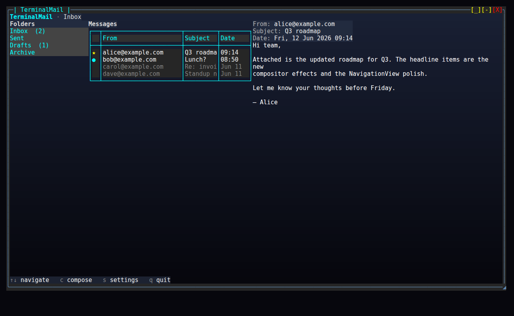

# Build a Terminal Mail Client in C# — a tour of SharpConsoleUI


Terminal UIs are having a moment. Tools like `lazygit`, `k9s`, and `btop` have shown that a text interface can feel as polished as a desktop app — gradients, panels, modal dialogs, smooth focus handling, the works. If you write C#, you can build the same thing.

In this tutorial we build **TerminalMail**: a full-screen, three-pane mail client — folders on the left, a message list in the middle, a reading pane on the right — with a compose dialog and a settings screen. It runs over fake in-memory data so we can keep the focus where it belongs: on the UI and on a clean, declarative way to wire state to the screen.

The framework is [SharpConsoleUI](https://github.com/nickprotop/ConsoleEx), a windowing toolkit for the terminal. Along the way we'll touch its window system, its layout primitives, its data-binding layer, and the polish features (alpha blending, gradients, fade-in animation) that make a TUI look intentional rather than improvised.

This is a long one — grab a coffee. Every code block below is lifted verbatim from the runnable sample project, and every figure was generated by actually running it.

---

## 1. What we're building, and why

The finished app is a single maximized window split into three columns:

```
┌─ TerminalMail  ·  Inbox ─────────────────────────────────────────────────┐
│ ▸ Inbox    (2) │ ● Q3 roadmap        alice   09:14 │ From:  alice@ex.com   │
│   Sent         │   Lunch?            bob     08:50 │ Subj:  Q3 roadmap     │
│   Drafts   (1) │   Re: invoice       carol   Mon   │ ───────────────────── │
│   Archive      │   Standup notes     dave    Mon   │ Hi team, attached is  │
│                │                                   │ the updated roadmap…  │
│  folders       │           message list            │     reading pane      │
├───────────────────────────────────────────────────────────────────────────┤
│ ↑↓ navigate  c compose  s settings  q quit                                 │
└───────────────────────────────────────────────────────────────────────────┘
```

The teaching spine of this article is **MVVM data binding**. State lives in view models that implement `INotifyPropertyChanged`; the UI binds to them. When you select a message, the reading pane updates itself — you never reach into a control and call `SetText(...)`. That declarative style is the thing I most want to show off.

### An honest framing

A quick note before we go further, because honesty matters more than a sales pitch. SharpConsoleUI powers a couple of real apps — CXPost and LazyNuGet — and **neither of them is built with MVVM**. They use a Coordinator/Controller pattern with imperative updates: a controller responds to events and calls `control.SetContent(...)` directly. That works, and it scales to large apps.

This tutorial deliberately takes the *other* road. We use the framework's `Bind` / `BindTwoWay` data-binding to achieve the same look and feel with less wiring and a cleaner separation between state and view. So when you see "the reading pane updates automatically," understand that this is one valid approach the framework supports — not the only one, and not the one the production apps happen to use. I'm using it here because it's the more declarative, more teachable path.

### Prerequisites

You'll need **.NET 8 or newer**. The published `SharpConsoleUI` NuGet package targets `net8.0`, `net9.0`, and `net10.0`, so any of those works. (The sample project in this article targets `net10.0`, but nothing in the code requires it — `net8.0` is fine.)

Create a console project and add the package:

```bash
dotnet new console -n TerminalMail
cd TerminalMail
dotnet add package SharpConsoleUI
```

Your `.csproj` reference looks like this:

```xml
<ItemGroup>
  <PackageReference Include="SharpConsoleUI" Version="2.4.60" />
</ItemGroup>
```

That's all the setup. Let's get a window on screen.

---

## 2. The first full-screen window

Everything in SharpConsoleUI hangs off a `ConsoleWindowSystem`. It owns the render loop, dispatches input, and composites the windows you create. You construct it with a *driver* (how it talks to the terminal) and some options.

Here is the entire `Program.cs` of TerminalMail:

```csharp
using SharpConsoleUI;
using SharpConsoleUI.Configuration;
using SharpConsoleUI.Drivers;
using TerminalMail.Data;
using TerminalMail.UI;
using TerminalMail.ViewModels;

var ws = new ConsoleWindowSystem(
    new NetConsoleDriver(RenderMode.Buffer),
    options: new ConsoleWindowSystemOptions(
        ShowTopPanel: false,
        ShowBottomPanel: false));

var mailbox = new MailboxViewModel(SampleInbox.Build());
new MailWindow(ws, mailbox).Create();

return ws.Run();
```

A few things to unpack:

- **`NetConsoleDriver(RenderMode.Buffer)`** renders to an off-screen buffer and flushes it in one go, which avoids flicker. This is the standard choice for a full-screen app.
- **`ShowTopPanel: false, ShowBottomPanel: false`** turns off the framework's built-in chrome. We want the whole terminal for our own layout, lazygit-style, so we draw our own breadcrumb header and help bar instead.
- We build the view model from in-memory seed data, hand it to a `MailWindow` (our class), and call `ws.Run()`. `Run()` is the blocking render/input loop; it returns an exit code when the app shuts down.

That's the bootstrap. Notice how little ceremony there is: construct the system, create a window, run. Everything interesting is in `MailWindow` and the view models — which is exactly how it should be.

---

## 3. Models and ViewModels — the MVVM foundation

Before any UI, we need state. The model layer is dumb data — no framework types, no UI concerns. A `Message`:

```csharp
namespace TerminalMail.Models;

/// <summary>A single mail message (plain data, no UI concerns).</summary>
public sealed class Message
{
    public required string From { get; init; }
    public required string Subject { get; init; }
    public required string Body { get; init; }
    public required DateTime Date { get; init; }
    public bool IsRead { get; set; }
    public bool IsFlagged { get; set; }
}
```

A `Folder` holds messages and computes its unread count:

```csharp
namespace TerminalMail.Models;

/// <summary>A mail folder holding messages.</summary>
public sealed class Folder
{
    public required string Name { get; init; }
    public List<Message> Messages { get; init; } = new();

    /// <summary>Count of unread messages in this folder.</summary>
    public int UnreadCount => Messages.Count(m => !m.IsRead);
}
```

Now the part that makes binding work. The framework's binding looks for `INotifyPropertyChanged` on its source, so we give every view model a tiny base class with the canonical `SetProperty` helper:

```csharp
using System.ComponentModel;
using System.Runtime.CompilerServices;

namespace TerminalMail.ViewModels;

/// <summary>Base class providing INotifyPropertyChanged with a SetProperty helper.</summary>
public abstract class ViewModelBase : INotifyPropertyChanged
{
    public event PropertyChangedEventHandler? PropertyChanged;

    protected void OnPropertyChanged([CallerMemberName] string? name = null)
        => PropertyChanged?.Invoke(this, new PropertyChangedEventArgs(name));

    protected bool SetProperty<T>(ref T field, T value, [CallerMemberName] string? name = null)
    {
        if (EqualityComparer<T>.Default.Equals(field, value)) return false;
        field = value;
        OnPropertyChanged(name);
        return true;
    }
}
```

If you've written WPF or MAUI, this is muscle memory. `SetProperty` only raises the event when the value actually changes, and `[CallerMemberName]` means you never type a property name as a string.

A `MessageViewModel` wraps a `Message` and exposes the bindable, display-shaped properties — including the markup the reading-pane header shows and a short date for the table:

```csharp
using TerminalMail.Models;

namespace TerminalMail.ViewModels;

/// <summary>Bindable wrapper around a <see cref="Message"/>.</summary>
public sealed class MessageViewModel : ViewModelBase
{
    private readonly Message _model;

    public MessageViewModel(Message model) => _model = model;

    public string From => _model.From;
    public string Subject => _model.Subject;
    public string Body => _model.Body;
    public DateTime Date => _model.Date;

    public bool IsRead
    {
        get => _model.IsRead;
        private set { if (_model.IsRead != value) { _model.IsRead = value; OnPropertyChanged(); } }
    }

    public bool IsFlagged => _model.IsFlagged;

    /// <summary>Markup shown in the reading-pane header.</summary>
    public string HeaderText =>
        $"[grey70]From:[/] {From}\n[grey70]Subject:[/] {Subject}\n[grey70]Date:[/] {Date:ddd, dd MMM yyyy HH:mm}";

    /// <summary>Short date used in the message table.</summary>
    public string ShortDate =>
        Date.Date == DateTime.Today ? Date.ToString("HH:mm") : Date.ToString("MMM dd");

    public void MarkRead() => IsRead = true;
}
```

The `[grey70]...[/]` syntax in `HeaderText` is markup — the framework's inline styling language, the same idea as Spectre.Console's markup. Wrapping a tag pair around text colors it.

Finally, the top-level `MailboxViewModel` holds the folder list, the *current* folder's messages as an `ObservableCollection`, and the two selections:

```csharp
using System.Collections.ObjectModel;
using TerminalMail.Models;

namespace TerminalMail.ViewModels;

/// <summary>Top-level view model: folders, the current folder's messages, and the selection.</summary>
public sealed class MailboxViewModel : ViewModelBase
{
    public IReadOnlyList<Folder> Folders { get; }

    /// <summary>Messages of the currently selected folder. Bound to the table via a data source.</summary>
    public ObservableCollection<MessageViewModel> Messages { get; } = new();

    private Folder? _selectedFolder;
    public Folder? SelectedFolder
    {
        get => _selectedFolder;
        private set => SetProperty(ref _selectedFolder, value);
    }

    private MessageViewModel? _selectedMessage;
    public MessageViewModel? SelectedMessage
    {
        get => _selectedMessage;
        private set => SetProperty(ref _selectedMessage, value);
    }

    public MailboxViewModel(IReadOnlyList<Folder> folders)
    {
        Folders = folders;
        if (folders.Count > 0) LoadFolder(folders[0]);
    }

    /// <summary>Switch folders and refill <see cref="Messages"/> (raises CollectionChanged).</summary>
    public void SelectFolder(Folder folder)
    {
        LoadFolder(folder);
    }

    private void LoadFolder(Folder folder)
    {
        SelectedFolder = folder;
        Messages.Clear();
        foreach (var m in folder.Messages)
            Messages.Add(new MessageViewModel(m));
        // Set initial selection without marking read — MarkRead happens only via SelectMessage.
        _selectedMessage = Messages.Count > 0 ? Messages[0] : null;
        OnPropertyChanged(nameof(SelectedMessage));
    }

    /// <summary>Select (and mark read) a message; null clears the reading pane.</summary>
    public void SelectMessage(MessageViewModel? message)
    {
        SelectedMessage = message;
        message?.MarkRead();
    }
}
```

Two design decisions worth calling out:

1. **`Messages` is an `ObservableCollection`.** Switching folders doesn't create a new collection — it `Clear()`s and refills the existing one. Those mutations raise `CollectionChanged`, which (as we'll see) the table picks up automatically.
2. **Auto-selection does not mark a message read.** Look closely at `LoadFolder`: it sets `_selectedMessage` directly (bypassing the public setter) and raises `PropertyChanged` manually, *without* calling `MarkRead()`. The reading pane still shows that first message on load — but the unread dot stays. Only an explicit `SelectMessage(...)` — the path the user's keyboard takes — marks a message read. This mirrors how a real mail client behaves: glancing at a freshly opened folder shouldn't silently clear your unread counts.

The seed data lives in a `SampleInbox` factory (an Inbox with four messages, plus Sent, Drafts, and Archive) — it's plain object construction, so I'll leave it to the [source repo](#where-to-go-next) and keep moving.

---

## 4. The master-detail layout

Time to put three panes on screen. SharpConsoleUI lays out controls with grids; for a side-by-side master-detail we use a **`HorizontalGrid`** with flex columns. Each column gets its own header and content.



Here's the grid builder from `MailWindow`. A fixed-width sidebar, then two flex columns at weights 2 and 3 so the reading pane gets the lion's share of the space:

```csharp
    private HorizontalGridControl BuildGrid()
    {
        return Controls.HorizontalGrid()
            .WithAlignment(HorizontalAlignment.Stretch)
            .WithVerticalAlignment(VerticalAlignment.Fill)
            .Column(col =>
            {
                col.Width(22);
                col.Add(MakeHeader("Folders"));
                col.Add(_folderList);
            })
            .Column(col =>
            {
                col.Flex(2.0);
                col.Add(MakeHeader("Messages"));
                col.Add(_messageTable);
            })
            .Column(col =>
            {
                col.Flex(3.0);
                col.Add(_readingHeader);
                col.AsScrollable();
                col.Add(_readingBody);
            })
            .Build();
    }
```

`col.AsScrollable()` makes the reading pane scroll independently when a long email overflows. The headers are small markup controls with a semi-transparent background (more on that alpha in the polish section):

```csharp
    private static MarkupControl MakeHeader(string text)
    {
        var h = Controls.Markup($"[bold grey85]{text}[/]").Build();
        h.BackgroundColor = ColorScheme.PanelHeaderBg;
        return h;
    }
```

The folder list and the message table are built in `BuildControls()`. The folder list is a `ListControl` populated from the view model, with an unread badge appended to each name:

```csharp
        // Folder list (left) — suppress default "List" title
        var folderBuilder = Controls.List()
            .WithTitle("")
            .WithColors(ColorScheme.Body, ColorScheme.SidebarBg)
            .WithHighlightForegroundColor(Color.White)
            .WithHighlightBackgroundColor(Color.SteelBlue);
        foreach (var f in _mailbox.Folders)
        {
            var badge = f.UnreadCount > 0 ? $"  [cyan1]({f.UnreadCount})[/]" : "";
            folderBuilder.AddItem($"{f.Name}{badge}");
        }
        _folderList = folderBuilder.Build();
```

The message list is a `TableControl`. Rather than feed it rows imperatively, we hand it a **data source** — a small adapter that the table queries for cells on demand. That adapter is the bridge between our `ObservableCollection` and the table:

```csharp
        // Message table (middle), driven by the data source
        _messageSource = new MessageTableDataSource(_mailbox.Messages);
        _messageTable = Controls.Table()
            .WithDataSource(_messageSource)
            .Build();
```

Here's the full data source. It implements `ITableDataSource`, which itself extends `INotifyCollectionChanged` — so when the wrapped collection changes, the table re-renders. No row rebuilding code anywhere:

```csharp
using System.Collections.ObjectModel;
using System.Collections.Specialized;
using SharpConsoleUI;
using SharpConsoleUI.Controls;
using SharpConsoleUI.Layout;
using TerminalMail.ViewModels;

namespace TerminalMail.UI;

/// <summary>
/// Adapts the mailbox's ObservableCollection&lt;MessageViewModel&gt; to the TableControl's
/// virtual data-source API. When the collection changes (e.g. the user switches folders),
/// the table refreshes automatically — no imperative row rebuilding.
/// </summary>
public sealed class MessageTableDataSource : ITableDataSource
{
    private readonly ObservableCollection<MessageViewModel> _items;

    public MessageTableDataSource(ObservableCollection<MessageViewModel> items)
    {
        _items = items;
        _items.CollectionChanged += (s, e) => CollectionChanged?.Invoke(this, e);
    }

    public event NotifyCollectionChangedEventHandler? CollectionChanged;

    public int RowCount => _items.Count;
    public int ColumnCount => 4;

    private static readonly string[] Headers = { " ", "From", "Subject", "Date" };

    public string GetColumnHeader(int columnIndex) => Headers[columnIndex];

    public TextJustification GetColumnAlignment(int columnIndex) => columnIndex switch
    {
        0 => TextJustification.Center,
        3 => TextJustification.Right,
        _ => TextJustification.Left,
    };

    public int? GetColumnWidth(int columnIndex) => columnIndex switch
    {
        0 => 2,    // flag/unread dot
        1 => 22,   // From
        3 => 8,    // Date
        _ => null, // Subject - auto
    };

    public string GetCellValue(int rowIndex, int columnIndex)
    {
        if (rowIndex < 0 || rowIndex >= _items.Count) return "";
        var m = _items[rowIndex];
        return columnIndex switch
        {
            0 => m.IsFlagged ? "[yellow]★[/]" : (m.IsRead ? " " : "[cyan1]●[/]"),
            1 => m.From,
            2 => m.Subject,
            3 => m.ShortDate,
            _ => "",
        };
    }

    public Color? GetRowForegroundColor(int rowIndex)
    {
        if (rowIndex < 0 || rowIndex >= _items.Count) return null;
        return _items[rowIndex].IsRead ? Color.Grey50 : Color.Grey93;
    }

    /// <summary>Maps a table row back to its view model (for selection handling).</summary>
    public MessageViewModel GetMessage(int rowIndex) => _items[rowIndex];
}
```

The four columns are **status · From · Subject · Date**. Column 0 is the status glyph, and it's worth being precise about what it shows, because it's easy to get wrong: a flagged message renders a yellow star (`[yellow]★[/]`), an unread one a cyan dot (`[cyan1]●[/]`), and a read one a blank space. Flagged wins over unread. `GetRowForegroundColor` dims read rows to grey and brightens unread ones — the standard "bold = unread" affordance.

The payoff: when `SelectFolder` clears and refills `Messages`, the data source forwards each `CollectionChanged` event to the table, and the middle pane repopulates itself. We never touch the table's rows by hand.

---

## 5. Data binding — selection drives the detail

This is the heart of the article. We want: select a folder → the message table updates; select a message → the reading pane updates. The first half we just got for free via the data source. The second half is data binding.


Selection is two event handlers, wired in `BuildControls()`. The folder list tells the view model to switch folders; the table tells it which message is selected:

```csharp
        // Folder selection → switch folder (refills the bound ObservableCollection,
        // which the data source forwards to the table automatically).
        _folderList.SelectedIndexChanged += (_, index) =>
        {
            if (index >= 0 && index < _mailbox.Folders.Count)
                _mailbox.SelectFolder(_mailbox.Folders[index]);
        };

        // Message row selection → set SelectedMessage on the view model.
        _messageTable.SelectedRowChanged += (_, rowIndex) =>
        {
            if (rowIndex >= 0 && rowIndex < _mailbox.Messages.Count)
                _mailbox.SelectMessage(_messageSource.GetMessage(rowIndex));
        };
```

Note we never tell the reading pane anything. The handlers just update the view model. The reading pane learns about the change through a **binding**:

```csharp
        // One-way bindings: SelectedMessage → reading pane header + body.
        _readingHeader.Bind(_mailbox,
            m => m.SelectedMessage,
            c => c.Text,
            msg => msg is null ? "[grey50]Select a message[/]" : msg.HeaderText);

        _readingBody.Bind(_mailbox,
            m => m.SelectedMessage,
            c => c.Text,
            msg => msg is null ? "" : msg.Body);
```

Read `Bind` left to right: **bind this control to `_mailbox`, watching its `SelectedMessage` property, pushing into the control's `Text` property, through this converter.** The converter turns the selected `MessageViewModel?` into display markup — falling back to a "Select a message" placeholder when nothing is selected.

The chain end to end: arrow key → table raises `SelectedRowChanged` → handler calls `SelectMessage` → `MailboxViewModel` raises `PropertyChanged(nameof(SelectedMessage))` → the binding fires, runs the converter, and writes the new text into the reading pane. That's the entire MVVM loop, and it's why the GIF above "just works" with no per-keystroke UI code.

(Remember from §3: the *first* message of a folder is shown on load but stays marked unread, because auto-selection bypasses `MarkRead`. Only these explicit user selections clear the unread dot.)

---

## 6. The compose dialog

Pressing `c` opens a compose window. It's a modal — it floats above the mailbox and takes focus until you close it — and it's where two-way binding earns its keep: as the user types, the input flows back into the view model.


The compose state is a trivial view model — three two-way-bindable strings:

```csharp
namespace TerminalMail.ViewModels;

/// <summary>Form state for the compose dialog (two-way bound to inputs).</summary>
public sealed class ComposeViewModel : ViewModelBase
{
    private string _to = "";
    public string To { get => _to; set => SetProperty(ref _to, value); }

    private string _subject = "";
    public string Subject { get => _subject; set => SetProperty(ref _subject, value); }

    private string _body = "";
    public string Body { get => _body; set => SetProperty(ref _body, value); }
}
```

And here's the whole dialog. There's no service layer, no dialog manager — just a static helper that builds a window inline:

```csharp
using SharpConsoleUI;
using SharpConsoleUI.Animation;
using SharpConsoleUI.Builders;
using SharpConsoleUI.Controls;
using SharpConsoleUI.DataBinding;
using SharpConsoleUI.Rendering;
using TerminalMail.ViewModels;

namespace TerminalMail.UI;

/// <summary>Lightweight modal dialogs — no service layer.</summary>
public static class Dialogs
{
    /// <summary>Shows the compose dialog as an alpha-blended modal over the mailbox.</summary>
    public static void ShowCompose(ConsoleWindowSystem ws)
    {
        var vm = new ComposeViewModel();

        // NOTE: PromptControl exposes .Input, not .Text — bind against that property.
        var to = Controls.Prompt("To:      ").Build();
        to.BindTwoWay(vm, v => v.To, c => c.Input);

        var subject = Controls.Prompt("Subject: ").Build();
        subject.BindTwoWay(vm, v => v.Subject, c => c.Input);

        var body = Controls.Prompt("Body:    ").Build();
        body.BindTwoWay(vm, v => v.Body, c => c.Input);

        Window modal = null!;

        var send = Controls.Button("[grey93] Send [/]")
            .OnClick((_, _) => modal.Close())
            .Build();
        var cancel = Controls.Button("[grey93] Cancel [/]")
            .OnClick((_, _) => modal.Close())
            .Build();

        var buttons = Controls.HorizontalGrid()
            .Column(col => col.Add(send))
            .Column(col => col.Add(cancel))
            .Build();

        modal = new WindowBuilder(ws)
            .WithTitle("Compose")
            .AsModal()
            .WithSize(64, 16)
            .Centered()
            .WithBorderStyle(BorderStyle.Rounded)
            .WithActiveBorderColor(ColorScheme.ActiveBorder)
            .WithBackgroundGradient(ColorScheme.WindowGradient, GradientDirection.Vertical)
            .WithTransparencyBrush(TransparencyBrush.Acrylic())
            .AddControl(to)
            .AddControl(subject)
            .AddControl(body)
            .AddControl(buttons)
            .OnKeyPressed((_, e) =>
            {
                if (e.KeyInfo.Key == ConsoleKey.Escape)
                {
                    modal.Close();
                    e.Handled = true;
                }
            })
            .BuildAndShow();

        // Fade-in animation on open.
        // FadeIn returns IAnimation but we don't need to track it.
        WindowAnimations.FadeIn(modal, TimeSpan.FromMilliseconds(180));
    }
}
```

The pieces:

- **`BindTwoWay(vm, v => v.To, c => c.Input)`** keeps the view model's `To` and the prompt's `Input` in lockstep, in both directions. Type in the box and `vm.To` updates; set `vm.To` in code and the box updates. (As the comment flags: `PromptControl` exposes its text as `Input`, not `Text` — a small gotcha worth remembering.)
- **`.AsModal()`** makes the window capture input until it closes; **`.Centered()`** and **`.WithSize(64, 16)`** position it.
- **`.WithTransparencyBrush(TransparencyBrush.Acrylic())`** is the frosted-glass effect — the mailbox behind shows through, blurred. More on that next.
- The `OnKeyPressed` handler closes on `Escape`; the Send/Cancel buttons close on click.
- **`WindowAnimations.FadeIn(...)`** fades the window in over 180 ms so it doesn't pop into existence.

For a real client you'd do something with `vm` on Send — append to the Sent folder, fire off SMTP. Here both buttons just close, because the point is the binding and the chrome, not the plumbing.

---

## 7. The polish pass — gradients, alpha, and a NavigationView

A TUI lives or dies on its details. SharpConsoleUI gives us a handful of cheap touches that lift the app from "functional" to "deliberate." We centralize the palette in one place so the look is consistent:

```csharp
using SharpConsoleUI;
using SharpConsoleUI.Helpers;

namespace TerminalMail.UI;

/// <summary>Centralized palette (mirrors the CXPost convention).</summary>
public static class ColorScheme
{
    // Window gradient (dark blue → near-black), like CXPost.
    public static ColorGradient WindowGradient => ColorGradient.FromColors(
        new Color(25, 32, 52),
        new Color(7, 7, 13));

    // Semi-transparent panel headers let the gradient bleed through (per-cell alpha).
    public static readonly Color PanelHeaderBg = new(40, 50, 70, 160);

    // Borders / accents
    public static readonly Color ActiveBorder = Color.SteelBlue;
    public static readonly Color InactiveBorder = Color.Grey23;

    // Panel backgrounds
    public static readonly Color SidebarBg = new(18, 22, 34, 200);
    public static readonly Color ReadingBg = new(12, 14, 22, 200);

    // Text
    public static readonly Color Primary = Color.Cyan1;
    public static readonly Color Muted = Color.Grey50;
    public static readonly Color Body = Color.Grey85;

    // Markup strings (for inline [..] usage)
    public const string PrimaryMarkup = "cyan1";
    public const string MutedMarkup = "grey50";
    public const string AccentMarkup = "steelblue1";
}
```

The things to notice here are the **four-argument colors**: `new Color(40, 50, 70, 160)` is RGBA — that last channel is alpha. SharpConsoleUI does true per-cell alpha blending, so a panel header at alpha 160 lets the gradient behind it bleed through. The window itself gets a vertical gradient from dark blue to near-black via `WithBackgroundGradient(...)`, and the semi-transparent headers sit on top of it.

Here's the breadcrumb header and bottom help bar that frame the layout — both backed by that same translucent `PanelHeaderBg`:

```csharp
    private MarkupControl BuildBreadcrumb()
    {
        _breadcrumb = Controls.Markup(BreadcrumbText()).Build();
        _breadcrumb.BackgroundColor = ColorScheme.PanelHeaderBg;
        // Keep breadcrumb in sync with folder changes.
        _mailbox.PropertyChanged += (_, e) =>
        {
            if (e.PropertyName == nameof(MailboxViewModel.SelectedFolder))
                _breadcrumb.Text = BreadcrumbText();
        };
        return _breadcrumb;
    }

    private string BreadcrumbText()
    {
        var folder = _mailbox.SelectedFolder?.Name ?? "—";
        return $"[bold {ColorScheme.PrimaryMarkup}]TerminalMail[/] [grey50]·[/] [grey85]{folder}[/]";
    }

    private static MarkupControl BuildHelpBar()
    {
        var bar = Controls.Markup(
            "[grey50]↑↓[/] navigate   [grey50]c[/] compose   [grey50]s[/] settings   [grey50]q[/] quit")
            .Build();
        bar.BackgroundColor = ColorScheme.PanelHeaderBg;
        return bar;
    }
```

The breadcrumb is itself a tiny binding done by hand: it subscribes to the mailbox's `PropertyChanged` and rewrites its text whenever `SelectedFolder` changes, so "TerminalMail · Inbox" becomes "TerminalMail · Sent" as you move around the sidebar.

The global key handling that drives compose/settings/quit is a single switch on the window:

```csharp
    private void OnKeyPressed(object? sender, KeyPressedEventArgs e)
    {
        switch (char.ToLowerInvariant(e.KeyInfo.KeyChar))
        {
            case 'c':
                ShowCompose();
                e.Handled = true;
                break;
            case 's':
                ShowSettings();
                e.Handled = true;
                break;
            case 'q':
                _ws.Shutdown(0);
                e.Handled = true;
                break;
        }
    }
```

### The settings screen — NavigationView

Pressing `s` opens a settings modal whose body is a **`NavigationView`** — the WinUI-style pane with a menu rail on the left and swappable content on the right. The framework gives you a fluent builder for it.


```csharp
using SharpConsoleUI;
using SharpConsoleUI.Builders;
using SharpConsoleUI.Controls;
using SharpConsoleUI.Rendering;

namespace TerminalMail.UI;

/// <summary>Settings modal whose body is a WinUI-style NavigationView.</summary>
public static class SettingsView
{
    public static void Show(ConsoleWindowSystem ws)
    {
        var nav = Controls.NavigationView()
            .AddItem("Account", icon: "\U0001F464", content: panel =>
            {
                panel.AddControl(Controls.Markup("[bold grey85]Account[/]").Build());
                panel.AddControl(Controls.Prompt("Display name: ").WithInput("Nikolaos").Build());
                panel.AddControl(Controls.Prompt("Email:        ").WithInput("me@example.com").Build());
            })
            .AddItem("Appearance", icon: "\U0001F3A8", content: panel =>
            {
                panel.AddControl(Controls.Markup("[bold grey85]Appearance[/]").Build());
                panel.AddControl(Controls.Markup("[grey70]Accent[/]  [steelblue1]████[/] SteelBlue").Build());
                panel.AddControl(Controls.Markup("[grey70]Gradient backdrop:[/] [green]On[/]").Build());
            })
            .AddItem("About", icon: "ℹ", content: panel =>
            {
                panel.AddControl(Controls.Markup("[bold grey85]TerminalMail[/]").Build());
                panel.AddControl(Controls.Markup("[grey70]A SharpConsoleUI showcase.[/]").Build());
            })
            .WithSelectedIndex(0)
            .Fill()
            .Build();

        Window modal = null!;
        var close = Controls.Button("[grey93] Close [/]")
            .OnClick((_, _) => modal.Close())
            .Build();

        modal = new WindowBuilder(ws)
            .WithTitle("Settings")
            .AsModal()
            .WithSize(74, 22)
            .Centered()
            .WithBorderStyle(BorderStyle.Rounded)
            .WithActiveBorderColor(ColorScheme.ActiveBorder)
            .WithBackgroundGradient(ColorScheme.WindowGradient, GradientDirection.Vertical)
            .WithTransparencyBrush(TransparencyBrush.Acrylic())
            .AddControl(nav)
            .AddControl(close)
            .OnKeyPressed((_, e) =>
            {
                if (e.KeyInfo.Key == ConsoleKey.Escape)
                {
                    modal.Close();
                    e.Handled = true;
                }
            })
            .BuildAndShow();
    }
}
```

Each `.AddItem(...)` is a menu entry with an emoji icon and a content callback. The callback receives a `panel` you add controls into — those controls become the right-hand pane when the item is selected. Selecting Account, Appearance, or About in the rail swaps the content, exactly like a settings app you've used a hundred times. `.WithSelectedIndex(0)` starts on Account, and `.Fill()` lets the view expand to the modal's size.

Together — gradient backdrop, alpha-blended headers and acrylic modal overlays, rounded accent borders, the fade-in animation, and the NavigationView — these are what make the hero GIF at the top look like a real app rather than a wall of monospaced text.

---

## 8. Wrap-up

We built a complete terminal mail client and, along the way, took a tour of SharpConsoleUI's main pillars:

- **`ConsoleWindowSystem` + `WindowBuilder`** — a full-screen, panel-free window driven by a buffered render loop.
- **`HorizontalGrid`** with fixed and flex columns for a master-detail layout.
- **`TableControl` + `ITableDataSource`** — a virtual table that re-renders itself when its backing `ObservableCollection` changes.
- **`Bind` / `BindTwoWay`** — the MVVM glue: selection drives the reading pane one-way; the compose form syncs two-way.
- **Modals** via `AsModal()`, with **acrylic transparency**, **gradient backdrops**, **alpha-blended** chrome, **fade-in animation**, and a **NavigationView** settings screen.

A reminder of the honest framing from the top: the production apps built on this framework — CXPost and LazyNuGet — use an imperative Coordinator/Controller pattern, not MVVM. We deliberately chose binding here because it's the cleaner, more declarative way to teach the same result. Both styles are first-class; pick whichever fits your app's complexity.

### Where to go next

TerminalMail stops at the UI on purpose. Obvious next steps, roughly in order of effort:

- **Real mail** — swap `SampleInbox` for an IMAP client (e.g. MailKit) to fetch folders and messages, and SMTP on the compose dialog's Send button.
- **Search** — a search box that filters the `ObservableCollection`; the table updates for free.
- **Threading** — group messages by conversation in the table's data source.
- **Attachments** — a list control in the reading pane, plus a file picker in compose.

Every file is reproduced inline above — and the **complete, runnable project lives right next to this tutorial** in [`04-mail-client/`](04-mail-client/) (app + tests). Just `cd 04-mail-client/TerminalMail && dotnet run`.

For more complete applications built on SharpConsoleUI, browse the [Examples](../../Examples) in this repository, or the production projects [CXPost](https://github.com/nickprotop/cxpost) (a terminal mail client) and [LazyNuGet](https://github.com/nickprotop/lazynuget) (a lazygit-style NuGet manager).

Create the project, run `dotnet run`, and start poking. The whole point of a framework like this is that the distance from "idea" to "thing on screen" is short. Go build something.
