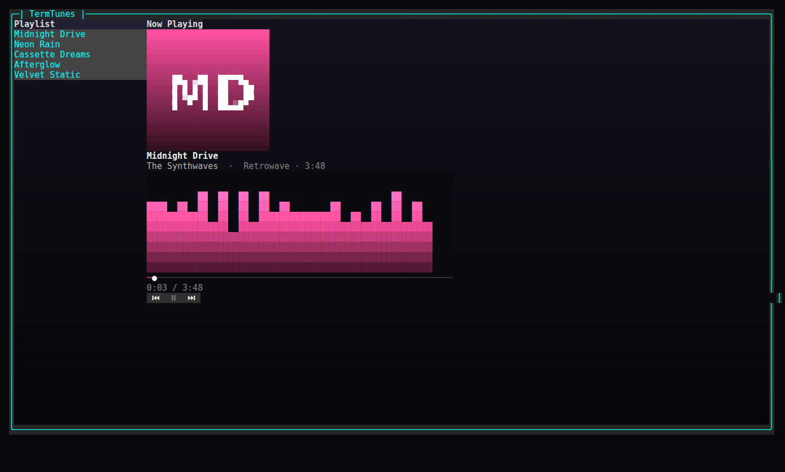
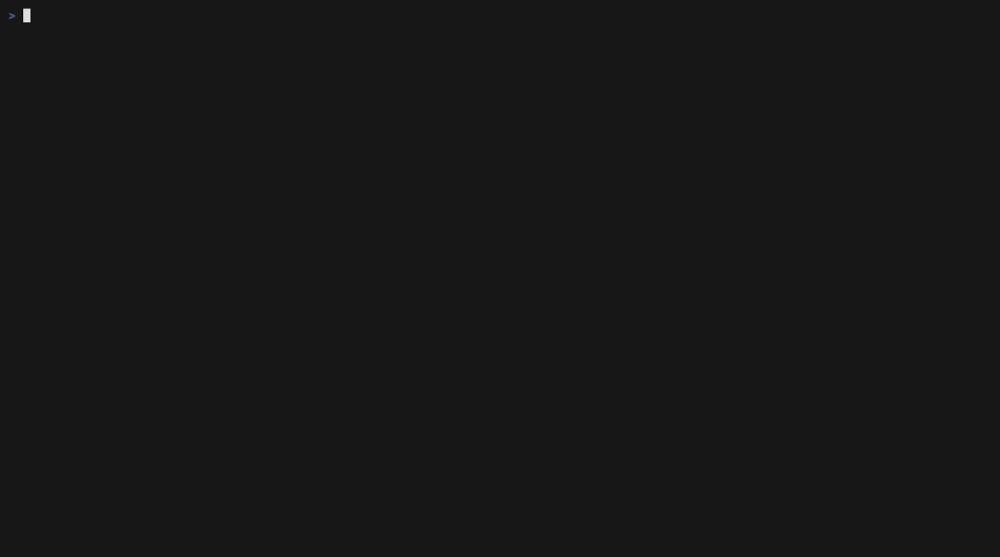

# Now Playing: Build a Terminal Music Player in C#


A spectrum dances. A gradient seek bar creeps forward. You arrow down the playlist, hit Enter, and the whole right-hand pane recolors to match the new track. It looks like a real music player — and it runs entirely in your terminal.

There is a confession to make up front, though: **there is no audio.** TermTunes plays nothing. There is no decoder, no sound card, no FFT. The "spectrum" is a handful of layered sine waves. What's real is everything you *see*: a per-frame animation loop driving a `CanvasControl` visualizer, a canvas-drawn gradient progress bar, album art rendered through `ImageControl`, a scrolling marquee, a pulsing play button, and per-track accent theming — all built with [SharpConsoleUI](https://github.com/nickprotop/ConsoleEx).

This is the polish-focused counterpart to the earlier master-detail/MVVM tutorial. Where that one was about *structure*, this one is about *motion and richness*. If you want to know how far a TUI framework can be pushed toward "this doesn't look like a terminal app," this is the tour.

## What we're building, and why

The whole app is a single chrome-free, maximized window split into two panes:

- a **playlist** on the left (a `ListControl`), and
- a **"now playing" card** on the right: album art, the track title/artist/album, an animated spectrum visualizer, a gradient seek bar with `elapsed / total`, and `⏮ ⏯ ⏭` transport buttons.

A simulated playback clock advances the position while "playing," auto-advancing to the next track at the end. Selecting a track plays it. Space — or the `⏯` button — toggles play/pause; the spectrum falls to silence when paused and springs back to life when you resume.

Because there's no audio engine to fight, every line of effort goes into rendering. That's the point: this is a showcase of the framework's rich-UI capabilities, not a media app. We'll be honest about the seams as we hit them.

**Prerequisites:** .NET 8 or newer (the sample targets `net10.0`). Add the framework with:

```bash
dotnet add package SharpConsoleUI
```

The only other dependency is Python's Pillow, and *only* if you want to regenerate the cover-art PNGs — they already ship with the sample.

## The window

The bootstrap is deliberately tiny. We create a `ConsoleWindowSystem` with both system panels turned off, build a `PlayerViewModel` from the sample playlist, hand it to a `PlayerWindow`, and run:

```csharp
using SharpConsoleUI;
using SharpConsoleUI.Configuration;
using SharpConsoleUI.Drivers;
using TermTunes.Data;
using TermTunes.UI;
using TermTunes.ViewModels;

var ws = new ConsoleWindowSystem(
    new NetConsoleDriver(RenderMode.Buffer),
    options: new ConsoleWindowSystemOptions(
        ShowTopPanel: false,
        ShowBottomPanel: false));

var player = new PlayerViewModel(SamplePlaylist.Build());
new PlayerWindow(ws, player).Create();

return ws.Run();
```

The window itself is configured to feel like a full-screen app rather than a draggable window-in-a-window. It's maximized, its title buttons are hidden, and it's locked down — not movable, resizable, minimizable, or maximizable — so the layout never shifts under the animation. The backdrop is a vertical gradient, dark blue fading to near-black:

```csharp
_window = new WindowBuilder(_ws)
    .WithTitle("TermTunes")
    .Maximized()
    .HideTitleButtons()
    .Movable(false).Resizable(false).Minimizable(false).Maximizable(false)
    .WithBorderStyle(BorderStyle.Rounded)
    .WithBackgroundGradient(ColorScheme.WindowGradient, GradientDirection.Vertical)
    .AddControl(grid)
    .WithAsyncWindowThread(FrameLoopAsync)
    .BuildAndShow();
```

That gradient comes from a small palette helper. Notice the alpha channel on the panel backgrounds — those `170`/`160`/`200` alpha values let the window gradient bleed through the cards, so the panels feel layered rather than flatly opaque:

```csharp
public static ColorGradient WindowGradient => ColorGradient.FromColors(
    new Color(18, 18, 28),
    new Color(6, 6, 10));

public static readonly Color CardBg = new(22, 22, 34, 170);   // alpha → gradient bleeds through
public static readonly Color PanelHeaderBg = new(40, 40, 60, 160);
public static readonly Color SidebarBg = new(16, 16, 26, 200);
```

The `.WithAsyncWindowThread(FrameLoopAsync)` line is the one that brings everything to life. We'll come back to it.

## Tracks and the player view model

The data model is plain. A `Track` is immutable data with no behavior — note the per-track `Accent`, a simple RGB triple that themes the visualizer, seek bar, and play button for that track:

```csharp
namespace TermTunes.Models;

/// <summary>A track in the playlist (plain data; no audio).</summary>
public sealed class Track
{
    public required string Title { get; init; }
    public required string Artist { get; init; }
    public required string Album { get; init; }
    public required TimeSpan Duration { get; init; }
    /// <summary>Path to the cover image (PNG) relative to the working dir.</summary>
    public required string CoverPath { get; init; }
    /// <summary>Accent color used to theme the visualizer/seek bar for this track.</summary>
    public (byte R, byte G, byte B) Accent { get; init; }
}
```

The sample playlist is just five hard-coded tracks, each with a fictional artist, a duration, a cover path, and an accent color:

```csharp
public static List<Track> Build() => new()
{
    new() { Title = "Midnight Drive", Artist = "The Synthwaves", Album = "Retrowave",
            Duration = TimeSpan.FromSeconds(228), CoverPath = "assets/covers/midnight.png", Accent = (255, 80, 160) },
    new() { Title = "Neon Rain", Artist = "Violet Static", Album = "City Lights",
            Duration = TimeSpan.FromSeconds(195), CoverPath = "assets/covers/neon.png", Accent = (80, 200, 255) },
    new() { Title = "Cassette Dreams", Artist = "Lo-Fi Cartel", Album = "Tape Hiss",
            Duration = TimeSpan.FromSeconds(174), CoverPath = "assets/covers/cassette.png", Accent = (255, 180, 60) },
    new() { Title = "Afterglow", Artist = "Aurora Skies", Album = "Northern",
            Duration = TimeSpan.FromSeconds(243), CoverPath = "assets/covers/afterglow.png", Accent = (130, 255, 150) },
    new() { Title = "Velvet Static", Artist = "The Synthwaves", Album = "Retrowave",
            Duration = TimeSpan.FromSeconds(210), CoverPath = "assets/covers/velvet.png", Accent = (190, 130, 255) },
};
```

The `PlayerViewModel` holds all playback state. It uses a light MVVM pattern: a `ViewModelBase` with `INotifyPropertyChanged` and a `SetProperty` helper (shared with the earlier tutorial), so that `CurrentTrack`, `IsPlaying`, and `Position` raise change notifications when they move.

The heart of it is `Tick`, and it's worth dwelling on because it's deliberately *pure and testable* — it takes a time delta, advances the simulated position, and auto-advances to the next track when the current one runs out. No timers, no I/O, no framework dependency:

```csharp
/// <summary>Advance the simulated clock; auto-advances at end of track.</summary>
public void Tick(TimeSpan delta)
{
    if (!IsPlaying || CurrentTrack is null) return;
    var next = Position + delta;
    if (next >= CurrentTrack.Duration)
        Next(); // PlayAt resets Position to zero and keeps IsPlaying true
    else
        Position = next;
}
```

`PlayAt` does the index math (with wrap-around), and `Next`/`Prev` are one-liners on top of it:

```csharp
/// <summary>Play the track at <paramref name="index"/> from the start.</summary>
public void PlayAt(int index)
{
    if (Playlist.Count == 0) return;
    CurrentIndex = ((index % Playlist.Count) + Playlist.Count) % Playlist.Count;
    CurrentTrack = Playlist[CurrentIndex];
    Position = TimeSpan.Zero;
    IsPlaying = true;
}

public void Next() => PlayAt(CurrentIndex + 1);
public void Prev() => PlayAt(CurrentIndex - 1);
```

Because `Tick` is pure, the whole playback core is unit-tested without ever touching the terminal: ticking advances the position, ticking past the end auto-advances and wraps, `Next`/`Prev` wrap around the ends, and a paused player ignores ticks entirely.

There's also a tiny bindable wrapper, `TrackViewModel`, that exposes the model's fields and a `"m:ss"` time formatter reused by the seek-bar labels:

```csharp
public string DurationText => FormatTime(_model.Duration);

/// <summary>"m:ss" formatting shared by the seek-bar time labels.</summary>
public static string FormatTime(TimeSpan t) => $"{(int)t.TotalMinutes}:{t.Seconds:D2}";
```

## The two-pane layout

The layout is a `HorizontalGrid` with two columns. The left column is a fixed-width playlist; the right is a flexible "now playing" column stacking the album art, title, meta, visualizer, seek bar, time label, and transport buttons top to bottom:

```csharp
return Controls.HorizontalGrid()
    .WithAlignment(HorizontalAlignment.Stretch)
    .WithVerticalAlignment(VerticalAlignment.Fill)
    .Column(col =>
    {
        col.Width(26);
        col.Add(Header("Playlist"));
        col.Add(_playlist);
    })
    .Column(col =>
    {
        col.Flex(3.0);
        col.Add(Header("Now Playing"));
        col.Add(_albumArt);
        col.Add(_trackTitle);
        col.Add(_trackMeta);
        col.Add(_visualizer.Control);
        col.Add(_seekBar.Control);
        col.Add(_timeLabel);
        col.Add(_transport);
    })
    .Build();
```



The static text — title and meta — is data-bound to the view model, so it follows the current track without any imperative wiring. Two `Bind` calls do it, each mapping `CurrentTrack` to the control's `Text` with a formatter:

```csharp
// Track title/meta follow the current track.
_trackTitle.Bind(_player, p => p.CurrentTrack, c => c.Text,
    t => t is null ? "[grey50]—[/]" : $"[grey93 bold]{t.Title}[/]");
_trackMeta.Bind(_player, p => p.CurrentTrack, c => c.Text,
    t => t is null ? "" : $"[grey70]{t.Artist}[/]  [grey50]·  {t.Album} · {t.DurationText}[/]");
```

The playlist selection is wired the other way — picking a row plays that track and loads its cover:

```csharp
// Selecting a track plays it (and loads its cover).
_playlist.SelectedIndexChanged += (_, index) =>
{
    if (index >= 0 && index < _player.Playlist.Count)
    {
        _player.PlayAt(index);
        LoadCover(_player.CurrentTrack!.CoverPath);
    }
};
```

That's the dividing line in this app: scalar text and selection use the binding system; the rich, per-frame rendering (visualizer, seek bar, marquee, pulse, art) is imperative, driven by the frame loop.

## The playback clock: a per-frame async loop

`WithAsyncWindowThread` gives the window a dedicated async task that runs for the window's lifetime. Ours is the frame loop. Each iteration measures the elapsed wall-clock time since the last frame (using `Environment.TickCount64`, not a wall-clock date — this is a runtime app, and a monotonic tick counter is exactly what you want for a delta), ticks the view model if we're playing, then redraws every animated piece and sleeps ~70 ms for roughly 14 frames per second:

```csharp
private async Task FrameLoopAsync(Window window, CancellationToken ct)
{
    _lastTick = Environment.TickCount64;
    while (!ct.IsCancellationRequested)
    {
        long now = Environment.TickCount64;
        var delta = TimeSpan.FromMilliseconds(now - _lastTick);
        _lastTick = now;
        _frame++;

        if (_player.IsPlaying)
        {
            var before = _player.CurrentTrack;
            _player.Tick(delta);
            if (!ReferenceEquals(before, _player.CurrentTrack))
                LoadCover(_player.CurrentTrack!.CoverPath); // auto-advanced to next track
        }

        UpdateLevels();
        var accent = _player.CurrentTrack?.Accent ?? Color.Grey50;
        _visualizer.Render(_levels, accent);
        _seekBar.Render(_player.Position, _player.Duration, accent);
        UpdateTimeLabel();
        UpdateMarquee();
        UpdatePulse();

        await Task.Delay(70, ct); // ~14 fps
    }
}
```

Notice the `ReferenceEquals` check after `Tick`: if `Tick` auto-advanced to a new track, the loop reloads the album art. That's the one place where simulated playback (the clock running out) needs to nudge the imperative side (loading a new cover).

The time label is the simplest consumer — it just formats position and duration each frame:

```csharp
private void UpdateTimeLabel()
{
    var pos = TrackViewModel.FormatTime(_player.Position);
    var dur = _player.CurrentTrack is null ? "0:00" : _player.CurrentTrack.DurationText;
    _timeLabel.Text = $"[grey50]{pos} / {dur}[/]";
}
```

## The gradient seek bar

Here we hit the first "why did you draw this by hand?" moment. The framework has a `ProgressBar`, but it fills with a single solid color — no gradient. We want the filled portion to ramp through the track's accent. So the seek bar is a one-row `CanvasControl` we paint ourselves.

The `CanvasControl` API is a retained drawing surface: you call `BeginPaint()` to get a graphics object, draw into it, and call `EndPaint()` — and that `EndPaint()` is what marks the canvas dirty and triggers the redraw. (That's why every renderer here wraps its drawing in a `try`/`finally` with `EndPaint()` in the `finally`: even if drawing throws, the frame is committed.)

The render clears the surface, lays down a dim unfilled track, draws the filled portion with a horizontal gradient from a dimmed accent up to the full accent, and caps it with a white "playhead" cell:

```csharp
/// <summary>Draw the filled (gradient) portion up to position/duration, plus a playhead.</summary>
public void Render(TimeSpan position, TimeSpan duration, Color accent)
{
    int w = _canvas.CanvasWidth;
    int h = _canvas.CanvasHeight;
    if (w < 2 || h < 1) return;

    double frac = duration.TotalSeconds <= 0 ? 0 : Math.Clamp(position.TotalSeconds / duration.TotalSeconds, 0, 1);
    int filled = (int)Math.Round(frac * (w - 1));

    var g = _canvas.BeginPaint();
    try
    {
        g.Clear(new Color(10, 10, 16));
        // unfilled track
        g.FillRect(0, 0, w, h, '─', ColorScheme.SeekTrack, new Color(10, 10, 16));
        // filled gradient
        if (filled > 0)
        {
            var dim = new Color((byte)(accent.R / 2), (byte)(accent.G / 2), (byte)(accent.B / 2));
            g.GradientFillHorizontal(0, 0, filled, h, '━', dim, accent, new Color(10, 10, 16));
        }
        // playhead
        g.SetNarrowCell(Math.Min(filled, w - 1), 0, '●', Color.White, new Color(10, 10, 16));
    }
    finally
    {
        _canvas.EndPaint();
    }
}
```

`GradientFillHorizontal` does the per-cell color interpolation across the filled width for us; `FillRect` lays down the dim track behind it; `SetNarrowCell` places a single character at an exact coordinate. The bar is created at a nominal width with `AutoSize = true`, so it stretches to fill the column, and we read `CanvasWidth`/`CanvasHeight` back each frame rather than assuming a size.

## The animated visualizer — the centerpiece

This is the part that sells the illusion, and it's also where the honesty matters most: **the spectrum is simulated.** There is no audio to analyze and no FFT. Each frame we compute a level for each of 28 bars from layered sine waves plus a little noise, smoothed toward the target so the bars rise and fall organically instead of jittering:

```csharp
private void UpdateLevels()
{
    double energy = _player.IsPlaying ? 1.0 : 0.0;
    double t = _frame * 0.12;
    for (int i = 0; i < _levels.Length; i++)
    {
        // Simulated spectrum: layered sines + noise, smoothed toward target
        double target = energy * (0.45 + 0.45 * Math.Abs(Math.Sin(t * (0.6 + i * 0.07) + i)))
                        * (0.7 + 0.3 * _rng.NextDouble());
        _levels[i] += (target - _levels[i]) * 0.35; // smoothing / decay
    }
}
```

The `energy` term is the trick that makes pause feel right: when paused it drops to `0`, so the target for every bar becomes zero, and the same smoothing line that animates the bars also makes them *decay* gracefully down to silence rather than snapping flat. Each bar gets a slightly different sine frequency (`0.6 + i * 0.07`) and phase (`+ i`) so neighboring bars don't move in lockstep.

The visualizer renderer turns those 0..1 levels into colored columns. For each bar it computes a pixel height, then fills cells from the bottom up, coloring each row by interpolating along the track's accent ramp — so the bottom of each bar is a dim accent and the top brightens toward white:

```csharp
/// <summary>Render the given normalized levels (one per bar) using the accent gradient.</summary>
public void Render(IReadOnlyList<double> levels, Color accent)
{
    int w = _canvas.CanvasWidth;
    int h = _canvas.CanvasHeight;
    if (w < 2 || h < 1 || levels.Count == 0) return;

    var ramp = ColorScheme.AccentRamp(accent);
    var bg = new Color(10, 10, 16);

    var g = _canvas.BeginPaint();
    try
    {
        g.Clear(bg);
        int bars = Math.Min(levels.Count, w);
        int barW = Math.Max(1, w / bars);
        for (int b = 0; b < bars; b++)
        {
            double level = Math.Clamp(levels[b], 0, 1);
            int barHeight = (int)Math.Round(level * h);
            for (int y = 0; y < barHeight; y++)
            {
                double t = h <= 1 ? 1 : (double)y / (h - 1);
                var color = ramp.Interpolate(t);
                int row = h - 1 - y;
                for (int dx = 0; dx < barW; dx++)
                {
                    int x = b * barW + dx;
                    if (x < w) g.SetNarrowCell(x, row, '█', color, bg);
                }
            }
        }
    }
    finally
    {
        _canvas.EndPaint();
    }
}
```



The accent ramp is a three-stop gradient — a dimmed third of the accent, the accent itself, then a brightened version — built once per color in the palette:

```csharp
/// <summary>Build a 0..1 gradient for a track accent (dim → accent → white-ish).</summary>
public static ColorGradient AccentRamp(Color accent) => ColorGradient.FromColors(
    new Color((byte)(accent.R / 3), (byte)(accent.G / 3), (byte)(accent.B / 3)),
    accent,
    new Color(
        (byte)Math.Min(255, accent.R + 60),
        (byte)Math.Min(255, accent.G + 60),
        (byte)Math.Min(255, accent.B + 60)));
```

`ColorGradient.Interpolate(t)` returns the `Color` at position `t` along that ramp, which is exactly what the per-row coloring needs.

## Album art and per-track accent theming

Album art uses `ImageControl`, which is smarter than it looks. On terminals that support the Kitty graphics protocol it renders actual pixels; everywhere else it falls back to half-block or braille approximations. (The GIFs in this article show the fallback, since the capture pipeline runs under tmux.) That single control adapts to the terminal it lands in, no branching on your side.

It's built with a `Fit` scale mode, and — importantly — its height is capped:

```csharp
_albumArt = Controls.Image()
    .WithScaleMode(ImageScaleMode.Fit)
    .Build();
_albumArt.Height = 12; // constrain to ~12 rows so other controls stay visible
```

That `Height = 12` is load-bearing. With `Fit` and no cap, the image happily expands to fill the column, shoving the visualizer, seek bar, and transport off-screen. Capping the height keeps the art a tidy square at the top of the card and leaves room for everything below it.

Loading a cover swaps the `Source` to a `PixelBuffer` read from disk and invalidates the control's image cache so the new art actually re-renders. It's wrapped in a guard and a `try`/`catch` so a missing or unreadable file just leaves the previous art in place rather than crashing the frame loop:

```csharp
private void LoadCover(string path)
{
    try
    {
        if (File.Exists(path))
        {
            _albumArt.Source = PixelBuffer.FromFile(path);
            _albumArt.InvalidateImageCache();
        }
    }
    catch { /* fallback: leave previous art */ }
}
```

The accent theming ties the whole right pane together. Every frame the loop reads the current track's accent and passes it into both the visualizer and the seek bar, so changing tracks instantly recolors the bars, the progress fill, and (as we'll see next) the play button:

```csharp
var accent = _player.CurrentTrack?.Accent ?? Color.Grey50;
_visualizer.Render(_levels, accent);
_seekBar.Render(_player.Position, _player.Duration, accent);
```


## Final polish: marquee and pulse

Two small touches finish the effect, and neither has a built-in control — both are hand-animated in the frame loop.

The **marquee** handles titles too long for the label width. Short titles are drawn as-is; long ones get padded, then rotated by one character every few frames so the text scrolls horizontally:

```csharp
private void UpdateMarquee()
{
    var track = _player.CurrentTrack;
    if (track is null) return;
    const int width = 28;
    string title = track.Title;
    if (title.Length <= width)
    {
        _trackTitle.Text = $"[grey93 bold]{title}[/]";
        return;
    }
    string padded = title + "    ";
    if (_frame % 3 == 0) _marqueeOffset = (_marqueeOffset + 1) % padded.Length;
    string rotated = padded.Substring(_marqueeOffset) + padded.Substring(0, _marqueeOffset);
    _trackTitle.Text = $"[grey93 bold]{rotated.Substring(0, width)}[/]";
}
```

The **pulse** makes the play button breathe while playing. A sine wave drives a blend from a neutral grey toward the track accent, and the glyph flips between `⏸` (playing) and `⏯` (paused). The byte math is clamped to 0..255 so the color arithmetic can't overflow:

```csharp
private void UpdatePulse()
{
    if (_player.IsPlaying)
    {
        double pulse = 0.5 + 0.5 * Math.Sin(_frame * 0.3);
        var accent = _player.CurrentTrack?.Accent ?? Color.Grey93;
        _playBtn.ForegroundColor = new Color(
            (byte)Math.Clamp((int)(120 + (accent.R - 120) * pulse), 0, 255),
            (byte)Math.Clamp((int)(120 + (accent.G - 120) * pulse), 0, 255),
            (byte)Math.Clamp((int)(120 + (accent.B - 120) * pulse), 0, 255));
        _playBtn.Text = "⏸";
    }
    else
    {
        _playBtn.ForegroundColor = ColorScheme.Muted;
        _playBtn.Text = "⏯";
    }
}
```

Both run from the same async window thread as the canvas rendering. The framework invalidates on property set and on `EndPaint`, so mutating `Text`/`ForegroundColor` and repainting the canvases directly from this loop is safe — no manual UI-thread marshalling required.

## Where to go next

TermTunes is a UI showcase wearing a music player's clothes. The seams are all in the places we were honest about, and each is a natural extension:

- **Real audio.** Swap the simulated clock for an actual audio backend (LibVLC, NAudio, miniaudio bindings). `PlayerViewModel.Tick` becomes a position query against the playing stream instead of a wall-clock delta — and because it's already isolated and tested, that swap is contained.
- **A real FFT visualizer.** Once audio is real, feed PCM samples through an FFT and map frequency bins onto the bars. The renderer doesn't change at all — it just consumes a different source of 0..1 levels. That's the payoff of keeping `UpdateLevels` separate from `Visualizer.Render`.
- **Fetched cover art.** Replace the generated PNGs with real artwork pulled from a metadata service (MusicBrainz/Cover Art Archive, last.fm), cached to disk and loaded through the same `LoadCover` path.

None of those touch the rendering layer, which is the part this tutorial is really about: an animation loop, a couple of hand-drawn canvases, an adaptive image control, and a per-track accent threaded through all of it.

The complete, runnable source — app, tests, and cover generator — lives right next to this tutorial in [`05-music-player/`](05-music-player/). Just `cd 05-music-player/TermTunes && dotnet run`. For more applications built on SharpConsoleUI, browse the [Examples](../../Examples) in this repository.
